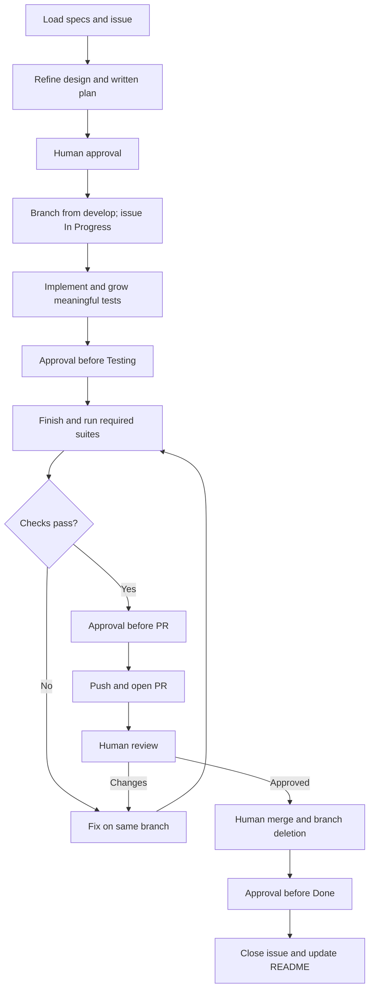

# Development Workflow Document — Cerberus API

## 1. Purpose

Formalize the approved [initial Workflow](../initial/Workflow.md), preserving its stages,
approval gates, branch pattern and Definition of Done.

> **One use case = one branch = one issue = one pull request.**

The first foundation issue establishes the platform before use-case issues start. GitHub is
the intended tracker; its repository is to be supplied by the user. A project-board selection
does not change the normative status lifecycle.

---

## 2. Workflow at a glance



An explicit unattended authorization replaces only the gates/transitions it names. Record
the scope and automated verification criteria first; permission to advance does not imply
permission to merge, self-approve, close issues or delete branches. Those actions need explicit
coverage when an unattended run needs them. The one-use-case invariant remains unchanged.

---

## 3. Issue status lifecycle

| Order | Status | Transition rule |
| --- | --- | --- |
| 1 | Todo | Not started. |
| 2 | In Progress | Unattended once the branch exists and implementation begins. |
| 3 | Testing | Code complete; approval required before transition by default. |
| 4 | Done | Reviewed/merged, branch deleted, issue closure approved by default. |

Review changes stay on the same issue/branch and return to verification. Do not declare Done
merely because product code exists or some tests passed.

---

## 4. Step-by-step

### Step 1 — Branch from the develop branch

First load the target use case, all alternative flows, traced requirements, permissions,
technology, testing and operations documents from disk. Refine a concrete design and written
test-first implementation plan. Present both and obtain the required approval before coding.

After approval, preserve user work and create the branch from an up-to-date `develop`:

```bash
git switch develop
git pull
git switch -c feature/uc-01-register-account
```

Pattern: `feature/uc-##-use-case-name`. The concrete example now names UC-01 from the approved
use-case inventory. The foundation issue uses `feature/project-foundation`, keeping a separate
issue/branch/PR. Remote commands require the user-configured repository.

### Step 2 — Move the issue to In Progress

Make this transition once the branch exists and work begins. It is the only default unattended
transition.

### Step 3 — Implement

Execute the approved plan, implementing the main and all alternative flows. Grow meaningful
tests with the implementation, preserve encryption/ownership rules, and commit on the branch.
Do not change approved business rules or add services silently.

### Step 4 — Move the issue to Testing

Present the code-complete change and ask before advancing, unless that transition is explicitly
authorized unattended.

### Step 5 — Test until green

Finish the required tests and run the full required unit and functional suites. Fix failures,
rerun the affected checks, and confirm the coverage gate. Test response and database behavior
for every applicable alternative flow. Commands from the repository root:

```bash
dotnet test src/ArturRios.Cerberus.sln --filter "Category=Unit"
dotnet test src/ArturRios.Cerberus.sln --filter "Category=Functional"
```

Report fresh passing evidence and request approval before a pull request unless explicitly
authorized to make that transition unattended.

### Step 6 — Open a pull request

After the required approval, push and open a PR into `develop`, referencing its actual issue
number with a closing reference. Explain the resulting behavior and validation. Attach every
created PR to the active Codex chat when working through Codex.

### Step 7 — Human review and merge

A human reviews, merges and deletes the branch by default. Review changes remain on that
branch and rerun required checks. Agent merge/deletion is permitted only by explicit scoped
authorization for those actions; never infer it from authorization to implement.

### Step 8 — Close the issue

After merge and branch deletion, obtain the required approval for Done, confirm the issue is
closed, and update the repository-root README backlog entry. Use explicitly authorized
unattended closeout only within its stated scope.

---

### Branch protections and releases

Feature and fix branches start from `develop` and target `develop`; accepted names are
`feature/<name>`, `fix/<name>` and Dependabot branches. Releases use `release/x.y.z`
snapshots of `develop` and target `main` with merge commits only. Both branches reject
force pushes and deletion, require `branch-policy`, `test` and `docker`, and retain
Heimdall's administrator bypass. `main` also requires `deploy/production`; the deployment
integration must be provisioned before a release. Release tags matching `v*` cannot be
updated or deleted except through the same administrator bypass. Human review remains
the default process; the copied rulesets do not mandate an approval count.

See the repository [contribution policy](../../CONTRIBUTING.md) for release details.

## 5. Definition of Done

- [ ] Implemented on its own `feature/uc-##-use-case-name` branch from `develop`.
- [ ] Main flow and every alternative flow implemented.
- [ ] Unit and functional tests cover the use case at the correct layers.
- [ ] Required suites and the adopted coverage gate pass with fresh evidence.
- [ ] Encryption, ownership, and sharing rules remain satisfied.
- [ ] Pull request reviewed by a human and merged, or verified and merged under explicit
      unattended authorization covering that action.
- [ ] Branch deleted by the human or explicitly authorized agent.
- [ ] Issue closed and in `Done`, with the required transition authorization.
- [ ] README backlog status updated when the README tracks this use case.

---

## 6. References

- [Initial Workflow](../initial/Workflow.md)
- [Use Case Specification](Use%20Case%20Specification%20Document.md)
- [System Requirements](System%20Requirements%20Document.md)
- [Testing Specification](Testing%20Specification%20Document.md)
- [Technology Stack](Technology%20Stack%20Document.md)
- [Operations & Infrastructure](Operations%20%26%20Infrastructure%20Document.md)
