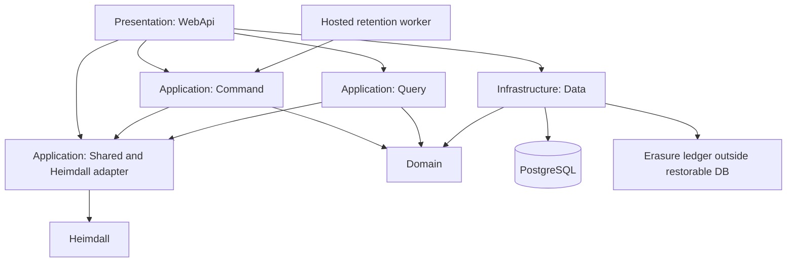

# Operations & Infrastructure Document — Cerberus API

## 1. Introduction

### 1.1 Purpose

Specify the foundation and operational controls without duplicating technologies/versions from
[Technology Stack](Technology%20Stack%20Document.md). Domain permissions and lifecycle rules
remain in [System Requirements](System%20Requirements%20Document.md).

### 1.2 Scope

Layered scaffolding, configuration, persistence, identity adapter, tests, CI, logging, health,
retention and deletion-preserving backup/restore. The foundation is exactly one issue with the
platform requirements below as its Definition of Done. Business retention behavior has its
own use case and is not silently considered implemented by a timer scaffold.

---

## 2. Technical Foundation

### 2.1 Overview

Establish a usable API skeleton and verification pipeline before domain use cases start.
Repository paths are intended scaffolding paths, not claims that source files currently exist.

### 2.2 Solution Architecture



### 2.3 Repository Layout

```text
README.md
docs/
  initial/
  requirements/
src/
  ArturRios.Cerberus.sln
  Domain/ArturRios.Cerberus.Domain/
  Application/ArturRios.Cerberus.Command/
  Application/ArturRios.Cerberus.Query/
  Application/ArturRios.Cerberus.Shared/
  Infrastructure/ArturRios.Cerberus.Data/
  Presentation/ArturRios.Cerberus.WebApi/
tests/
  Domain/ArturRios.Cerberus.Domain.Tests/
  Application/ArturRios.Cerberus.Command.Tests/
  Application/ArturRios.Cerberus.Query.Tests/
  Application/ArturRios.Cerberus.Shared.Tests/
  Infrastructure/ArturRios.Cerberus.Data.Tests/
  Presentation/ArturRios.Cerberus.WebApi.Tests/
.github/workflows/
```

### 2.4 Platform Requirements

| ID | Requirement |
| --- | --- |
| IR-01 | The solution shall create the approved Domain, Command, Query, Shared, Data and WebApi projects in the specified solution layout. |
| IR-02 | The solution shall provide the latest mutually compatible stable dependencies under the Technology Stack policy. |
| IR-03 | The solution shall load nonsecret settings and environment-supplied secrets with explicit precedence. |
| IR-04 | The solution shall configure the approved database provider, migrations, repository abstractions and naming convention. |
| IR-05 | The solution shall bootstrap controlled Heimdall scope, token validation and HTTP adapter contracts without exposing privileged credentials. |
| IR-06 | The solution shall provide a single structured logging pipeline that excludes protected credentials, content bodies and recovery material. |
| IR-07 | The solution shall create mirrored unit and functional test projects using the approved categories and real database fixtures. |
| IR-08 | The solution shall provide CI restore, build, unit, functional, merged-coverage and contract-drift checks. |
| IR-09 | The solution shall provide a release gate for the reviewed E2E, recovery and offline-lease protocol before dependent implementation. |
| IR-10 | The solution shall provide migration/configuration validation and a deployable API artifact for the approved VPS target. |
| IR-11 | The solution shall validate explicit backup/log/sync retention configuration and a durable external-to-database erasure ledger before accepting production traffic. |
| IR-12 | The solution shall provide a tested backup restore procedure that reapplies erasures and verifies current authorization before restoring traffic. |
| IR-13 | The solution shall provide retention-worker infrastructure with idempotent claiming/retry and monitored failures. |
| IR-14 | The solution shall configure safe no-store response behavior and request limits without logging sensitive request bodies. |

---

## 3. Configuration

Use checked-in nonsecret settings and environment-supplied secrets. Later sources override
earlier sources; production secrets never appear in example settings or the repository.

| Concern | Keys / mechanism | Policy |
| --- | --- | --- |
| Database | CERBERUS_DATA_CONNECTIONSTRING; CERBERUS_DATA_DATABASETYPE | Connection secret; provider fixed by approved stack. |
| Heimdall | CERBERUS_HEIMDALL_BASE_URL; CERBERUS_HEIMDALL_SCOPE_ID | Required identity integration; HTTPS outside isolated local tests. |
| Registration identity | CERBERUS_HEIMDALL_SERVICE_CREDENTIAL | Secret; narrowly authorized scope registration only; no fallback to global administration. |
| Registration retries | CERBERUS_REGISTRATION_FINGERPRINT_KEY | Independent durable HMAC secret; at least 32 printable ASCII characters; preserve across replicas, restores and routine identity-key rotation. |
| Token validation | CERBERUS_AUTH_ISSUER; CERBERUS_AUTH_AUDIENCE; configured trusted validation keys | Required; reject unsupported issuer/scope/key or unavailable required revalidation. |
| Offline signing | CERBERUS_OFFLINE_SIGNING_KEY; reviewed key identifier/rotation configuration | Server signing secret; never a vault decryption key. |
| Retention worker | CERBERUS_RETENTION_INTERVAL | Explicit positive representable interval; retries and purge lag monitored. |
| Backup retention | CERBERUS_BACKUP_RETENTION; CERBERUS_BACKUP_PATH | Operator-supplied expiry and protected storage; no unlimited default. |
| Erasure ledger | CERBERUS_ERASURE_LEDGER_PATH | Durable outside restorable database; survives database rollback and is access-controlled. |
| Log retention | CERBERUS_LOG_RETENTION; protected log destination | Explicit documented expiry; no vault payloads or direct identity credentials. |
| Sync retention | CERBERUS_SYNC_RETENTION | Explicit cursor history policy; expired cursors require authorized full resync; terminal deletion defenses remain. |
| Request/page limits | CERBERUS_MAX_REQUEST_BYTES; CERBERUS_MAX_PAGE_SIZE | Explicit finite bounds validated at startup; values selected and load-tested during foundation design. |
| Protocols | Reviewed accepted envelope formats, proof/lease suites and key epochs | Reject unknown formats; cryptographic sizes come from the reviewed suite. |
| Offline user policy | Account persistence, not global deployment environment | 24-hour initial policy; owner-selected positive interval or renewal disabled. |

Fail production startup/readiness on missing mandatory credentials, limits, retention policy or
ledger configuration. No deployment secret values or fabricated retention periods are supplied
by these documents. Required operator values must be chosen before the foundation is approved.

---

## 4. Logging & Monitoring

| Concern | Approach |
| --- | --- |
| Format | Structured events through one logging pipeline with correlation identifiers. |
| Destination | Protected console/file collection on the VPS; documented configured expiry. |
| Events | Request result/error code, dependency failures, authorization denial, retention progress and restore reconciliation. |
| Never logged | Credentials, tokens, unlock/recovery proofs, usable keys, ciphertext bodies, export bodies or plaintext personal details. |
| Metrics | Redacted request failures, dependency state, worker failures/backlog and expiry lag. |
| Diagnostics | Detailed errors and SQL sensitive-data logging remain disabled where protected data could appear. |
| Privacy | Document metadata purposes, operator access and retention; do not label pseudonymous identifiers anonymous automatically. |

Retention failures alert the operator without logging discarded content. Report performance
observations without claiming an unapproved SLO. Avoid external logging/monitoring services;
operator infrastructure does not become an additional application integration.

---

## 5. Health & Monitoring Endpoints

### 5.1 Endpoints

| Endpoint | Purpose | Authorization |
| --- | --- | --- |
| /health/live | Process responds | Public minimal state |
| /health/ready | Database and configured identity integration available | Public minimal state |
| /health/details | Redacted component information | Explicit operational grant |

### 5.2 Response Contract

Public health returns only:

```json
{"status":"healthy"}
```

Readiness uses 200 when ready and 503 when unavailable. The authorized detailed view may add
component names/states and elapsed durations; never credentials, topology secrets or exception
stacks. Liveness does not imply identity/database availability. Health probes use a non-user
dependency probe contract; do not register accounts or attempt user authentication for a probe.

### 5.3 Use Case — UC-55: Check API health

The normative actor, pre/postconditions, main flow and AF rows are defined in
[Use Case Specification](Use%20Case%20Specification%20Document.md#uc-55-check-api-health).
This is one use case and one issue, continuing the domain numbering. Requirements:
FR-OP-01, FR-OP-02, FR-OP-03. The contracts above refine the same use case.

| Field | Value |
| --- | --- |
| **ID** | UC-55 |
| **Name** | Check API health |
| **Actors** | Operator or monitoring client |
| **Description** | Return a minimal 200 or 503 status; return component details only to an authorized operator. |
| **Preconditions** | Process reachable; detailed view additionally requires operational authorization. |
| **Postconditions** | Return a minimal 200 or 503 status; return component details only to an authorized operator. |
| **Requirements** | FR-OP-01, FR-OP-02, FR-OP-03 |

**Main Flow**

1. Request liveness, readiness, or the authenticated detailed health view.
2. Resolve the acting identity/scope and validate the operation-specific input, permissions and current state. Public health and internal worker exceptions follow the authorization matrix.
3. Check process liveness, and for readiness check database availability and configured Heimdall reachability without using user credentials.
4. Return a minimal 200 or 503 status; return component details only to an authorized operator.

**Alternative Flows**

| ID | Condition | Outcome |
| --- | --- | --- |
| AF-01 | Public health request has no identity | Allow only minimal liveness/readiness status. |
| AF-02 | Detailed endpoint actor is unauthenticated or lacks operational privilege | Return 401/403 without component details. |
| AF-03 | Dependency is unavailable | Return readiness 503 with minimal state; liveness remains tied to process state. |

---

## 6. Environments

| Environment | Purpose | Differences |
| --- | --- | --- |
| Local | Development and functional tests | Disposable database containers; controlled Heimdall fixtures; no production identities/secrets. |
| Staging | Integrated release verification | Dedicated test data, real configured Heimdall scope, production-like transport and retention controls. |
| Production | Initial beta on Ubuntu VPS | User-authorized deploy, protected keys/metadata, explicit backup/log retention and tested restore reconciliation. |

Regions, VPS sizing and concrete operator retention values are deployment decisions, not
invented requirements. Before beta, record the lawful purposes, exposed structural metadata,
privacy notice, data-subject request procedure, host/transfer details, recipient deletion
limits and backup erasure policy. The technical specification alone is not evidence of legal
compliance. Primary obligations are in
[LGPD](https://www.planalto.gov.br/ccivil_03/_ato2015-2018/2018/lei/l13709.htm) and
[GDPR](https://eur-lex.europa.eu/eli/reg/2016/679/oj/eng).

---

## 7. Build & Delivery

CI on pushes/PRs restores and builds the solution, runs separate unit/functional steps, merges
coverage and enforces its floor, and validates published API contracts. A failing required
check blocks merge. Use protected `develop` for feature/fix PRs and protected `main` for release PRs,
following the [contribution policy](../../CONTRIBUTING.md). CI validates the specifications and,
since the foundation scaffold, also runs vulnerability checks, unit/functional tests, merged
coverage enforcement and a Docker build. The required `deploy/production` check on `main` requires
the deployment integration to be provisioned: Cerberus is not yet registered in yggdrasil's
`catalog.yaml` and has no `Jenkinsfile`. No scheduled issue labels or due dates are invented.

After approval, package the API with the stable runtime and deploy to the Ubuntu VPS through
the operator's controlled delivery path. Validate configuration, apply migrations through an
explicit deployment step, run health/contract checks, and enable traffic only after they pass.
Production deployment remains a separate authorized action, not implied by writing specs.

Backups contain encrypted vault content and sensitive structural metadata, so encrypt and
access-control the backups independently of E2E. Keep the configured expiry explicit. Record
completed deletion identifiers in a durable protected ledger that a database restore cannot
roll back. A restore remains isolated: restore the database, replay all completed erasures,
reconcile pending deadlines and current authorization, verify purged identifiers remain
unavailable, and only then reopen traffic. Preserve the ledger as well as its tested replay
procedure. Do not treat keys cached in client copies as remotely erasable.

The retention worker claims expired operations idempotently and retries failures. Request-time
deadline checks prevent worker outages from extending restore windows. Registration and
erasure recovery procedures must also cover interrupted cross-system/ledger operations.

---

## Account read access

`GET /api/accounts/me` requires a current scoped Heimdall identity and a single
`X-Cerberus-Vault-Access` header containing a canonical unpadded base64url 32-byte
opaque handle. Only its SHA-256 verifier is stored. Account reads accept no query
parameters or request body and return public account metadata with the original
opaque encrypted details envelope; responses are not cacheable.

The account-wide session must belong to the current active, non-erased account,
match its current policy and revocation generations, and remain unrevoked and
unexpired. Profile-only access cannot read account details. With renewal disabled,
a session must explicitly have no expiry. UC-03 provides verification and storage;
trusted account session issuance and vault initialization are UC-38, and selected
profile issuance is UC-15. Authentication and account reads never create access sessions.
Apply the additive `VaultAccessSessions` migration before enabling this route.

`PUT /api/accounts/me` uses the same current identity and account-wide access header.
Its strict JSON body contains only a positive integer `expectedRevision` and the
replacement `details` envelope. It atomically rechecks account state, erasure,
session access and expected revision before changing details and incrementing revision.
The identity link, policy and session records remain intact. Concurrent edits with
the same expected revision permit one winner; a stale edit or lost-response retry
returns `409/revision_conflict` and requires reloading the current account before
retrying. Success returns only the public account ID and new revision. No additional
migration is required for UC-04.

`PUT /api/identity/me` requires the same current identity and account-wide access
header. Its strict JSON body contains only required `name` (at most 200 characters)
and a valid `email`. It forwards the original actor bearer to Heimdall's own public
person route, omitting role, scope, password and other provider controls. Success
returns only public identity ID, name, email and email verification state. Heimdall
clears verification when email changes; its uniqueness/concurrency conflicts map
to `409/identity_conflict`. Missing input/access, hidden account, denied access and
unavailable dependencies use the same stable, non-cacheable 400/401/404/403/503
contracts. No identity revision is invented: the inspected provider accepts none.

The identity update locks the account and matching session in that order, then
checks permission with fresh database statement time after waiting for locks.
Those locks remain held across the bounded provider call to serialize local
lifecycle/revocation changes. Cerberus retrieves no encrypted payload and changes
no account, profile, revision, policy or session data. No migration is required.
A timeout or malformed/lost response can follow a committed Heimdall update:
503 does not imply remote rollback. Retry the same name/email replacement or verify
identity state. Cross-service identity changes retain the existing current-request
boundary; no distributed transaction is claimed.

---

## Vault protection and account unlock

Apply the additive `VaultProtectionAndChallenges` migration before enabling the
protection routes. It adds one opaque protection bundle per account and indexed,
expiring proof challenges; both cascade with account erasure. Account ciphertext,
revision and offline policy remain unchanged. Login, initialization, material reads
and challenge issuance create no vault session.

`POST /api/vault/protection` binds client-created public verifiers and wrapped bundles
to the current owner's active account and expected account revision. Bootstrap does
not require an already-existing vault session. Concurrent initialization permits one
winner; retry returns409 without replacing it. `GET /api/vault/protection` returns
only own encrypted bundles/public verifiers for local unlocking, never account details.

`POST /api/vault/challenges` requires a currently valid scoped identity with signed
`iat` within the exclusive60-second freshness window; reauthenticate if older. Its
account-unlock challenge expires exclusively after60 seconds and binds identity,
account/scope, protection/key state and original request digest. `POST /api/vault/unlock`
verifies a separate native P256 signature over those bindings and original UTF8 body
bytes. It atomically consumes the challenge and stores only a SHA256 handle verifier,
with current policy/generation and initial24-hour expiry (no expiry when explicitly
disabled). Account locking and statement time recheck queued lifecycle/policy/expiry
changes; no raw key/password, server decryption, offline lease or profile access is added.

See [vault protection API](../security/vault-protection-api.md) for exact requests,
proof bytes, retry behavior and client encrypted-contract responsibilities. The owner
review deferral permits development only; actual protocol/client approval remains
pending and the main/tag release gate stays enforced.

---

## 8. Traceability

| Platform capability | Requirements |
| --- | --- |
| Scaffolding and data | IR-01 through IR-04 |
| Identity/configuration | IR-03, IR-05 |
| Logging and tests | IR-06 through IR-08 |
| Protocol release gate | IR-09 |
| Delivery, retention and restore | IR-10 through IR-14 |
| Health | FR-OP-01, FR-OP-02, FR-OP-03; UC-55 |

The single foundation issue owns all IR requirements; do not create an issue per IR. Use-case
issues own functional health, retention, recovery, synchronization and privacy behavior.
Foundational infrastructure provides those modules with tested primitives, not a claim that
every future use case is already delivered.

UC39 protection replacement requires both account-wide vault access and the current
registered unlock-key proof. Rewrap preserves account ciphertext; complete current
content rotation and both wrappers commit with protection/account revisions and
revocation generation in one transaction. Previous sessions/challenges become stale;
clients must re-unlock. The complete current inventory is the account envelope, all retained owned profiles,
records, folders and collections, plus every active owned collection grant. Received
and revoked grants remain unchanged; future content/sharing flows must preserve coverage.
See [vault protection API](../security/vault-protection-api.md) for exact modes,
original-body proof binding and ambiguous-response retry behavior.

UC40 adds `VaultRecoveryOperations`, a unique own-account/idempotency-key table
containing only the original body digest and committed protection/recovery/revocation
counters. It contains no credentials, proofs, wrappers or access handles and cascades
with account erasure. Apply the additive `VaultRecoveryOperations` migration before
serving recovery. Recovery locks the account, rechecks current lifecycle/policy and
signed-iat freshness against database statement time, then atomically consumes the
old recovery proof and replaces wrappers/verifier/counters/outcome. Exact retries
return the historical result after challenge expiry or cleanup; clients retrieve
latest protection separately. Current fresh provider identity remains mandatory,
and different body bytes with the same key conflict. Secrets remain client-held.

UC41 reuses the recovery-outcome table and atomic transition with current account-wide
session authorization and the old unlock key. No additional migration is needed.
New refresh requests lock account then session and recheck identity/challenge/session
expiry at statement time; failure rolls back consumption/wrappers/counters/outcome.
Exact completed retries under fresh current identity return historical counters even
when the original handle is now stale; they perform no new operation. A changed
purpose/body conflicts under the same account/idempotency key. The named fresh
recovery-material read creates no session and consumes no credential. Secrets remain
client-held; independent protocol/client approvals and strict release gate persist.


### Encrypted record creation (UC16)

`POST /api/records` uses current Heimdall identity and opaque vault access to create
owned native ciphertext, with required `recordId`, `envelope`, `editedAt`, `profileIds`
and optional nullable `folderId`. Account-wide access permits owned active links;
selected access requires exactly its selected profile and an already permitted owned
folder subtree. Foreign collection grants do not confer creation ownership.
Creation, direct links and parent structural revision/sequence updates are atomic,
preserving existing ciphertext, wrappers and edit times. Access/lifecycle is checked
after waits and at statement time. UTC timestamps are floored to microseconds before
binding, with minimum 10 ticks. No schema migration or dependency update is required.
New records enter the complete protection-rotation inventory. The separate typed
terminal-erasure repair remains required before physical purge. See the
[record API](../security/record-api.md) for exact scope, fields, errors and retries.

### Encrypted record listing (UC17)

Apply additive `20261008224646_CollectionMembership` before serving `GET /api/records`.
The two typed link tables enforce same-owner record/folder inclusion with composite
foreign keys; the migration preserves existing ciphertext and metadata. Public
collection mutation remains its separate use case. Listing uses one read-only SQL
snapshot for current session and selected scope, full folder ancestry, native
recipient grant evidence, permitted sequence integrity, highwater and bounded page.
Current permitted direct/member/descendant routes bound record admission before
complete ancestry is traversed.
Grant/public-pin evidence stays internal; output contains only five encrypted record
fields and an opaque continuation. Hidden ancestry omits content before corruption
checks; fully active relevant cycles or invalid relevant native grants fail `503`.
Set `MaxPageSize` appropriately and share the dedicated `RegistrationFingerprintKey`
among replicas. Its rotation invalidates list cursors with `400`; clients restart.
Current permissions are re-evaluated per page; ordinary listing is not durable sync.
No release approval or typed terminal-erasure repair is implied. See the
[record API](../security/record-api.md) for the complete visibility/cursor contract.

### Encrypted record lookup (UC18)

`GET /api/records/{id}` retrieves one currently permitted encrypted record and only
its visible profile, parent-folder and collection references. It uses the UC17
membership schema without another migration. One SQL statement captures current
session/selection, at most one target and its complete upward ancestry, references
and native grant evidence. Protection pins are validated once per target owner and
recipient, then every contributing foreign grant is verified. No inventory-wide
record traversal, read writes or foreign-owner locks are needed.

Direct record permission does not expose an otherwise unselected/unshared parent;
`folderId` is null in that case. Recipients receive no owner profile references.
Hidden targets/ancestors return `404` before native inspection; relevant fully
active cycles or corrupt visible/native evidence fail the entire response with
`503`. Current scope/link/grant changes appear on the next get. All responses are
no-store. The [record API](../security/record-api.md#get-an-encrypted-record-uc18)
documents the exact eight-field contract and error/retry boundaries. Independent
security/client approvals and typed terminal-erasure repair remain pending under
their existing release/purge gates.

### Profile creation and protection inventory (UC09)

`POST /api/profiles` requires current Heimdall identity and a current account-wide
`X-Cerberus-Vault-Access` handle. Ownership comes from the identity binding. Client
public IDs are chosen before encryption; duplicate or permanently reserved IDs
conflict. Required relationships are explicit arrays; nonempty IDs resolve to owned records/folders
and owned or currently granted collections with nonrevealing404 for hidden targets.

Input fields are `profileId`, `envelope`, `keyWrappers`, `editedAt`, `recordIds`,
`folderIds`, `collectionIds`. Output contains only profile ID, initial revision1,
monotonic server sequence and stored UTC edit time (PostgreSQL microsecond precision).
Sequence gaps are valid. This operation leaves account ciphertext/protection/revision
unchanged. Strict UTF-8/no compression/no BOM, exact schema and native formats apply;
name remains a client-required encrypted payload member with no uniqueness rule.

Profile `keyWrappers` has Master/PerProfile mode, distinct scoped unlock public
verifier, a native owner recipient wrapper and a password wrapper only in PerProfile
mode. Owner wrapper bindings are account/profile/public-ID/content-epoch,
grant-ID=profile-ID, grant-revision=profile-revision at wrapper creation/rotation (it can
precede later content-only revisions), recipient identity=owner identity,
and the existing pinned account recipient/author fingerprints. The server verifies
the pinned author's native signature, valid SEC1 public point and visible structure;
it cannot validate HPKE plaintext/decryptability. This owner wrapper grants no sharing
permission. Clients must retain the account recipient/author private keys inside
client-encrypted account material reachable through recovery, and the independent
profile root/scoped unlock private key inside the appropriate encrypted profile
material. Bundle membership, key correspondence and name are client checks; independent
client/protocol approval remains pending. Profile creation requires no recovery secret.

Content rotation requires the account plus every retained owned profile, record,
folder and collection, including trash, with expected revisions, new content epochs
and complete replacement profile wrappers and active owned grant wrappers.
PerProfile password wrappers also advance slot epoch and use fresh contexts. Missing,
extra, foreign or stale profiles reject before consuming the native proof. Account,
profile, wrapper, revision and revocation writes commit or roll back together. Master
password rewrap preserves profile bytes/revisions/sequences. Each later resource or
sharing UC must extend this authoritative inventory before release. Selected-profile
unlocking is UC15; changing a per-profile password remains a future protection path.


### Encrypted record replacement (UC19)

`PUT /api/records/{id}` accepts only expected revision, native encrypted envelope and
UTC edit time under current owner or native read/write collection scope. It returns
four public metadata fields, advances one record revision and global sequence, and
retains ownership, relationships, parent metadata and protection material. Visible
read-only targets return403; hidden targets404; stale revisions409 preserve the
winner. Changed content requires the same epoch plus fresh salt and nonce; client
timestamps do not override a revision conflict. No migration or dependency change.

Own account/session/selection locks precede collection SHARE, grant SHARE and target
record locks. Account and record use NO KEY UPDATE so implicit foreign-key KEY SHARE
checks do not block referencing inserts. No foreign account/profile or folder locks.
Current native evidence is reloaded after waits; full recursive ancestry and current
permission/lifecycle/exclusive expiry are reevaluated inside the final UPDATE. New
unheld collection/grant authority requires409/reload; malformed relevant native
evidence503 rolls back. Reciprocal edits, concurrent folder-parent creation and owner
rotation have real PostgreSQL regression coverage. Before public grant creation,
audit other recipient writers' account locks against implicit foreign-key locks too.
See the [record API](../security/record-api.md#update-an-encrypted-record-uc19) for
strict body, timestamp, retry and error rules. Release qualification remains pending.


### Selected profile access (UC15)

`POST /api/profiles/{id}/access/challenges` accepts a fresh signed Heimdall identity
and required `expectedRevision`/`requestHash`, without an existing vault handle. It
returns only the native 60-second profile challenge and selected encrypted bootstrap.
`POST /api/profiles/{id}/access` accepts required `expectedRevision` plus the exact
original-body native challenge/proof headers. It atomically consumes the proof and
inserts a hashed selected-session handle, returning current permitted encrypted
profile context. Native scope, current policy/generation, revision/epoch, expiry,
owned active lifecycle and verifier isolation are checked under account→profile
locks. No profile/account content changes. All failures are no-store and contain
no handle; dependency/session failure rolls back consumption. A lost successful
response requires a new challenge. See [profile access API](../security/profile-access-api.md).

No new migration or runtime dependency is needed. Scoped verifiers must differ
from all account role pins and retained owned profiles including trash. New duplicate
creation returns 400; legacy duplicates/corrupt retained metadata fail closed with 503 at
challenge/open. Replace legacy profiles using account-wide access, fresh IDs and
independent keys; never silently regenerate secrets. No profile-password-change
endpoint is added. Future profile protection changes/restore must preserve isolation
and revoke affected handles. Physical purge MUST revoke/delete selected sessions
or retain nonnull stale ProfileId metadata; NEVER clear it to null (account-wide scope).
Independent protocol/client review remains a release prerequisite.


### Recoverable record deletion (UC20)

`DELETE /api/records/{id}` accepts only the current expected revision under current
owned scope and returns six public trash metadata fields. Current native foreign
RO and RW access cannot delete. The atomic transaction retains unchanged opaque
ciphertext and client edit time for 720 hours, snapshots all stored direct typed
associations including inactive ones, detaches the folder and direct record links,
and advances affected active immediate owned parent structural metadata. Selected
profile handles stay valid. Lost-success retry returns404 without extending expiry.

Own account NO KEY UPDATE and session UPDATE precede ordered owned profiles and
collections NO KEY UPDATE, immediate folder NO KEY UPDATE, record UPDATE and typed
association row UPDATE. Current scope is reloaded after waits and complete ancestry,
lifecycle and exclusive expiry are guarded at database statement time. New unheld
parents return409; failures roll back record, links, parents, trash and queue writes.
No foreign account/profile/resource locks, schema or dependency changes are added.
Damaged opaque owned content can be trashed without decryption; corrupt required
structural or relevant native authority metadata fails closed.

One typed trash operation/entry and `trash/{operationId}` retention item commit with
the mutation. The existing executor fails closed and retries an unavailable handler.
UC51 must implement association-revalidated restoration and consume/reconcile the
old typed entry before re-trash; UC53 must implement typed expiry before release.
Retained records remain mandatory in protection-rotation inventory. Before ANY
physical purge, repair cross-kind terminal GUID handling and preserve selected
session isolation: never clear selected ProfileId to null. See the
[record API](../security/record-api.md#delete-an-encrypted-record-uc20). Independent
protocol/client qualification remains a release prerequisite.

### Owned record folder moves (UC21)

`PUT /api/records/{id}/folder` accepts exactly required `expectedRevision` and
required nullable `folderId` with current owner identity/access. Current selected
scope cannot introduce new effective owned profiles or collections. Complete
source/destination ancestry, current native resulting grant envelopes and exclusive
statement-time expiry are validated before an atomic record/immediate-parent update.
Content identity, ciphertext, client time, direct associations and valid wrappers
remain unchanged. Same-parent/no-parent no-ops advance only record metadata;
stale retries return409 without another parent bump. Native-visible foreign RO/RW
records deny403; hidden targets/destinations deny404 before conflict or corruption.

Lock order is own account NO KEY UPDATE, own session UPDATE, selected profile NO KEY
UPDATE, source/result owned collections by public UUID NO KEY UPDATE, resulting
grants by public UUID SHARE, distinct immediate folders by public UUID NO KEY UPDATE,
then record NO KEY UPDATE. Ancestors and foreign accounts/profiles are never locked.
Final SQL recomputes scope, held authority and exact native evidence; new earlier
locks or changed source parents require reload rather than late lock acquisition.
Real owner/recipient edits, trash, create, profile association and protection rotation
races, all seven lock-class expiry checks and faults after each structural mutation
are tested. Future writers must preserve this protocol and the UC35 implicit
recipient-account FK audit remains required. Query plans constrain source and
destination candidates to one each before upward traversal.

No schema, dependency, trash, purge or session change is introduced. Client-root
availability and any additional opaque client provisioning remain release
qualification work; native signature validation is not a decryption proof. Durable
sync visibility changes and shared OpenAPI corrections remain later prerequisites.
BEFORE ANY physical purge in UC22 or later, repair terminal identifiers by resource
kind and prove same-GUID different-kind survival. Never clear a selected profile
reference to null and thereby broaden a handle. Independent protocol/security and
real-client approvals remain deferred for development only. See the
[record API](../security/record-api.md#move-an-encrypted-record-uc21).


### Folder listing (UC24)

GET `/api/folders` uses one permission/content/native-evidence SQL snapshot.
Current owned/selected/native recipient member-folder admission occurs before
complete self/upward ancestry and pagination. Hidden ancestry omits folders;
fully active relevant cycles, duplicate/unsafe visible ordering and corrupt
contributing native evidence fail503 with no partial payload. Reads do not lock
or mutate resources. Record-only grants and profile-record links never widen
folder visibility, and member leaves do not expose unshared ancestors/siblings.

Configure `MaxPageSize` and share the dedicated `RegistrationFingerprintKey`
among replicas. Key rotation invalidates folder cursors400; clients restart.
Current grant/link/selection/session policy and database statement-time expiry
are rechecked per page. Permission changes after the statement affect the next
request. Distinct account pins are parsed once per snapshot; all visible foreign
grant signatures remain mandatory even beyond the current page. Candidate/ancestry
query plans are checked with unrelated deep inventories; no production workload
certification or durable offline synchronization is implied. Independent formal
security/client approval remains a mandatory release prerequisite. See the
[folder list contract](../security/folder-api.md#list-encrypted-folders-uc24).

### Folder detail (UC25)

GET `/api/folders/{id}` requires current identity and vault access, canonical public ID,
no query override or GET body, and returns only eight encrypted metadata/visible-reference
fields. One target-first SQL snapshot revalidates current selection, complete owned
ancestry and all relevant foreign native bindings before exposing references; record-only
authority never exposes a folder. Reads are no-store, take no resource locks and make
no mutation. Hidden/incomplete targets stay404; needed corruption/dependencies fail503.
See [folder detail API](../security/folder-api.md#get-an-encrypted-folder-uc25).
Shared OpenAPI metadata, independent formal security/protocol and real-client/production
qualification remain outstanding release gates.

### Folder content update (UC26)

PUT `/api/folders/{id}` uses current identity/vault access and strict replacement
JSON with expected revision. Own account/session/selection, ordered eligible
collections/grants and target-folder locks precede a final current recursive
write-authority guard. No foreign account/profile or ancestor lock chain is taken.
Read-only scope denies403, hidden targets404, stale/new unheld authority409 and
necessary corruption/dependency failures503. Post-write faults roll back row changes;
sequence gaps are allowed. Only target content and metadata change; organization,
children, records and associations remain unchanged. Record-only authority never
permits a folder edit. See [folder update API](../security/folder-api.md#update-encrypted-folder-content-uc26).
Shared OpenAPI metadata, durable synchronization and independent formal/client
qualification remain mandatory release follow-ups.

### Recoverable owned folder cascade (UC27)

DELETE `/api/folders/{id}` accepts strict required `expectedRevision` and returns
six public deletion metadata fields. A visible owned root admits its active owned
subtree and active contained records even when selected access does not link every
member independently. Native RO/RW recipients cannot delete; all relevant folder
contributors are verified before403, while record-only routes remain404.

Own account UPDATE serializes current owner creation/move/association/rotation;
ordered profiles/collections precede captured folders/records/direct links. Fresh
authority after every waiting phase and a complete root inventory guard reject
stale scope, expiry and uncaptured growth. The root guarded write linearizes the
atomic cascade. All members retain ciphertext/edit times/ownership, share the
root's database UTC microsecond deletion time and exact720hour purge deadline,
and advance counters once. Typed parent/profile/collection snapshots include
inactive links; distinct active external parents advance once. Independent prior
trash and typed terminal branches remain untouched. All stages roll back together,
including operation/entries/queue; global sequence gaps are allowed.

Active reads/lists hide members and remove direct associations without revoking
grants or retracting recipient copies. One folder trash operation/many typed
entries/one `trash/{operationId}` queue commit atomically. Current missing trash
handlers retry; UC50–53 must implement listing/revalidated restore/empty/physical
expiry, and UC48 durable visibility remains required. Retained members stay in
complete native protection rotation; restore must consume old typed entries before
re-trash and must not revive revoked grants. Strong account locking requires the
separate implicit recipient-FK audit before UC35. Independent qualification and
shared OpenAPI metadata remain release gates. See the
[folder deletion API](../security/folder-api.md#recoverably-delete-a-folder-uc27).

### Owned folder parent moves (UC28)

PUT `/api/folders/{id}/parent` requires `expectedRevision` and explicitly nullable
`parentFolderId`. Current owned source and destination folder authority is checked
without broadening selection; native RO/RW foreign sources return403 after current
binding validation, and record-only grants do not admit a container. Visible
self/descendant destinations400, hidden targets404 and relevant stored cycles503.

Capture active owned subtree folders/records, typed direct links, each member's
before/result effective profile/collection sets and current native result evidence.
Selected access requires both result sets to be subsets for each member; account-wide
access can expand intentionally. Every active resulting recipient envelope binds
current owner/recipient pins, identity, collection epoch and grant revision. Missing
persisted evidence503; changed or uncaptured valid evidence409. No usable server key
or client decryption claim is introduced.

Own account UPDATE/session UPDATE, selection NO KEY UPDATE, ordered own collections
NO KEY UPDATE and result grants SHARE precede captured folders/records/links UPDATE.
Current authority is checked after each wait. Complete inventory/native evidence is
recomputed inside the guarded root statement, the authorization linearization point.
Root parent/revision/sequence/stamp and distinct changed immediate parents commit
atomically or roll back completely. Descendant metadata, ciphertext/client times,
keys, direct associations, recipient metadata and independent trash operations and
deadlines remain unchanged. Same-parent moves change only root; lost-success retry409.
Global sequence gaps are allowed. No foreign account/profile or upward-chain lock.
Current create/move/trash/association/rotation and native recipient edit races are
covered; before UC35 audit implicit recipient-account FK locks separately.

Current GET/list inheritance updates immediately. UC48 must add durable inherited
visibility and recipient offline removal delivery; recipients can retain prior copies.
External key provisioning/decryption, shared OpenAPI metadata and independent
security/protocol/client approval remain release gates. See the
[folder move API](../security/folder-api.md#move-a-folder-uc28).

### Owned collection creation (UC29)

POST `/api/collections` accepts exactly required `collectionId`, `envelope`,
`editedAt`, `profileIds`, `recordIds`, `folderIds`. Current identity establishes
ownership. Initial native epoch1, canonical typed UUIDs and UTC microsecond edit
time follow existing creation boundaries. Output is201 `collection_created` with
exactly collectionId/revision1/safe serverSequence/normalized editedAt. No plaintext,
owner override, grant, usable key or extra proof input is accepted.

Account-wide access supports empty/multiple-profile membership. Selected access
requires exactly its current profile and only already-visible owned folders/records,
through direct typed links, folder ancestry or selected owned collections. Record-only
routes cannot admit a folder. Foreign native RO/RW member content404 even after a
successful GET. Hidden/incomplete ancestry404 precedes structural inspection;
relevant active cycles503 and unrelated corruption cannot probe unrelated scope.

Own account/session UPDATE, ordered requested/selected profiles NO KEY UPDATE,
ordered effective owned collections NO KEY UPDATE, requested folders UPDATE and
requested records UPDATE precede atomic counted PC/CF/CR batches and distinct direct
structural bumps. Current authority is checked after every wait and at the guarded
INSERT authorization boundary. Valid changed captured/unheld scope409; current
permission loss retains404/403 precedence. No foreign or upward-chain locks.
Collection, links and metadata commit once or roll back fully after actual mutations;
opaque bytes/time/parents/protection/grants/recipient state/prior trash stay exact.
Natural expiry after guarded admission can complete under held locks. Safe counter
exhaustion409, required corruption/regressed sequence503 and sequence gaps are allowed.

Native complete retained rotation includes newly created collections and current
profile/folder/record revisions; omitted/extra/foreign/stale replacements reject
before proof consumption, and rewrap preserves content/links. Current GET/list
inheritance changes immediately, while UC48 durable delivery remains later work.
Before UC35, audit implicit recipient-account FK locks against strong owner writers.
Shared OpenAPI metadata, independent security/protocol approval and external-client
key provisioning/decryption remain release obligations. See the
[collection create API](../security/collection-api.md).
