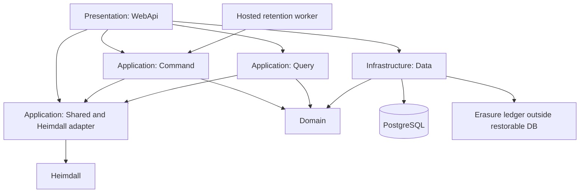

# Operations & Infrastructure Document — Cerberus API

## 1. Introduction

### 1.1 Purpose

Specify the foundation and operational controls without duplicating technologies/versions from
[Technology Stack](Technology%20Stack%20Document.md). Domain permissions and lifecycle rules
remain in [System Requirements](System%20Requirements%20Document.md).

### 1.2 Scope

Layered scaffolding, configuration, persistence, identity adapter, tests, CI, logging, health,
retention and deletion-preserving backup/restore. The foundation is exactly one issue with the
platform requirements below as its Definition of Done. Business retention behavior has its
own use case and is not silently considered implemented by a timer scaffold.

---

## 2. Technical Foundation

### 2.1 Overview

Establish a usable API skeleton and verification pipeline before domain use cases start.
Repository paths are intended scaffolding paths, not claims that source files currently exist.

### 2.2 Solution Architecture



### 2.3 Repository Layout

```text
README.md
docs/
  initial/
  requirements/
src/
  ArturRios.Cerberus.sln
  Domain/ArturRios.Cerberus.Domain/
  Application/ArturRios.Cerberus.Command/
  Application/ArturRios.Cerberus.Query/
  Application/ArturRios.Cerberus.Shared/
  Infrastructure/ArturRios.Cerberus.Data/
  Presentation/ArturRios.Cerberus.WebApi/
tests/
  Domain/ArturRios.Cerberus.Domain.Tests/
  Application/ArturRios.Cerberus.Command.Tests/
  Application/ArturRios.Cerberus.Query.Tests/
  Application/ArturRios.Cerberus.Shared.Tests/
  Infrastructure/ArturRios.Cerberus.Data.Tests/
  Presentation/ArturRios.Cerberus.WebApi.Tests/
.github/workflows/
```

### 2.4 Platform Requirements

| ID | Requirement |
| --- | --- |
| IR-01 | The solution shall create the approved Domain, Command, Query, Shared, Data and WebApi projects in the specified solution layout. |
| IR-02 | The solution shall provide the latest mutually compatible stable dependencies under the Technology Stack policy. |
| IR-03 | The solution shall load nonsecret settings and environment-supplied secrets with explicit precedence. |
| IR-04 | The solution shall configure the approved database provider, migrations, repository abstractions and naming convention. |
| IR-05 | The solution shall bootstrap controlled Heimdall scope, token validation and HTTP adapter contracts without exposing privileged credentials. |
| IR-06 | The solution shall provide a single structured logging pipeline that excludes protected credentials, content bodies and recovery material. |
| IR-07 | The solution shall create mirrored unit and functional test projects using the approved categories and real database fixtures. |
| IR-08 | The solution shall provide CI restore, build, unit, functional, merged-coverage and contract-drift checks. |
| IR-09 | The solution shall provide a release gate for the reviewed E2E, recovery and offline-lease protocol before dependent implementation. |
| IR-10 | The solution shall provide migration/configuration validation and a deployable API artifact for the approved VPS target. |
| IR-11 | The solution shall validate explicit backup/log/sync retention configuration and a durable external-to-database erasure ledger before accepting production traffic. |
| IR-12 | The solution shall provide a tested backup restore procedure that reapplies erasures and verifies current authorization before restoring traffic. |
| IR-13 | The solution shall provide retention-worker infrastructure with idempotent claiming/retry and monitored failures. |
| IR-14 | The solution shall configure safe no-store response behavior and request limits without logging sensitive request bodies. |

---

## 3. Configuration

Use checked-in nonsecret settings and environment-supplied secrets. Later sources override
earlier sources; production secrets never appear in example settings or the repository.

| Concern | Keys / mechanism | Policy |
| --- | --- | --- |
| Database | CERBERUS_DATA_CONNECTIONSTRING; CERBERUS_DATA_DATABASETYPE | Connection secret; provider fixed by approved stack. |
| Heimdall | CERBERUS_HEIMDALL_BASE_URL; CERBERUS_HEIMDALL_SCOPE_ID | Required identity integration; HTTPS outside isolated local tests. |
| Registration identity | CERBERUS_HEIMDALL_SERVICE_CREDENTIAL | Secret; narrowly authorized scope registration only; no fallback to global administration. |
| Token validation | CERBERUS_AUTH_ISSUER; CERBERUS_AUTH_AUDIENCE; configured trusted validation keys | Required; reject unsupported issuer/scope/key or unavailable required revalidation. |
| Offline signing | CERBERUS_OFFLINE_SIGNING_KEY; reviewed key identifier/rotation configuration | Server signing secret; never a vault decryption key. |
| Retention worker | CERBERUS_RETENTION_INTERVAL | Explicit positive representable interval; retries and purge lag monitored. |
| Backup retention | CERBERUS_BACKUP_RETENTION; CERBERUS_BACKUP_PATH | Operator-supplied expiry and protected storage; no unlimited default. |
| Erasure ledger | CERBERUS_ERASURE_LEDGER_PATH | Durable outside restorable database; survives database rollback and is access-controlled. |
| Log retention | CERBERUS_LOG_RETENTION; protected log destination | Explicit documented expiry; no vault payloads or direct identity credentials. |
| Sync retention | CERBERUS_SYNC_RETENTION | Explicit cursor history policy; expired cursors require authorized full resync; terminal deletion defenses remain. |
| Request/page limits | CERBERUS_MAX_REQUEST_BYTES; CERBERUS_MAX_PAGE_SIZE | Explicit finite bounds validated at startup; values selected and load-tested during foundation design. |
| Protocols | Reviewed accepted envelope formats, proof/lease suites and key epochs | Reject unknown formats; cryptographic sizes come from the reviewed suite. |
| Offline user policy | Account persistence, not global deployment environment | 24-hour initial policy; owner-selected positive interval or renewal disabled. |

Fail production startup/readiness on missing mandatory credentials, limits, retention policy or
ledger configuration. No deployment secret values or fabricated retention periods are supplied
by these documents. Required operator values must be chosen before the foundation is approved.

---

## 4. Logging & Monitoring

| Concern | Approach |
| --- | --- |
| Format | Structured events through one logging pipeline with correlation identifiers. |
| Destination | Protected console/file collection on the VPS; documented configured expiry. |
| Events | Request result/error code, dependency failures, authorization denial, retention progress and restore reconciliation. |
| Never logged | Credentials, tokens, unlock/recovery proofs, usable keys, ciphertext bodies, export bodies or plaintext personal details. |
| Metrics | Redacted request failures, dependency state, worker failures/backlog and expiry lag. |
| Diagnostics | Detailed errors and SQL sensitive-data logging remain disabled where protected data could appear. |
| Privacy | Document metadata purposes, operator access and retention; do not label pseudonymous identifiers anonymous automatically. |

Retention failures alert the operator without logging discarded content. Report performance
observations without claiming an unapproved SLO. Avoid external logging/monitoring services;
operator infrastructure does not become an additional application integration.

---

## 5. Health & Monitoring Endpoints

### 5.1 Endpoints

| Endpoint | Purpose | Authorization |
| --- | --- | --- |
| /health/live | Process responds | Public minimal state |
| /health/ready | Database and configured identity integration available | Public minimal state |
| /health/details | Redacted component information | Explicit operational grant |

### 5.2 Response Contract

Public health returns only:

```json
{"status":"healthy"}
```

Readiness uses 200 when ready and 503 when unavailable. The authorized detailed view may add
component names/states and elapsed durations; never credentials, topology secrets or exception
stacks. Liveness does not imply identity/database availability. Health probes use a non-user
dependency probe contract; do not register accounts or attempt user authentication for a probe.

### 5.3 Use Case — UC-55: Check API health

The normative actor, pre/postconditions, main flow and AF rows are defined in
[Use Case Specification](Use%20Case%20Specification%20Document.md#uc-55-check-api-health).
This is one use case and one issue, continuing the domain numbering. Requirements:
FR-OP-01, FR-OP-02, FR-OP-03. The contracts above refine the same use case.

| Field | Value |
| --- | --- |
| **ID** | UC-55 |
| **Name** | Check API health |
| **Actors** | Operator or monitoring client |
| **Description** | Return a minimal 200 or 503 status; return component details only to an authorized operator. |
| **Preconditions** | Process reachable; detailed view additionally requires operational authorization. |
| **Postconditions** | Return a minimal 200 or 503 status; return component details only to an authorized operator. |
| **Requirements** | FR-OP-01, FR-OP-02, FR-OP-03 |

**Main Flow**

1. Request liveness, readiness, or the authenticated detailed health view.
2. Resolve the acting identity/scope and validate the operation-specific input, permissions and current state. Public health and internal worker exceptions follow the authorization matrix.
3. Check process liveness, and for readiness check database availability and configured Heimdall reachability without using user credentials.
4. Return a minimal 200 or 503 status; return component details only to an authorized operator.

**Alternative Flows**

| ID | Condition | Outcome |
| --- | --- | --- |
| AF-01 | Public health request has no identity | Allow only minimal liveness/readiness status. |
| AF-02 | Detailed endpoint actor is unauthenticated or lacks operational privilege | Return 401/403 without component details. |
| AF-03 | Dependency is unavailable | Return readiness 503 with minimal state; liveness remains tied to process state. |

---

## 6. Environments

| Environment | Purpose | Differences |
| --- | --- | --- |
| Local | Development and functional tests | Disposable database containers; controlled Heimdall fixtures; no production identities/secrets. |
| Staging | Integrated release verification | Dedicated test data, real configured Heimdall scope, production-like transport and retention controls. |
| Production | Initial beta on Ubuntu VPS | User-authorized deploy, protected keys/metadata, explicit backup/log retention and tested restore reconciliation. |

Regions, VPS sizing and concrete operator retention values are deployment decisions, not
invented requirements. Before beta, record the lawful purposes, exposed structural metadata,
privacy notice, data-subject request procedure, host/transfer details, recipient deletion
limits and backup erasure policy. The technical specification alone is not evidence of legal
compliance. Primary obligations are in
[LGPD](https://www.planalto.gov.br/ccivil_03/_ato2015-2018/2018/lei/l13709.htm) and
[GDPR](https://eur-lex.europa.eu/eli/reg/2016/679/oj/eng).

---

## 7. Build & Delivery

CI on pushes/PRs restores and builds the solution, runs separate unit/functional steps, merges
coverage and enforces its floor, and validates published API contracts. A failing required
check blocks merge. Use protected `develop` for feature/fix PRs and protected `main` for release PRs,
following the [contribution policy](../../CONTRIBUTING.md). The initial documentation-only
CI validates specifications. After scaffolding, it also runs vulnerability checks,
unit/functional tests, merged coverage enforcement and a Docker build. The required
`deploy/production` check on `main` requires the deployment integration to be provisioned. No scheduled issue labels or due dates are invented.

After approval, package the API with the stable runtime and deploy to the Ubuntu VPS through
the operator's controlled delivery path. Validate configuration, apply migrations through an
explicit deployment step, run health/contract checks, and enable traffic only after they pass.
Production deployment remains a separate authorized action, not implied by writing specs.

Backups contain encrypted vault content and sensitive structural metadata, so encrypt and
access-control the backups independently of E2E. Keep the configured expiry explicit. Record
completed deletion identifiers in a durable protected ledger that a database restore cannot
roll back. A restore remains isolated: restore the database, replay all completed erasures,
reconcile pending deadlines and current authorization, verify purged identifiers remain
unavailable, and only then reopen traffic. Preserve the ledger as well as its tested replay
procedure. Do not treat keys cached in client copies as remotely erasable.

The retention worker claims expired operations idempotently and retries failures. Request-time
deadline checks prevent worker outages from extending restore windows. Registration and
erasure recovery procedures must also cover interrupted cross-system/ledger operations.

---

## 8. Traceability

| Platform capability | Requirements |
| --- | --- |
| Scaffolding and data | IR-01 through IR-04 |
| Identity/configuration | IR-03, IR-05 |
| Logging and tests | IR-06 through IR-08 |
| Protocol release gate | IR-09 |
| Delivery, retention and restore | IR-10 through IR-14 |
| Health | FR-OP-01, FR-OP-02, FR-OP-03; UC-55 |

The single foundation issue owns all IR requirements; do not create an issue per IR. Use-case
issues own functional health, retention, recovery, synchronization and privacy behavior.
Foundational infrastructure provides those modules with tested primitives, not a claim that
every future use case is already delivered.
