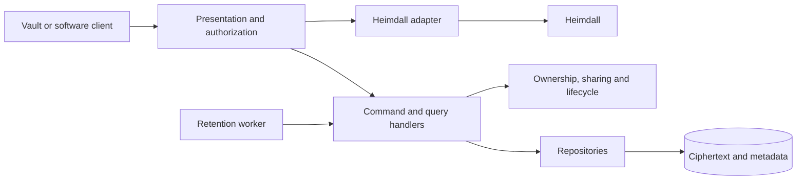
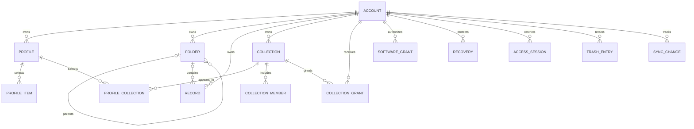
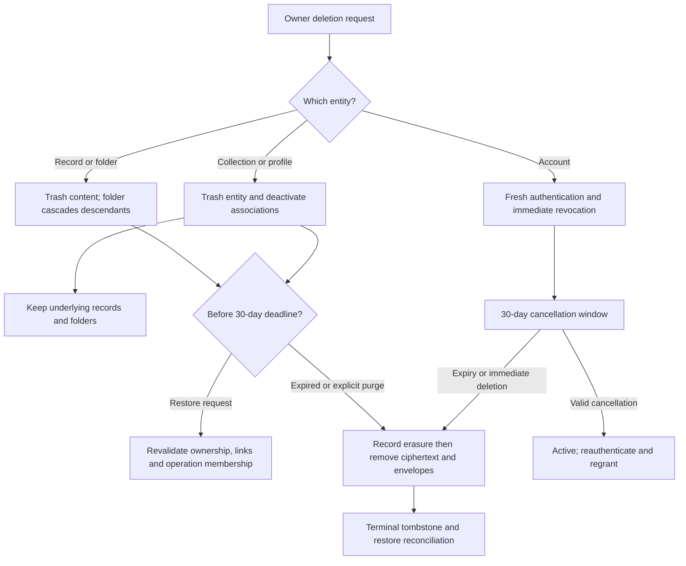

# System Requirements Document — Cerberus API

## 1. Introduction

### 1.1 Purpose

Specify testable functional and non-functional assertions derived from the approved initial
documents and Phase 2 decisions. Technology versions belong only in the
[Technology Stack Document](Technology%20Stack%20Document.md).

### 1.2 Scope

All approved API capabilities; no client implementation. Client obligations are explicitly
identified where encryption, plaintext validation or offline enforcement is outside the API.

### 1.3 Definitions

| Term | Definition |
| --- | --- |
| **Encrypted envelope** | Opaque content plus format identifier, epoch, nonce/tag and authenticated metadata as selected by protocol review. |
| **Public identifier** | GUID used at all external boundaries; internal numeric keys stay private. |
| **Selected profile** | Restriction carried in a vault access session; identity authentication alone does not open another profile. |
| **Effective collection member** | Explicit member or descendant item inherited through a member folder. |
| **Latest edit** | UTC client edit timestamp ordered with a stable persisted server sequence for ties; not guaranteed real-world chronology. |
| **Fresh authentication** | New Heimdall authentication performed for the protected action rather than merely accepting an existing session. |
| **Terminal deletion** | Irreversible state represented by minimal metadata preventing resurrection; content/envelopes are purged. |

---

## 2. System Overview

All HTTP paths below are Cerberus contracts, not claims that matching Heimdall endpoints exist.
Every `{id}` is a public GUID. The acting account is derived from authenticated identity, never
trusted from a caller-supplied owner ID. Online account/grant checks apply on every vault request.
The closure-cancellation path admits only fresh authenticated identity for a pending closure.

Public reads never return internal database IDs. Lists filter before pagination. Unauthorized
cross-account probes return nonrevealing not-found responses. Return 400 for invalid visible
input, 401 for failed authentication/unlock proof, 403 for known denied operations, 404 for
absent/hidden resources, 409 for revision/state conflicts, 410 for expired own trash/cursors
requiring resynchronization, and 503 for unavailable required dependencies. Use stable output
error codes alongside these statuses. All responses containing identity/vault/recovery/export
data carry `Cache-Control: no-store`; do not use conditional-cache validators for such responses.
Empty/read-only results still require authorization. Identity passwords may transit the login
adapter under encrypted transport; vault passwords and usable content keys may not.

---

## 3. Functional Requirements

### 3.1 Identity and accounts (AC)

| ID | Requirement |
| --- | --- |
| FR-AC-01 | The system shall register users through Heimdall without issuing independent identity tokens. |
| FR-AC-02 | The system shall link each Cerberus account to exactly one Heimdall identity. |
| FR-AC-03 | The system shall prevent a second active Cerberus account for the same Heimdall identity. |
| FR-AC-04 | The system shall reconcile retried or partially completed registration without creating duplicate identities or active orphaned accounts. |
| FR-AC-05 | The system shall delegate identity login to Heimdall. |
| FR-AC-06 | The system shall reject tokens for an unrelated scope or inactive Cerberus account. |
| FR-AC-07 | The system shall propagate a required Heimdall authentication challenge without treating it as a completed login. |
| FR-AC-08 | The system shall return the current owner's Cerberus account details independently of Heimdall identity details. |
| FR-AC-09 | The system shall update Cerberus-specific account details without changing the linked Heimdall identity. |
| FR-AC-10 | The system shall delegate identity-detail changes to Heimdall without treating a vault profile as an identity profile. |
| FR-AC-11 | The system shall require fresh authentication before account closure. |
| FR-AC-12 | The system shall revoke account access immediately when closure is requested. |
| FR-AC-13 | The system shall allow cancellation of account closure within 30 days. |
| FR-AC-14 | The system shall cancel pending account closure before its deadline through a restricted freshly authenticated recovery path. |
| FR-AC-15 | The system shall offer immediate permanent deletion of a Cerberus account. |
| FR-AC-16 | The system shall remove Cerberus-owned account data and grants during permanent account deletion. |
| FR-AC-17 | The system shall retain the linked Heimdall identity when deleting a Cerberus account. |
| FR-AC-18 | The system shall reapply completed account erasures after restoring backups. |

### 3.2 Vault profiles (PR)

| ID | Requirement |
| --- | --- |
| FR-PR-01 | The system shall create an account-owned profile from a valid encrypted envelope. |
| FR-PR-02 | The system shall list permitted active profiles without disclosing unrelated account data. |
| FR-PR-03 | The system shall retrieve an accessible profile by its public identifier. |
| FR-PR-04 | The system shall update an accessible profile under its write permission. |
| FR-PR-05 | The system shall trash an owned profile for 30 days before permanent deletion. |
| FR-PR-06 | The system shall preserve contained folders and records when deleting a collection or profile. |
| FR-PR-07 | The system shall associate a folder or record with multiple profiles inside its owning account. |
| FR-PR-08 | The system shall associate an account-owned collection with multiple profiles. |
| FR-PR-09 | The system shall allow a recipient to associate an accessible shared collection with their own profiles. |
| FR-PR-10 | The system shall restrict a selected profile-access session to that profile's permitted content. |
| FR-PR-11 | The system shall support a master vault password or distinct profile passwords through client-held keys and separate unlock proofs. |

### 3.3 Records (RC)

| ID | Requirement |
| --- | --- |
| FR-RC-01 | The system shall create an account-owned record from a valid encrypted envelope. |
| FR-RC-02 | The system shall list permitted active records without disclosing unrelated account data. |
| FR-RC-03 | The system shall retrieve an accessible record by its public identifier. |
| FR-RC-04 | The system shall update an accessible record under its write permission. |
| FR-RC-05 | The system shall trash an owned record for 30 days before permanent deletion. |
| FR-RC-06 | The system shall assign a record to zero or one folder inside its owning account. |
| FR-RC-07 | The system shall allow immediate permanent deletion of an owned record. |
| FR-RC-08 | The system shall prevent permanently deleted record identifiers from being resurrected by synchronization or backup restoration. |

### 3.4 Folders (FD)

| ID | Requirement |
| --- | --- |
| FR-FD-01 | The system shall create an account-owned folder from a valid encrypted envelope. |
| FR-FD-02 | The system shall list permitted active folders without disclosing unrelated account data. |
| FR-FD-03 | The system shall retrieve an accessible folder by its public identifier. |
| FR-FD-04 | The system shall update an accessible folder under its write permission. |
| FR-FD-05 | The system shall trash an owned folder for 30 days before permanent deletion. |
| FR-FD-06 | The system shall cascade folder deletion to descendant folders and contained records. |
| FR-FD-07 | The system shall support nested folders with zero or one same-account parent. |
| FR-FD-08 | The system shall reject a folder-parent change that creates a cycle. |

### 3.5 Collections (CL)

| ID | Requirement |
| --- | --- |
| FR-CL-01 | The system shall create an account-owned collection from a valid encrypted envelope. |
| FR-CL-02 | The system shall list permitted active collections without disclosing unrelated account data. |
| FR-CL-03 | The system shall retrieve an accessible collection by its public identifier. |
| FR-CL-04 | The system shall update an accessible collection under its write permission. |
| FR-CL-05 | The system shall trash an owned collection for 30 days before permanent deletion. |
| FR-CL-06 | The system shall preserve contained folders and records when deleting a collection or profile. |
| FR-CL-07 | The system shall include a record or folder in multiple collections. |
| FR-CL-08 | The system shall include descendants of a folder shared through a collection. |
| FR-CL-09 | The system shall restrict collection membership changes to the collection owner. |

### 3.6 Collection sharing (SH)

| ID | Requirement |
| --- | --- |
| FR-SH-01 | The system shall share a collection between accounts through an explicit read-only or read/write grant. |
| FR-SH-02 | The system shall keep collection sharing administration restricted to the collection owner. |
| FR-SH-03 | The system shall avoid transferring entity ownership when collection access is granted. |
| FR-SH-04 | The system shall allow the collection owner to change a recipient's read-only or read/write permission. |
| FR-SH-05 | The system shall prevent a read-only recipient from modifying shared content. |
| FR-SH-06 | The system shall revoke collection access on subsequent online requests. |
| FR-SH-07 | The system shall publish sharing revocations for enforcement on client reconnection. |
| FR-SH-08 | The system shall exclude revoked recipients from replacement key envelopes. |

### 3.7 Vault protection and recovery (KY)

| ID | Requirement |
| --- | --- |
| FR-KY-01 | The system shall store vault key material only in client-encrypted envelopes. |
| FR-KY-02 | The system shall require a versioned encrypted payload and key-envelope contract. |
| FR-KY-03 | The system shall require the client record contract to include a name. |
| FR-KY-04 | The system shall support text, numeric, boolean, and hidden-text fields inside encrypted record payloads. |
| FR-KY-05 | The system shall require clients using a template to enforce that template's required fields. |
| FR-KY-06 | The system shall change vault or profile protection without sending raw vault passwords or usable decryption keys to the API. |
| FR-KY-07 | The system shall commit wrapped-key changes atomically with the corresponding content/key epoch. |
| FR-KY-08 | The system shall allow exactly one committed recovery for a current recovery credential. |
| FR-KY-09 | The system shall replace the recovery credential after successful recovery. |
| FR-KY-10 | The system shall separate server-verifiable recovery proofs from client decryption secrets. |
| FR-KY-11 | The system shall allow an authorized owner to refresh their recovery credential at any time. |
| FR-KY-12 | The system shall reject a superseded credential on future recovery requests. |
| FR-KY-13 | The system shall require encrypted transport for client/API and API/Heimdall communication. |

### 3.8 Software secret access (SW)

| ID | Requirement |
| --- | --- |
| FR-SW-01 | The system shall create an explicit read-only grant for a Heimdall software identity. |
| FR-SW-02 | The system shall require client-side decryption-key provisioning for granted software access. |
| FR-SW-03 | The system shall return only granted ciphertext to an authenticated software consumer. |
| FR-SW-04 | The system shall avoid granting decryption capability solely because software authenticated. |
| FR-SW-05 | The system shall revoke software grants on subsequent retrieval requests. |

### 3.9 Offline policy and synchronization (SY)

| ID | Requirement |
| --- | --- |
| FR-SY-01 | The system shall default periodic offline authorization renewal to 24 hours. |
| FR-SY-02 | The system shall allow the account owner to change the required offline renewal interval. |
| FR-SY-03 | The system shall allow the account owner to disable periodic offline renewal. |
| FR-SY-04 | The system shall issue offline authorizations scoped to current permitted profile content. |
| FR-SY-05 | The system shall require compliant clients to lock offline access on enabled renewal expiry until online renewal succeeds. |
| FR-SY-06 | The system shall require compliant clients to enforce discovered revocations on reconnection. |
| FR-SY-07 | The system shall require online-only and web clients to avoid persistent vault storage or caching. |
| FR-SY-08 | The system shall return incremental permitted changes through an opaque synchronization cursor. |
| FR-SY-09 | The system shall include access removals and permanent-deletion tombstones in synchronization. |
| FR-SY-10 | The system shall avoid returning revoked ciphertext merely because it appears in an older change page. |
| FR-SY-11 | The system shall resolve offline edit conflicts by the client edit timestamp. |
| FR-SY-12 | The system shall break equal edit timestamps deterministically with a persisted monotonic server sequence. |
| FR-SY-13 | The system shall reject offline edits that would resurrect a permanently deleted identifier. |
| FR-SY-14 | The system shall make repeated synchronization operations idempotent. |

### 3.10 Trash and retention (TR)

| ID | Requirement |
| --- | --- |
| FR-TR-01 | The system shall list owner-visible trashed records, folders, collections, and profiles with their expiry. |
| FR-TR-02 | The system shall restore an owner's trash entry before its 30-day deadline. |
| FR-TR-03 | The system shall restore a folder deletion's retained cascade without restoring independently deleted records. |
| FR-TR-04 | The system shall revalidate associations when restoring a collection or profile. |
| FR-TR-05 | The system shall allow an owner to empty their trash permanently at any time. |
| FR-TR-06 | The system shall permanently delete trash entries after the 30-day retention window. |
| FR-TR-07 | The system shall permanently delete uncancelled accounts after their 30-day closure window. |
| FR-TR-08 | The system shall retry interrupted deletion work without reviving expired data. |

### 3.11 Privacy portability (PV)

| ID | Requirement |
| --- | --- |
| FR-PV-01 | The system shall provide an authenticated export of the owner's Cerberus data. |
| FR-PV-02 | The system shall exclude unrelated account data from privacy exports. |

### 3.12 Operational health (OP)

| ID | Requirement |
| --- | --- |
| FR-OP-01 | The system shall expose a minimal process liveness endpoint. |
| FR-OP-02 | The system shall expose readiness that reports database and configured Heimdall dependency availability. |
| FR-OP-03 | The system shall restrict detailed health information to an explicitly authorized operator. |

---

## 4. Data Model

### 4.0 Identifier Strategy

Use generated internal bigint keys and external GUIDs as in Heimdall. A client may choose a
new public GUID for an offline-created entity; the server atomically enforces uniqueness and
keeps terminal identifier tombstones. Join rows use internal composite keys. Public GUIDs are
identifiers, not authorization credentials. Ownership foreign keys never come from trusted
request input. Cryptographic authenticated metadata binds content to the intended owner,
resource identifier, format and key epoch under the reviewed protocol.

### 4.1 Entity Relationship Diagram

### 4.2 Common owned entity Fields

| Field | Type | Constraints | Description |
| --- | --- | --- | --- |
| Id | bigint | Generated internal primary key | Never exposed in the API. |
| PublicId | GUID | Required, unique; generated by client for offline creates or server online | External identifier; reserved permanently after deletion. |
| AccountId | bigint | Required internal foreign key | Immutable owning account. |
| Envelope | binary + visible format metadata | Required for content-bearing entities | Encrypted name/details/content; API cannot inspect plaintext. |
| Revision | bigint | Required, increasing | Concurrency and sync revision. |
| EditedAt | UTC timestamp | Required | Client edit timestamp for content changes. |
| ServerSequence | bigint | Required, monotonic | Stable synchronization/timestamp tie-break order. |
| DeletedAt / PurgeAt | nullable UTC timestamps | Both set for trash | Recoverable deletion state; deadline checked on reads/restores. |

### 4.3 Account Fields

| Field | Type | Constraints | Description |
| --- | --- | --- | --- |
| HeimdallPublicId | GUID | Required, unique identity binding | External human identity identifier; not a Cerberus profile. |
| State | enum | Active or ClosurePending | Purged accounts are removed. |
| DetailsEnvelope | binary envelope | Required; optional details inside | Optional display name and other user-provided details remain encrypted. |
| ClosureRequestedAt / ClosurePurgeAt | nullable UTC timestamps | Required only when closing | 30-day cancellation deadline. |
| RenewalEnabled | boolean | Required; initially true | Owner may disable periodic offline renewal. |
| RenewalInterval | positive representable duration or null | Initially 24 hours; required if enabled | Disabled is explicit, not zero or accidental overflow. |
| PolicyRevision / RevocationGeneration | bigint | Required, increasing | Invalidate/reconcile access policy and grants. |

### 4.4 Profile Fields

| Field | Type | Constraints | Description |
| --- | --- | --- | --- |
| NameEnvelope | encrypted payload member | Required client-side, not unique | Opaque required-name contract. |
| UnlockMode | enum | Master or PerProfile | Client-controlled password wrapper selection. |
| KeyWrappers | encrypted envelopes | Required for configured protection | No server-usable decryption key. |

### 4.5 Folder Fields

| Field | Type | Constraints | Description |
| --- | --- | --- | --- |
| ParentFolderId | nullable bigint | Same owner; no cycles | Zero or one parent. |
| NameEnvelope | encrypted payload member | Required client-side, not unique | Folder label stays encrypted. |

### 4.6 Record Fields

| Field | Type | Constraints | Description |
| --- | --- | --- | --- |
| FolderId | nullable bigint | Same owner | Zero or one parent folder. |
| Name | encrypted string in Envelope | Required by client; not unique | Only universal content field requirement. |
| Fields | encrypted key/value array | User-defined | Text, numeric, boolean or hidden text; keys/values stay encrypted. |
| TemplateDescriptor | optional encrypted payload member | No server template CRUD | Caller enforces selected template mandatory fields. |

### 4.7 Collection Fields

| Field | Type | Constraints | Description |
| --- | --- | --- | --- |
| NameEnvelope | encrypted payload member | Required client-side, not unique | Owned grouping with optional sharing. |
| KeyEpoch | opaque identifier | Required for shared envelopes | Client-managed key epoch; not a secret. |

### 4.8 Association rows Fields

| Field | Type | Constraints | Description |
| --- | --- | --- | --- |
| ProfileItem | ProfileId + typed RecordId/FolderId | Unique tuple; direct targets same owner | Many profiles per item. |
| ProfileCollection | ProfileId + CollectionId | Unique tuple; ownership or active recipient grant | Own or accessible shared collections in recipient profiles. |
| CollectionMember | CollectionId + typed RecordId/FolderId | Unique tuple; targets owned by collection owner | Includes folder descendants dynamically; cycles remain forbidden. |

### 4.9 CollectionGrant Fields

| Field | Type | Constraints | Description |
| --- | --- | --- | --- |
| PublicId | GUID | Required and unique | Grant resource identifier. |
| CollectionId / RecipientAccountId | bigint foreign keys | Required; unique current collection/recipient binding | Original owner remains unchanged. |
| Access | enum | ReadOnly or ReadWrite | No delete/membership/sharing right for recipients. |
| State / Revision | enum + bigint | Active or Revoked; increasing | Current online permission decision. |
| RecipientKeyEnvelopes | binary envelopes + key epoch | Required before access becomes active | Keys wrapped only for the entitled client identity. |

### 4.10 SoftwareGrant Fields

| Field | Type | Constraints | Description |
| --- | --- | --- | --- |
| PublicId / AccountId | GUID + bigint | Required | Owner-controlled grant. |
| HeimdallSoftwarePublicId | GUID | Required | External non-human identity. |
| Targets | record/collection associations | Required, explicit | Read-only authorized scope. |
| State / KeyEnvelopes | enum + opaque envelopes | Active/Revoked and valid recipient binding | No plaintext service-secret endpoint. |

### 4.11 Protection and recovery Fields

| Field | Type | Constraints | Description |
| --- | --- | --- | --- |
| ProtectionRevision | bigint | Required, increasing | Atomic protection changes. |
| KeyEnvelopes / PublicKeys | opaque binary envelopes + public keys | Required per approved protocol | Recipient-key identity binding reviewed before implementation. |
| RecoveryVerifier | opaque verifier | Required for a current credential | Verifier cannot derive client decryption secret. |
| RecoveryEnvelope | binary envelope | Required | Client-encrypted recovery key material. |
| RecoveryState / Generation | enum + bigint | Current, Consumed or Superseded | One committed use; replacement in same transaction. |

### 4.12 AccessSession and offline lease Fields

| Field | Type | Constraints | Description |
| --- | --- | --- | --- |
| HandleVerifier / AccountId / ProfileId | opaque verifier + internal keys | Required selected scope | Opaque online access handle, distinct from identity bearer. |
| IssuedAt / ExpiresAt | UTC + nullable UTC | Expiry required when renewal enabled | Explicit no-periodic-expiry when disabled. |
| PolicyRevision / RevocationGeneration | bigint | Required | Client compares on reconnection. |
| Signature / PermittedScope | binary + public identifiers | Required for offline lease | Signature suite selected by crypto review; no vault secret. |

### 4.13 Trash, synchronization and erasure metadata Fields

| Field | Type | Constraints | Description |
| --- | --- | --- | --- |
| TrashEntry | operation GUID + entity type/id + timestamps | Required 30-day expiry | Retain associations/cascade membership for valid restore. |
| SyncChange | sequence + public identifier + event type | Monotonic cursor source | Changes, visibility removals and minimal terminal tombstones. |
| SyncOperation | account + stable client operation identifier | Unique | Repeated submissions are idempotent. |
| RegistrationOperation | idempotency key + identity binding + execution state | Unique request binding; no retained login credentials | Persist before upstream creation and reconcile partial completion before activating an account. |
| ErasureLedger | minimal deleted identifiers + deletion time | Durable outside the restorable database | Replayed before restored data becomes accessible; no vault payload. |

Names are required under the client payload contract but cannot be inspected by the API.
Encrypted field keys and values are not relational plaintext columns. Payload/request limits,
KDF parameters and binary envelope lengths come from the reviewed protocol and deployment
configuration; do not invent field limits or decrypt for server-side validation. Server-side
search can filter permitted metadata; plaintext name/content search is a client responsibility.
Minimal tombstones and the erasure ledger contain no retained record content; their retention
and identifier treatment must be justified by the deployment privacy policy.

---

## 5. API Endpoints Overview

### 5.1 Identity and accounts Endpoints

| Method | Path / trigger | Operation | Requirements |
| --- | --- | --- | --- |
| POST | `/api/accounts` | UC-01 Register account | FR-AC-01, FR-AC-02, FR-AC-03, FR-AC-04 |
| POST | `/api/auth/login` | UC-02 Authenticate | FR-AC-05, FR-AC-06, FR-AC-07 |
| GET | `/api/accounts/me` | UC-03 Get account | FR-AC-08 |
| PUT | `/api/accounts/me` | UC-04 Update account | FR-AC-09 |
| PUT | `/api/identity/me` | UC-05 Update identity details | FR-AC-10 |
| POST | `/api/accounts/me/closure` | UC-06 Request account closure | FR-AC-11, FR-AC-12, FR-AC-13 |
| POST | `/api/accounts/me/closure/cancel` | UC-07 Cancel account closure | FR-AC-14 |
| DELETE | `/api/accounts/me/permanent` | UC-08 Permanently delete account | FR-AC-15, FR-AC-16, FR-AC-17, FR-AC-18 |

### 5.2 Vault profiles Endpoints

| Method | Path / trigger | Operation | Requirements |
| --- | --- | --- | --- |
| POST | `/api/profiles` | UC-09 Create profile | FR-PR-01 |
| GET | `/api/profiles` | UC-10 List profiles | FR-PR-02 |
| GET | `/api/profiles/{id}` | UC-11 Get profile | FR-PR-03 |
| PUT | `/api/profiles/{id}` | UC-12 Update profile | FR-PR-04 |
| DELETE | `/api/profiles/{id}` | UC-13 Delete profile | FR-PR-05, FR-PR-06 |
| PUT | `/api/profiles/{id}/associations` | UC-14 Set profile associations | FR-PR-07, FR-PR-08, FR-PR-09 |
| POST | `/api/profiles/{id}/access` | UC-15 Open profile access | FR-PR-10, FR-PR-11 |

### 5.3 Records Endpoints

| Method | Path / trigger | Operation | Requirements |
| --- | --- | --- | --- |
| POST | `/api/records` | UC-16 Create record | FR-RC-01 |
| GET | `/api/records` | UC-17 List records | FR-RC-02 |
| GET | `/api/records/{id}` | UC-18 Get record | FR-RC-03 |
| PUT | `/api/records/{id}` | UC-19 Update record | FR-RC-04 |
| DELETE | `/api/records/{id}` | UC-20 Delete record | FR-RC-05 |
| PUT | `/api/records/{id}/folder` | UC-21 Move record | FR-RC-06 |
| DELETE | `/api/records/{id}/permanent` | UC-22 Permanently delete record | FR-RC-07, FR-RC-08 |

### 5.4 Folders Endpoints

| Method | Path / trigger | Operation | Requirements |
| --- | --- | --- | --- |
| POST | `/api/folders` | UC-23 Create folder | FR-FD-01 |
| GET | `/api/folders` | UC-24 List folders | FR-FD-02 |
| GET | `/api/folders/{id}` | UC-25 Get folder | FR-FD-03 |
| PUT | `/api/folders/{id}` | UC-26 Update folder | FR-FD-04 |
| DELETE | `/api/folders/{id}` | UC-27 Delete folder | FR-FD-05, FR-FD-06 |
| PUT | `/api/folders/{id}/parent` | UC-28 Move folder | FR-FD-07, FR-FD-08 |

### 5.5 Collections Endpoints

| Method | Path / trigger | Operation | Requirements |
| --- | --- | --- | --- |
| POST | `/api/collections` | UC-29 Create collection | FR-CL-01 |
| GET | `/api/collections` | UC-30 List collections | FR-CL-02 |
| GET | `/api/collections/{id}` | UC-31 Get collection | FR-CL-03 |
| PUT | `/api/collections/{id}` | UC-32 Update collection | FR-CL-04 |
| DELETE | `/api/collections/{id}` | UC-33 Delete collection | FR-CL-05, FR-CL-06 |
| PUT | `/api/collections/{id}/members` | UC-34 Set collection membership | FR-CL-07, FR-CL-08, FR-CL-09 |

### 5.6 Collection sharing Endpoints

| Method | Path / trigger | Operation | Requirements |
| --- | --- | --- | --- |
| POST | `/api/collections/{id}/grants` | UC-35 Grant collection access | FR-SH-01, FR-SH-02, FR-SH-03 |
| PUT | `/api/collections/{id}/grants/{grantId}` | UC-36 Change collection access | FR-SH-04, FR-SH-05 |
| DELETE | `/api/collections/{id}/grants/{grantId}` | UC-37 Revoke collection access | FR-SH-06, FR-SH-07, FR-SH-08 |

### 5.7 Vault protection and recovery Endpoints

| Method | Path / trigger | Operation | Requirements |
| --- | --- | --- | --- |
| POST | `/api/vault/protection` | UC-38 Initialize vault protection | FR-KY-01, FR-KY-02, FR-KY-03, FR-KY-04, FR-KY-05, FR-KY-13 |
| PUT | `/api/vault/protection` | UC-39 Change vault protection | FR-KY-06, FR-KY-07 |
| POST | `/api/vault/recovery` | UC-40 Recover vault access | FR-KY-08, FR-KY-09, FR-KY-10 |
| PUT | `/api/vault/recovery` | UC-41 Refresh recovery key | FR-KY-11, FR-KY-12 |

### 5.8 Software secret access Endpoints

| Method | Path / trigger | Operation | Requirements |
| --- | --- | --- | --- |
| POST | `/api/software-grants` | UC-42 Grant software access | FR-SW-01, FR-SW-02 |
| GET | `/api/software-secrets` | UC-43 Retrieve software secrets | FR-SW-03, FR-SW-04 |
| DELETE | `/api/software-grants/{id}` | UC-44 Revoke software access | FR-SW-05 |

### 5.9 Offline policy and synchronization Endpoints

| Method | Path / trigger | Operation | Requirements |
| --- | --- | --- | --- |
| GET | `/api/accounts/me/offline-policy` | UC-45 Get offline policy | FR-SY-01 |
| PUT | `/api/accounts/me/offline-policy` | UC-46 Set offline policy | FR-SY-02, FR-SY-03 |
| POST | `/api/offline-authorizations` | UC-47 Renew offline authorization | FR-SY-04, FR-SY-05, FR-SY-06, FR-SY-07 |
| GET | `/api/sync/changes` | UC-48 Download synchronization changes | FR-SY-08, FR-SY-09, FR-SY-10 |
| POST | `/api/sync/edits` | UC-49 Upload offline edits | FR-SY-11, FR-SY-12, FR-SY-13, FR-SY-14 |

### 5.10 Trash and retention Endpoints

| Method | Path / trigger | Operation | Requirements |
| --- | --- | --- | --- |
| GET | `/api/trash` | UC-50 List trash | FR-TR-01 |
| POST | `/api/trash/{id}/restore` | UC-51 Restore trash entry | FR-TR-02, FR-TR-03, FR-TR-04 |
| DELETE | `/api/trash` | UC-52 Empty trash | FR-TR-05 |
| SCHEDULE | `Internal retention worker` | UC-53 Expire retained deletions | FR-TR-06, FR-TR-07, FR-TR-08 |

### 5.11 Privacy portability Endpoints

| Method | Path / trigger | Operation | Requirements |
| --- | --- | --- | --- |
| POST | `/api/accounts/me/export` | UC-54 Export account data | FR-PV-01, FR-PV-02 |

### 5.12 Operational health Endpoints

| Method | Path / trigger | Operation | Requirements |
| --- | --- | --- | --- |
| GET | `/health/live and /health/ready` | UC-55 Check API health | FR-OP-01, FR-OP-02, FR-OP-03 |

Additional steps within the authentication/recovery/health use cases:

| Method | Path | Purpose | Use case |
| --- | --- | --- | --- |
| POST | /api/auth/2fa/verify | Forward completion of a Heimdall login challenge | UC-02 |
| GET | /api/vault/recovery-material | Freshly authenticated access to opaque recovery envelopes; does not consume the recovery credential | UC-40 |
| GET | /health/details | Operator-only detailed components | UC-55 |

List/synchronization pagination uses a bounded page size and opaque continuation cursor; bounds
are configured and validated at deployment. Mutations that touch key access and membership
commit together. A stale online expected revision returns 409; offline uploads instead return
the documented per-item latest-edit outcomes. Registration and completed recovery support
stable idempotency keys without exposing credentials through their result-status responses.
An initial changes request without a cursor supplies an authorized snapshot with a stable
continuation boundary; cursor-expiry recovery uses that same flow. Every continuation page
rechecks current permissions, and clients apply visibility removals before accepting new data.

Heimdall adapters use its inspected login, challenge, person and application contracts.
Human registration requires a constrained Cerberus-scope service identity authorized to create
persons; deploy without that privilege only if onboarding is restricted to already provisioned
identities. Do not forward arbitrary scope/admin operations or expose service credentials.
Contract fixtures must verify issuer/audience/scope, identity mapping, challenge handling and
upstream errors before release. An unavailable upstream fails closed; it does not authorize
new access from an unchecked local cache.

---

## 6. Non-Functional Requirements

| ID | Category | Requirement |
| --- | --- | --- |
| NFR-01 | Security | The system shall accept only opaque encrypted-envelope contracts for persisted vault content, without plaintext content fields or usable decryption keys. |
| NFR-02 | Transport | The system shall encrypt client/API and API/Heimdall communication. |
| NFR-03 | Confidentiality | The system shall exclude identity credentials, recovery proofs, tokens, plaintext secrets and encrypted payload bodies from logs. |
| NFR-04 | Caching | The system shall return no-store directives on identity, vault, key, synchronization and export responses. |
| NFR-05 | Isolation | The system shall enforce ownership and active grants before data retrieval, pagination and writes. |
| NFR-06 | Concurrency | The system shall atomically guard recovery consumption, association replacement and deletion/restore races. |
| NFR-07 | Determinism | The system shall preserve a stable timestamp/sequence ordering across synchronization retries. |
| NFR-08 | Erasure | The system shall keep terminally deleted data inaccessible during purge retries and after backup restoration. |
| NFR-09 | Quality | The system shall meet the approved merged line-coverage floor of 90% and report branch coverage. |
| NFR-10 | Privacy | The system shall document purposes, metadata exposure, data-subject procedures, retention and recipient/backup deletion behavior before beta release. |
| NFR-11 | Protocol | The system shall block encryption/recovery implementation until the versioned protocol passes the approved security and client-interoperability review. |
| NFR-12 | Operability | The system shall provide redacted health/diagnostic results without revealing connection credentials or vault contents. |

Development exception authorized by the owner on 2026-10-08: defer NFR-11's independent
review prerequisite while implementing the open backlog into `develop`. The approval
manifest remains pending and release validation still requires actual review. The exact
scope and instruction are recorded in [development review deferral](../security/development-review-deferral.json).

No numerical latency, throughput or availability thresholds are defined for the beta by the
approved decision. Measure them without treating invented numbers as acceptance criteria.
Retention intervals beyond the product's 30-day deletion windows are explicit operator inputs
requiring documented justification, not silent unlimited defaults. Protocol algorithms and
precise binary layouts are explicitly deferred to the preimplementation security review.

---

## 7. Authorization Matrix

| Operation | Owner | Read-only recipient | Read/write recipient | Software | Operator |
| --- | --- | --- | --- | --- | --- |
| Own account/profile management | Allowed | Denied | Denied | Denied | Denied |
| Read selected owned content | Allowed with vault access | Denied unless shared | Denied unless shared | Explicit grant only | Denied |
| Read shared collection content | Allowed | Active grant | Active grant | Explicit grant only | Denied |
| Edit existing shared records/folders | Allowed | Denied | Active grant and selected scope | Denied | Denied |
| Create/delete owned resources | Allowed | Denied | Denied for another owner | Denied | Denied |
| Change parent/membership/sharing | Target owner only | Denied | Denied | Denied | Denied |
| Attach accessible collection to own profile | Allowed | Own profile + active grant | Own profile + active grant | Denied | Denied |
| Recovery/protection/offline policy | Account owner only | Denied | Denied | Denied | Denied |
| Close/purge/export account | Fresh authentication | Denied | Denied | Denied | No vault-user impersonation |
| Detailed health/restore maintenance | Operational grant only | Denied | Denied | Operational grant only | Allowed with operational grant |

Public liveness/readiness require no vault identity and reveal only minimal status. Registration
and login are identity entry points. Closure cancellation requires fresh valid identity and a
still-pending account, not an active vault session. The internal retention worker has narrowly
scoped system execution rights and never has plaintext decryption capability.

---

## 8. Deletion and Lifecycle Strategy

Folder trash cascades through nested folders to contained records, even when a record also
appears elsewhere. Collection/profile deletion does not trash those items; retain a restricted
association snapshot for valid restoration while active associations are removed. Collection
deletion revokes grants; restoration does not silently revive them. Restore a folder operation
only for entities that operation trashed, never previously trashed records. Expired entries
are inaccessible immediately even if the worker retries their physical purge later.

Account deletion purges owner-owned items shared with recipients and removes incoming/outgoing
grants, while other owners' shared content survives. Pending closure cancellation cannot reuse
old sessions/grants. Heimdall identity survives Cerberus erasure. All deletion completions are
reconciled on backup restore before user traffic resumes. Client copies are subject to the
documented client contract and cannot be forcibly recalled once copied.

---

## 9. Traceability

### 9.1 Feature and area mapping

| Feature | Area | Requirements |
| --- | --- | --- |
| F-01 Identity and accounts | AC | FR-AC-01 through FR-AC-18 |
| F-02 Vault profiles | PR | FR-PR-01 through FR-PR-11 |
| F-03 Records | RC | FR-RC-01 through FR-RC-08 |
| F-04 Folders | FD | FR-FD-01 through FR-FD-08 |
| F-05 Collections | CL | FR-CL-01 through FR-CL-09 |
| F-06 Collection sharing | SH | FR-SH-01 through FR-SH-08 |
| F-07 Vault protection and recovery | KY | FR-KY-01 through FR-KY-13 |
| F-08 Software secret access | SW | FR-SW-01 through FR-SW-05 |
| F-09 Offline policy and synchronization | SY | FR-SY-01 through FR-SY-14 |
| F-10 Trash and retention | TR | FR-TR-01 through FR-TR-08 |
| F-11 Privacy portability | PV | FR-PV-01 through FR-PV-02 |
| F-12 Operational health | OP | FR-OP-01 through FR-OP-03 |

### 9.2 Business rules

| Business Rule | Realized by |
| --- | --- |
| BR-01 | FR-AC-02, FR-AC-03 |
| BR-02 | FR-AC-01, FR-AC-05, FR-AC-10 |
| BR-03 | FR-AC-08, FR-AC-10, FR-PR-01, FR-PR-10 |
| BR-04 | FR-PR-07 |
| BR-05 | FR-CL-01, FR-PR-08 |
| BR-06 | FR-CL-07 |
| BR-07 | FR-FD-07, FR-FD-08, FR-RC-06 |
| BR-08 | FR-KY-03, FR-KY-04, FR-RC-01 |
| BR-09 | FR-KY-05 |
| BR-10 | FR-KY-01, FR-KY-02, FR-KY-06, FR-KY-07, FR-KY-10, FR-SW-02, FR-SW-03 |
| BR-11 | FR-KY-13 |
| BR-12 | FR-KY-06, FR-PR-11 |
| BR-13 | FR-KY-08, FR-KY-09 |
| BR-14 | FR-KY-11, FR-KY-12 |
| BR-15 | FR-SW-01, FR-SW-02, FR-SW-03, FR-SW-04, FR-SW-05 |
| BR-16 | FR-SY-01, FR-SY-02, FR-SY-03 |
| BR-17 | FR-SH-06, FR-SH-07, FR-SY-05, FR-SY-06 |
| BR-18 | FR-SY-11, FR-SY-12 |
| BR-19 | FR-SY-07 |
| BR-20 | FR-CL-05, FR-FD-05, FR-PR-05, FR-RC-05, FR-TR-02, FR-TR-06 |
| BR-21 | FR-RC-07, FR-TR-05 |
| BR-22 | FR-FD-06, FR-TR-03 |
| BR-23 | FR-CL-06, FR-PR-06, FR-TR-04 |
| BR-24 | FR-AC-11, FR-AC-12, FR-AC-13, FR-AC-14, FR-TR-07 |
| BR-25 | FR-AC-15, FR-AC-16, FR-AC-17 |
| BR-26 | FR-AC-18, FR-RC-08, FR-SY-13 |
| BR-27 | FR-CL-09, FR-SH-01, FR-SH-02, FR-SH-04, FR-SH-05 |
| BR-28 | FR-PR-09, FR-PV-02, FR-SH-03, FR-SW-04 |
| BR-29 | FR-AC-15, FR-AC-18, FR-PV-01 |

Use-case coverage is enumerated in [Use Case Specification](Use%20Case%20Specification%20Document.md).
Platform requirements and release controls are in
[Operations & Infrastructure](Operations%20%26%20Infrastructure%20Document.md).
