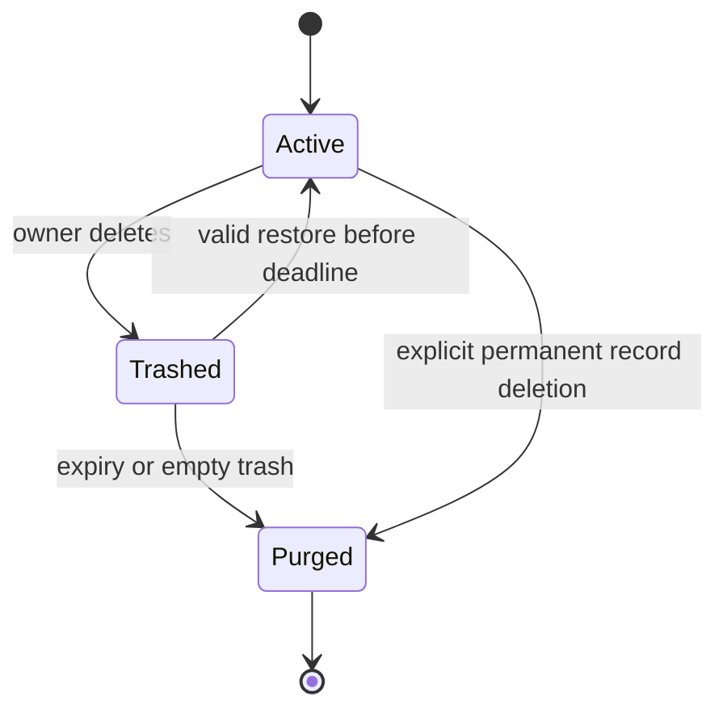
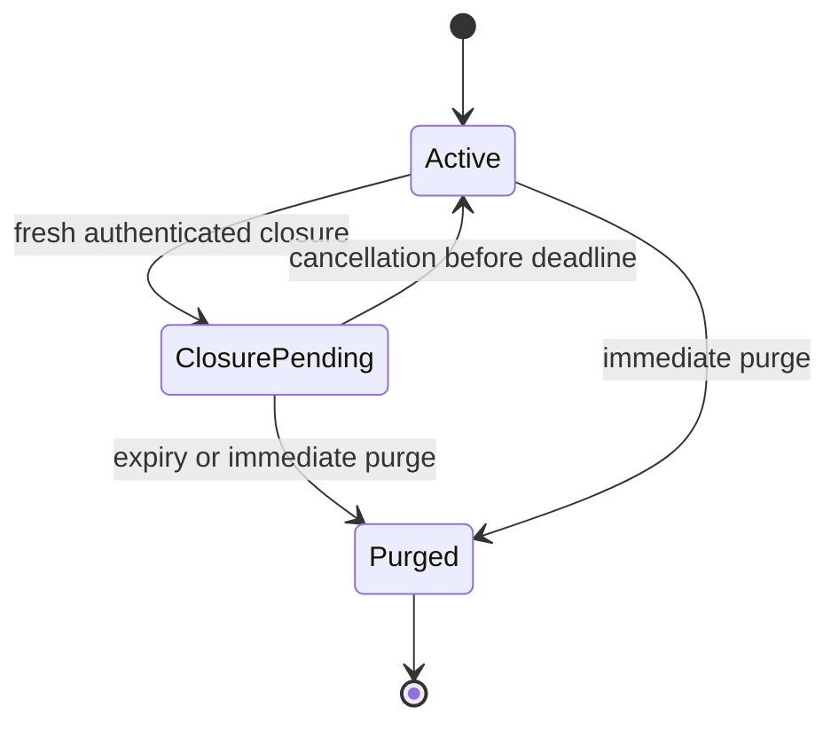
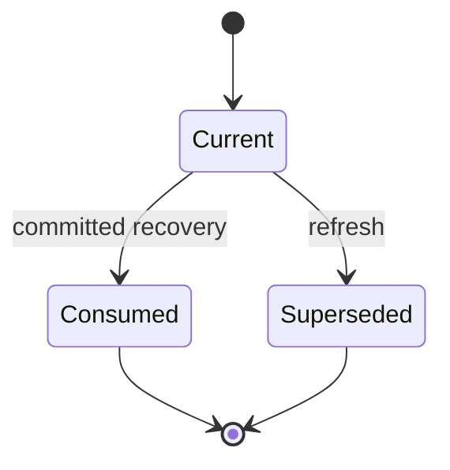

# Use Case Specification Document — Cerberus API

## 1. Introduction

### 1.1 Purpose

Specify one user-visible operation per use case, its pre/postconditions, main flow and failure
behavior. Public identifiers are GUIDs; internal database IDs never appear in client flows.
Requirement definitions and shared HTTP/error semantics are in
[System Requirements](System%20Requirements%20Document.md).

### 1.2 Actors

| Actor | Description |
| --- | --- |
| **Prospective owner** | Registers or links a proven Heimdall identity. |
| **Owner** | Acts on their own account/resources through appropriate vault access. |
| **Closing owner** | Freshly authenticated identity allowed only closure-cancellation/recovery paths. |
| **Recipient** | Has active read-only/read/write collection permission. |
| **Software client** | Heimdall non-human identity with explicit read-only secret grant. |
| **Heimdall** | External identity service, including constrained registration and challenge handling. |
| **Retention worker** | Internal system actor executing idempotent expiry and erasure. |
| **Operator / monitor** | Public minimal probes; detailed health needs explicit operational privilege. |

### 1.3 Use Case Overview

```mermaid
graph LR
    Owner(("Owner"))
    Recipient(("Recipient"))
    Software(("Software"))
    Worker(("Retention worker"))
    Operator(("Operator"))
    Heimdall(("Heimdall"))
    subgraph AC["Identity and accounts"]
        UC01["UC-01: Register account"]
        UC02["UC-02: Authenticate"]
        UC03["UC-03: Get account"]
        UC04["UC-04: Update account"]
        UC05["UC-05: Update identity details"]
        UC06["UC-06: Request account closure"]
        UC07["UC-07: Cancel account closure"]
        UC08["UC-08: Permanently delete account"]
    end
    Owner --> UC01
    UC01 --> Heimdall
    Owner --> UC02
    UC02 --> Heimdall
    Owner --> UC03
    Owner --> UC04
    Owner --> UC05
    UC05 --> Heimdall
    Owner --> UC06
    UC06 --> Heimdall
    Owner --> UC07
    UC07 --> Heimdall
    Owner --> UC08
    UC08 --> Heimdall
    subgraph PR["Vault profiles"]
        UC09["UC-09: Create profile"]
        UC10["UC-10: List profiles"]
        UC11["UC-11: Get profile"]
        UC12["UC-12: Update profile"]
        UC13["UC-13: Delete profile"]
        UC14["UC-14: Set profile associations"]
        UC15["UC-15: Open profile access"]
    end
    Owner --> UC09
    Owner --> UC10
    Owner --> UC11
    Owner --> UC12
    Owner --> UC13
    Owner --> UC14
    Owner --> UC15
    subgraph RC["Records"]
        UC16["UC-16: Create record"]
        UC17["UC-17: List records"]
        UC18["UC-18: Get record"]
        UC19["UC-19: Update record"]
        UC20["UC-20: Delete record"]
        UC21["UC-21: Move record"]
        UC22["UC-22: Permanently delete record"]
    end
    Owner --> UC16
    Owner --> UC17
    Recipient --> UC17
    Owner --> UC18
    Recipient --> UC18
    Owner --> UC19
    Recipient --> UC19
    Owner --> UC20
    Owner --> UC21
    Owner --> UC22
    subgraph FD["Folders"]
        UC23["UC-23: Create folder"]
        UC24["UC-24: List folders"]
        UC25["UC-25: Get folder"]
        UC26["UC-26: Update folder"]
        UC27["UC-27: Delete folder"]
        UC28["UC-28: Move folder"]
    end
    Owner --> UC23
    Owner --> UC24
    Recipient --> UC24
    Owner --> UC25
    Recipient --> UC25
    Owner --> UC26
    Recipient --> UC26
    Owner --> UC27
    Owner --> UC28
    subgraph CL["Collections"]
        UC29["UC-29: Create collection"]
        UC30["UC-30: List collections"]
        UC31["UC-31: Get collection"]
        UC32["UC-32: Update collection"]
        UC33["UC-33: Delete collection"]
        UC34["UC-34: Set collection membership"]
    end
    Owner --> UC29
    Owner --> UC30
    Recipient --> UC30
    Owner --> UC31
    Recipient --> UC31
    Owner --> UC32
    Owner --> UC33
    Owner --> UC34
    subgraph SH["Collection sharing"]
        UC35["UC-35: Grant collection access"]
        UC36["UC-36: Change collection access"]
        UC37["UC-37: Revoke collection access"]
    end
    Owner --> UC35
    Owner --> UC36
    Owner --> UC37
    subgraph KY["Vault protection and recovery"]
        UC38["UC-38: Initialize vault protection"]
        UC39["UC-39: Change vault protection"]
        UC40["UC-40: Recover vault access"]
        UC41["UC-41: Refresh recovery key"]
    end
    Owner --> UC38
    Owner --> UC39
    Owner --> UC40
    UC40 --> Heimdall
    Owner --> UC41
    subgraph SW["Software secret access"]
        UC42["UC-42: Grant software access"]
        UC43["UC-43: Retrieve software secrets"]
        UC44["UC-44: Revoke software access"]
    end
    Owner --> UC42
    Software --> UC43
    UC43 --> Heimdall
    Owner --> UC44
    subgraph SY["Offline policy and synchronization"]
        UC45["UC-45: Get offline policy"]
        UC46["UC-46: Set offline policy"]
        UC47["UC-47: Renew offline authorization"]
        UC48["UC-48: Download synchronization changes"]
        UC49["UC-49: Upload offline edits"]
    end
    Owner --> UC45
    Owner --> UC46
    Owner --> UC47
    UC47 --> Heimdall
    Owner --> UC48
    Recipient --> UC48
    Owner --> UC49
    Recipient --> UC49
    subgraph TR["Trash and retention"]
        UC50["UC-50: List trash"]
        UC51["UC-51: Restore trash entry"]
        UC52["UC-52: Empty trash"]
        UC53["UC-53: Expire retained deletions"]
    end
    Owner --> UC50
    Owner --> UC51
    Owner --> UC52
    Worker --> UC53
    subgraph PV["Privacy portability"]
        UC54["UC-54: Export account data"]
    end
    Owner --> UC54
    subgraph OP["Operational health"]
        UC55["UC-55: Check API health"]
    end
    Operator --> UC55
```

Resource-specific rights take precedence over actor labels: a recipient also owns their own
account/profile but cannot administer another owner's collection. Client cryptography and
offline enforcement are contract obligations, not frontend implementation in this repository.

---

## 2. Use Case Specifications

### UC-01: Register account

| Field | Value |
| --- | --- |
| **ID** | UC-01 |
| **Name** | Register account |
| **Actors** | Prospective owner and Heimdall |
| **Description** | Return the public account identifier and onboarding state; vault keys remain client-held. |
| **Preconditions** | No active duplicate identity binding; configured registration scope/service privilege; client-generated encrypted onboarding data. Required identity dependency is available for this flow. |
| **Postconditions** | Return the public account identifier and onboarding state; vault keys remain client-held. |
| **Requirements** | FR-AC-01, FR-AC-02, FR-AC-03, FR-AC-04 |

**Main Flow**

1. Submit identity registration input and the client-encrypted account envelope with an idempotency key.
2. Resolve the acting identity/scope and validate the operation-specific input, permissions and current state. Public health and internal worker exceptions follow the authorization matrix.
3. Create or reconcile the Heimdall identity through the configured scope integration, then atomically bind a unique Cerberus account to that identity.
4. Return the public account identifier and onboarding state; vault keys remain client-held.

**Alternative Flows**

| ID | Condition | Outcome |
| --- | --- | --- |
| AF-01 | Invalid visible input, unsupported envelope or malformed identifier | Reject with 400 and a stable error; do not decrypt or mutate content. |
| AF-02 | Target is absent or hidden by ownership/profile/grant restrictions | Return nonrevealing 404; lists instead omit inaccessible targets. |
| AF-03 | Authentication fails or an authenticated actor lacks the required operation permission | Return 401 or 403 without changing state or disclosing hidden content. |
| AF-04 | A required persistence or external dependency is unavailable | Return 503 or the defined retryable worker outcome; fail closed and keep transactions/retries idempotent. |
| AF-05 | Heimdall creation succeeds but local persistence fails | Record/reconcile the pending operation; a retry resumes it rather than creating another identity. |
| AF-06 | Identity is already registered | Require proof of that identity before linking; never infer ownership from email alone. |

---

### UC-02: Authenticate

| Field | Value |
| --- | --- |
| **ID** | UC-02 |
| **Name** | Authenticate |
| **Actors** | Owner or software client and Heimdall |
| **Description** | Return the Heimdall login result and permitted Cerberus account context, without unlocking vault content. |
| **Preconditions** | Configured Heimdall identity scope; caller has identity credentials or a challenge to complete. Required identity dependency is available for this flow. |
| **Postconditions** | Return the Heimdall login result and permitted Cerberus account context, without unlocking vault content. |
| **Requirements** | FR-AC-05, FR-AC-06, FR-AC-07 |

**Main Flow**

1. Submit the Heimdall-compatible login credentials for the configured Cerberus scope.
2. Resolve the acting identity/scope and validate the operation-specific input, permissions and current state. Public health and internal worker exceptions follow the authorization matrix.
3. Delegate login to Heimdall, validate the returned identity/scope, and distinguish a completed login from a pending challenge.
4. Return the Heimdall login result and permitted Cerberus account context, without unlocking vault content.

**Alternative Flows**

| ID | Condition | Outcome |
| --- | --- | --- |
| AF-01 | Invalid visible input, unsupported envelope or malformed identifier | Reject with 400 and a stable error; do not decrypt or mutate content. |
| AF-02 | Authentication fails or an authenticated actor lacks the required operation permission | Return 401 or 403 without changing state or disclosing hidden content. |
| AF-03 | A required persistence or external dependency is unavailable | Return 503 or the defined retryable worker outcome; fail closed and keep transactions/retries idempotent. |
| AF-04 | Heimdall requires a second factor | Return the challenge state and accept completion through the challenge verification adapter; do not create a vault session before completion. |
| AF-05 | Login credentials are rejected | Return a generic 401 without revealing whether the identity exists. |

---

### UC-03: Get account

| Field | Value |
| --- | --- |
| **ID** | UC-03 |
| **Name** | Get account |
| **Actors** | Owner |
| **Description** | Return encrypted account details and the account state using public identifiers. |
| **Preconditions** | Authenticated identity; active account and the operation-specific ownership/grant; required selected vault access is valid. |
| **Postconditions** | Return encrypted account details and the account state using public identifiers. |
| **Requirements** | FR-AC-08 |

**Main Flow**

1. Request the current account.
2. Resolve the acting identity/scope and validate the operation-specific input, permissions and current state. Public health and internal worker exceptions follow the authorization matrix.
3. Resolve the authenticated Heimdall public identity to the active Cerberus account.
4. Return encrypted account details and the account state using public identifiers.

**Alternative Flows**

| ID | Condition | Outcome |
| --- | --- | --- |
| AF-01 | Invalid visible input, unsupported envelope or malformed identifier | Reject with 400 and a stable error; do not decrypt or mutate content. |
| AF-02 | Target is absent or hidden by ownership/profile/grant restrictions | Return nonrevealing 404; lists instead omit inaccessible targets. |
| AF-03 | Authentication fails or an authenticated actor lacks the required operation permission | Return 401 or 403 without changing state or disclosing hidden content. |
| AF-04 | A required persistence or external dependency is unavailable | Return 503 or the defined retryable worker outcome; fail closed and keep transactions/retries idempotent. |

---

### UC-04: Update account

| Field | Value |
| --- | --- |
| **ID** | UC-04 |
| **Name** | Update account |
| **Actors** | Owner |
| **Description** | Commit the new account details and return the new revision. |
| **Preconditions** | Authenticated identity; active account and the operation-specific ownership/grant; required selected vault access is valid. |
| **Postconditions** | Commit the new account details and return the new revision. |
| **Requirements** | FR-AC-09 |

**Main Flow**

1. Submit replacement encrypted account details and the expected revision.
2. Resolve the acting identity/scope and validate the operation-specific input, permissions and current state. Public health and internal worker exceptions follow the authorization matrix.
3. Validate the envelope and expected revision, retaining the existing identity link.
4. Commit the new account details and return the new revision.

**Alternative Flows**

| ID | Condition | Outcome |
| --- | --- | --- |
| AF-01 | Invalid visible input, unsupported envelope or malformed identifier | Reject with 400 and a stable error; do not decrypt or mutate content. |
| AF-02 | Target is absent or hidden by ownership/profile/grant restrictions | Return nonrevealing 404; lists instead omit inaccessible targets. |
| AF-03 | Authentication fails or an authenticated actor lacks the required operation permission | Return 401 or 403 without changing state or disclosing hidden content. |
| AF-04 | Expected revision/state changed during the operation | Return 409, preserve the winning state, and require a reload/retry; sync uploads use their specified per-item outcomes. |
| AF-05 | A required persistence or external dependency is unavailable | Return 503 or the defined retryable worker outcome; fail closed and keep transactions/retries idempotent. |

---

### UC-05: Update identity details

| Field | Value |
| --- | --- |
| **ID** | UC-05 |
| **Name** | Update identity details |
| **Actors** | Owner and Heimdall |
| **Description** | Return the identity-update result; preserve Cerberus vault profiles and account details. |
| **Preconditions** | Authenticated identity; active account and the operation-specific ownership/grant; required selected vault access is valid. Required identity dependency is available for this flow. |
| **Postconditions** | Return the identity-update result; preserve Cerberus vault profiles and account details. |
| **Requirements** | FR-AC-10 |

**Main Flow**

1. Submit permitted identity-detail changes.
2. Resolve the acting identity/scope and validate the operation-specific input, permissions and current state. Public health and internal worker exceptions follow the authorization matrix.
3. Bind the request to the acting identity and invoke Heimdall's own update and validation rules.
4. Return the identity-update result; preserve Cerberus vault profiles and account details.

**Alternative Flows**

| ID | Condition | Outcome |
| --- | --- | --- |
| AF-01 | Invalid visible input, unsupported envelope or malformed identifier | Reject with 400 and a stable error; do not decrypt or mutate content. |
| AF-02 | Target is absent or hidden by ownership/profile/grant restrictions | Return nonrevealing 404; lists instead omit inaccessible targets. |
| AF-03 | Authentication fails or an authenticated actor lacks the required operation permission | Return 401 or 403 without changing state or disclosing hidden content. |
| AF-04 | Expected revision/state changed during the operation | Return 409, preserve the winning state, and require a reload/retry; sync uploads use their specified per-item outcomes. |
| AF-05 | A required persistence or external dependency is unavailable | Return 503 or the defined retryable worker outcome; fail closed and keep transactions/retries idempotent. |

---

### UC-06: Request account closure

| Field | Value |
| --- | --- |
| **ID** | UC-06 |
| **Name** | Request account closure |
| **Actors** | Owner and Heimdall |
| **Description** | Return the closure deadline; keep the Heimdall identity and retained data inaccessible pending cancellation or purge. |
| **Preconditions** | Authenticated identity; active account and the operation-specific ownership/grant; required selected vault access is valid. Required identity dependency is available for this flow. |
| **Postconditions** | Return the closure deadline; keep the Heimdall identity and retained data inaccessible pending cancellation or purge. |
| **Requirements** | FR-AC-11, FR-AC-12, FR-AC-13 |

**Main Flow**

1. Present fresh Heimdall authentication and explicitly request recoverable account closure.
2. Resolve the acting identity/scope and validate the operation-specific input, permissions and current state. Public health and internal worker exceptions follow the authorization matrix.
3. Mark closure pending, set the 30-day deadline, and invalidate online vault sessions, leases, and grants.
4. Return the closure deadline; keep the Heimdall identity and retained data inaccessible pending cancellation or purge.

**Alternative Flows**

| ID | Condition | Outcome |
| --- | --- | --- |
| AF-01 | Invalid visible input, unsupported envelope or malformed identifier | Reject with 400 and a stable error; do not decrypt or mutate content. |
| AF-02 | Target is absent or hidden by ownership/profile/grant restrictions | Return nonrevealing 404; lists instead omit inaccessible targets. |
| AF-03 | Authentication fails or an authenticated actor lacks the required operation permission | Return 401 or 403 without changing state or disclosing hidden content. |
| AF-04 | Expected revision/state changed during the operation | Return 409, preserve the winning state, and require a reload/retry; sync uploads use their specified per-item outcomes. |
| AF-05 | A required persistence or external dependency is unavailable | Return 503 or the defined retryable worker outcome; fail closed and keep transactions/retries idempotent. |
| AF-06 | Closure is already pending | Return the original deadline without extending the window. |
| AF-07 | Revocation affects disconnected clients | Return the revoked state on reconnection; local enforcement remains bounded by the configured offline policy. |

---

### UC-07: Cancel account closure

| Field | Value |
| --- | --- |
| **ID** | UC-07 |
| **Name** | Cancel account closure |
| **Actors** | Closing owner and Heimdall |
| **Description** | Restore the account to active; require new sessions and explicit regranting rather than reviving old access. |
| **Preconditions** | Account closure is pending and unexpired; fresh valid Heimdall identity for that account. Required identity dependency is available for this flow. |
| **Postconditions** | Restore the account to active; require new sessions and explicit regranting rather than reviving old access. |
| **Requirements** | FR-AC-14 |

**Main Flow**

1. Authenticate freshly through the retained Heimdall identity and request cancellation.
2. Resolve the acting identity/scope and validate the operation-specific input, permissions and current state. Public health and internal worker exceptions follow the authorization matrix.
3. Resolve only the caller's pending closure and verify that the deadline has not passed.
4. Restore the account to active; require new sessions and explicit regranting rather than reviving old access.

**Alternative Flows**

| ID | Condition | Outcome |
| --- | --- | --- |
| AF-01 | Invalid visible input, unsupported envelope or malformed identifier | Reject with 400 and a stable error; do not decrypt or mutate content. |
| AF-02 | Target is absent or hidden by ownership/profile/grant restrictions | Return nonrevealing 404; lists instead omit inaccessible targets. |
| AF-03 | Authentication fails or an authenticated actor lacks the required operation permission | Return 401 or 403 without changing state or disclosing hidden content. |
| AF-04 | Expected revision/state changed during the operation | Return 409, preserve the winning state, and require a reload/retry; sync uploads use their specified per-item outcomes. |
| AF-05 | A required persistence or external dependency is unavailable | Return 503 or the defined retryable worker outcome; fail closed and keep transactions/retries idempotent. |
| AF-06 | The deadline passed or the account was purged | Reject cancellation and never restore permanently deleted data. |

---

### UC-08: Permanently delete account

| Field | Value |
| --- | --- |
| **ID** | UC-08 |
| **Name** | Permanently delete account |
| **Actors** | Owner and Heimdall |
| **Description** | Confirm completed erasure or its tracked execution state without deleting the linked Heimdall identity. |
| **Preconditions** | Authenticated identity; active account and the operation-specific ownership/grant; required selected vault access is valid. Required identity dependency is available for this flow. |
| **Postconditions** | Confirm completed erasure or its tracked execution state without deleting the linked Heimdall identity. |
| **Requirements** | FR-AC-15, FR-AC-16, FR-AC-17, FR-AC-18 |

**Main Flow**

1. Authenticate freshly and explicitly request irreversible deletion.
2. Resolve the acting identity/scope and validate the operation-specific input, permissions and current state. Public health and internal worker exceptions follow the authorization matrix.
3. Revoke access, durably record erasure outside the restorable database, and purge the account's owned entities, encrypted envelopes, and grants.
4. Confirm completed erasure or its tracked execution state without deleting the linked Heimdall identity.

**Alternative Flows**

| ID | Condition | Outcome |
| --- | --- | --- |
| AF-01 | Invalid visible input, unsupported envelope or malformed identifier | Reject with 400 and a stable error; do not decrypt or mutate content. |
| AF-02 | Target is absent or hidden by ownership/profile/grant restrictions | Return nonrevealing 404; lists instead omit inaccessible targets. |
| AF-03 | Authentication fails or an authenticated actor lacks the required operation permission | Return 401 or 403 without changing state or disclosing hidden content. |
| AF-04 | Expected revision/state changed during the operation | Return 409, preserve the winning state, and require a reload/retry; sync uploads use their specified per-item outcomes. |
| AF-05 | A required persistence or external dependency is unavailable | Return 503 or the defined retryable worker outcome; fail closed and keep transactions/retries idempotent. |
| AF-06 | Another account had shared its collection with the deleted account | Remove the recipient grant; retain the other owner's collection and content. |
| AF-07 | An owned collection was shared with others | Revoke all its grants and purge its owner-owned data; previously copied client data cannot be recalled. |

---

### UC-09: Create profile

| Field | Value |
| --- | --- |
| **ID** | UC-09 |
| **Name** | Create profile |
| **Actors** | Owner |
| **Description** | Create the profile and return its public identifier and revision. |
| **Preconditions** | Authenticated identity; active account and the operation-specific ownership/grant; required selected vault access is valid. |
| **Postconditions** | Create the profile and return its public identifier and revision. |
| **Requirements** | FR-PR-01 |

**Main Flow**

1. Submit a client-encrypted profile envelope and permitted relationship identifiers.
2. Resolve the acting identity/scope and validate the operation-specific input, permissions and current state. Public health and internal worker exceptions follow the authorization matrix.
3. Bind ownership to the active account and validate the profile relationships without decrypting the payload.
4. Create the profile and return its public identifier and revision.

**Alternative Flows**

| ID | Condition | Outcome |
| --- | --- | --- |
| AF-01 | Invalid visible input, unsupported envelope or malformed identifier | Reject with 400 and a stable error; do not decrypt or mutate content. |
| AF-02 | Target is absent or hidden by ownership/profile/grant restrictions | Return nonrevealing 404; lists instead omit inaccessible targets. |
| AF-03 | Authentication fails or an authenticated actor lacks the required operation permission | Return 401 or 403 without changing state or disclosing hidden content. |
| AF-04 | Expected revision/state changed during the operation | Return 409, preserve the winning state, and require a reload/retry; sync uploads use their specified per-item outcomes. |
| AF-05 | A required persistence or external dependency is unavailable | Return 503 or the defined retryable worker outcome; fail closed and keep transactions/retries idempotent. |

---

### UC-10: List profiles

| Field | Value |
| --- | --- |
| **ID** | UC-10 |
| **Name** | List profiles |
| **Actors** | Owner |
| **Description** | Return only permitted profiles and pagination metadata. |
| **Preconditions** | Authenticated identity; active account and the operation-specific ownership/grant; required selected vault access is valid. |
| **Postconditions** | Return only permitted profiles and pagination metadata. |
| **Requirements** | FR-PR-02 |

**Main Flow**

1. Request a page of accessible profiles within the selected profile/access context.
2. Resolve the acting identity/scope and validate the operation-specific input, permissions and current state. Public health and internal worker exceptions follow the authorization matrix.
3. Apply ownership, selected-profile restrictions, active sharing grants, and trash exclusion before pagination.
4. Return only permitted profiles and pagination metadata.

**Alternative Flows**

| ID | Condition | Outcome |
| --- | --- | --- |
| AF-01 | Invalid visible input, unsupported envelope or malformed identifier | Reject with 400 and a stable error; do not decrypt or mutate content. |
| AF-02 | Target is absent or hidden by ownership/profile/grant restrictions | Return nonrevealing 404; lists instead omit inaccessible targets. |
| AF-03 | Authentication fails or an authenticated actor lacks the required operation permission | Return 401 or 403 without changing state or disclosing hidden content. |
| AF-04 | A required persistence or external dependency is unavailable | Return 503 or the defined retryable worker outcome; fail closed and keep transactions/retries idempotent. |

---

### UC-11: Get profile

| Field | Value |
| --- | --- |
| **ID** | UC-11 |
| **Name** | Get profile |
| **Actors** | Owner |
| **Description** | Return the encrypted profile and only its visible relationships. |
| **Preconditions** | Authenticated identity; active account and the operation-specific ownership/grant; required selected vault access is valid. |
| **Postconditions** | Return the encrypted profile and only its visible relationships. |
| **Requirements** | FR-PR-03 |

**Main Flow**

1. Request the profile by public identifier.
2. Resolve the acting identity/scope and validate the operation-specific input, permissions and current state. Public health and internal worker exceptions follow the authorization matrix.
3. Validate visibility through ownership or an active collection grant and the selected profile/access context.
4. Return the encrypted profile and only its visible relationships.

**Alternative Flows**

| ID | Condition | Outcome |
| --- | --- | --- |
| AF-01 | Invalid visible input, unsupported envelope or malformed identifier | Reject with 400 and a stable error; do not decrypt or mutate content. |
| AF-02 | Target is absent or hidden by ownership/profile/grant restrictions | Return nonrevealing 404; lists instead omit inaccessible targets. |
| AF-03 | Authentication fails or an authenticated actor lacks the required operation permission | Return 401 or 403 without changing state or disclosing hidden content. |
| AF-04 | A required persistence or external dependency is unavailable | Return 503 or the defined retryable worker outcome; fail closed and keep transactions/retries idempotent. |

---

### UC-12: Update profile

| Field | Value |
| --- | --- |
| **ID** | UC-12 |
| **Name** | Update profile |
| **Actors** | Owner |
| **Description** | Persist the accepted update with a new revision and synchronization change. |
| **Preconditions** | Authenticated identity; active account and the operation-specific ownership/grant; required selected vault access is valid. |
| **Postconditions** | Persist the accepted update with a new revision and synchronization change. |
| **Requirements** | FR-PR-04 |

**Main Flow**

1. Submit the replacement encrypted profile envelope and expected revision.
2. Resolve the acting identity/scope and validate the operation-specific input, permissions and current state. Public health and internal worker exceptions follow the authorization matrix.
3. Validate write permission and envelope metadata; reject a mismatched revision without silently overwriting another edit.
4. Persist the accepted update with a new revision and synchronization change.

**Alternative Flows**

| ID | Condition | Outcome |
| --- | --- | --- |
| AF-01 | Invalid visible input, unsupported envelope or malformed identifier | Reject with 400 and a stable error; do not decrypt or mutate content. |
| AF-02 | Target is absent or hidden by ownership/profile/grant restrictions | Return nonrevealing 404; lists instead omit inaccessible targets. |
| AF-03 | Authentication fails or an authenticated actor lacks the required operation permission | Return 401 or 403 without changing state or disclosing hidden content. |
| AF-04 | Expected revision/state changed during the operation | Return 409, preserve the winning state, and require a reload/retry; sync uploads use their specified per-item outcomes. |
| AF-05 | A required persistence or external dependency is unavailable | Return 503 or the defined retryable worker outcome; fail closed and keep transactions/retries idempotent. |

---

### UC-13: Delete profile

| Field | Value |
| --- | --- |
| **ID** | UC-13 |
| **Name** | Delete profile |
| **Actors** | Owner |
| **Description** | Return the trash-operation identifier and 30-day expiry; retain ciphertext only for the recoverable window. |
| **Preconditions** | Authenticated identity; active account and the operation-specific ownership/grant; required selected vault access is valid. |
| **Postconditions** | Return the trash-operation identifier and 30-day expiry; retain ciphertext only for the recoverable window. |
| **Requirements** | FR-PR-05, FR-PR-06 |

**Main Flow**

1. Request recoverable deletion of the profile.
2. Resolve the acting identity/scope and validate the operation-specific input, permissions and current state. Public health and internal worker exceptions follow the authorization matrix.
3. Trash the entity and deactivate its associations without trashing underlying records or folders.
4. Return the trash-operation identifier and 30-day expiry; retain ciphertext only for the recoverable window.

**Alternative Flows**

| ID | Condition | Outcome |
| --- | --- | --- |
| AF-01 | Invalid visible input, unsupported envelope or malformed identifier | Reject with 400 and a stable error; do not decrypt or mutate content. |
| AF-02 | Target is absent or hidden by ownership/profile/grant restrictions | Return nonrevealing 404; lists instead omit inaccessible targets. |
| AF-03 | Authentication fails or an authenticated actor lacks the required operation permission | Return 401 or 403 without changing state or disclosing hidden content. |
| AF-04 | Expected revision/state changed during the operation | Return 409, preserve the winning state, and require a reload/retry; sync uploads use their specified per-item outcomes. |
| AF-05 | A required persistence or external dependency is unavailable | Return 503 or the defined retryable worker outcome; fail closed and keep transactions/retries idempotent. |

---

### UC-14: Set profile associations

| Field | Value |
| --- | --- |
| **ID** | UC-14 |
| **Name** | Set profile associations |
| **Actors** | Owner |
| **Description** | Return the profile's resulting associations without changing entity ownership. |
| **Preconditions** | Authenticated identity; active account and the operation-specific ownership/grant; required selected vault access is valid. |
| **Postconditions** | Return the profile's resulting associations without changing entity ownership. |
| **Requirements** | FR-PR-07, FR-PR-08, FR-PR-09 |

**Main Flow**

1. Submit the replacement sets of folder, record, and accessible collection identifiers.
2. Resolve the acting identity/scope and validate the operation-specific input, permissions and current state. Public health and internal worker exceptions follow the authorization matrix.
3. Validate owned direct items and active grants for shared collections, then replace the association set atomically.
4. Return the profile's resulting associations without changing entity ownership.

**Alternative Flows**

| ID | Condition | Outcome |
| --- | --- | --- |
| AF-01 | Invalid visible input, unsupported envelope or malformed identifier | Reject with 400 and a stable error; do not decrypt or mutate content. |
| AF-02 | Target is absent or hidden by ownership/profile/grant restrictions | Return nonrevealing 404; lists instead omit inaccessible targets. |
| AF-03 | Authentication fails or an authenticated actor lacks the required operation permission | Return 401 or 403 without changing state or disclosing hidden content. |
| AF-04 | Expected revision/state changed during the operation | Return 409, preserve the winning state, and require a reload/retry; sync uploads use their specified per-item outcomes. |
| AF-05 | A required persistence or external dependency is unavailable | Return 503 or the defined retryable worker outcome; fail closed and keep transactions/retries idempotent. |

---

### UC-15: Open profile access

| Field | Value |
| --- | --- |
| **ID** | UC-15 |
| **Name** | Open profile access |
| **Actors** | Owner |
| **Description** | Return the profile access context and wrapped keys the client is entitled to decrypt. |
| **Preconditions** | Authenticated identity; active account and the operation-specific ownership/grant; required selected vault access is valid. |
| **Postconditions** | Return the profile access context and wrapped keys the client is entitled to decrypt. |
| **Requirements** | FR-PR-10, FR-PR-11 |

**Main Flow**

1. Submit a client-generated profile-unlock proof separated from the decryption secret.
2. Resolve the acting identity/scope and validate the operation-specific input, permissions and current state. Public health and internal worker exceptions follow the authorization matrix.
3. Verify the authenticated identity and approved unlock-proof protocol, then create an access handle restricted to the selected profile.
4. Return the profile access context and wrapped keys the client is entitled to decrypt.

**Alternative Flows**

| ID | Condition | Outcome |
| --- | --- | --- |
| AF-01 | Invalid visible input, unsupported envelope or malformed identifier | Reject with 400 and a stable error; do not decrypt or mutate content. |
| AF-02 | Target is absent or hidden by ownership/profile/grant restrictions | Return nonrevealing 404; lists instead omit inaccessible targets. |
| AF-03 | Authentication fails or an authenticated actor lacks the required operation permission | Return 401 or 403 without changing state or disclosing hidden content. |
| AF-04 | Expected revision/state changed during the operation | Return 409, preserve the winning state, and require a reload/retry; sync uploads use their specified per-item outcomes. |
| AF-05 | A required persistence or external dependency is unavailable | Return 503 or the defined retryable worker outcome; fail closed and keep transactions/retries idempotent. |
| AF-06 | Profile unlock proof is rejected | Deny opening the profile without receiving the raw vault password or decryption key. |

---

### UC-16: Create record

| Field | Value |
| --- | --- |
| **ID** | UC-16 |
| **Name** | Create record |
| **Actors** | Owner |
| **Description** | Create the record and return its public identifier and revision. |
| **Preconditions** | Authenticated identity; active account and the operation-specific ownership/grant; required selected vault access is valid. |
| **Postconditions** | Create the record and return its public identifier and revision. |
| **Requirements** | FR-RC-01 |

**Main Flow**

1. Submit a client-encrypted record envelope and permitted relationship identifiers.
2. Resolve the acting identity/scope and validate the operation-specific input, permissions and current state. Public health and internal worker exceptions follow the authorization matrix.
3. Bind ownership to the active account and validate the record relationships without decrypting the payload.
4. Create the record and return its public identifier and revision.

**Alternative Flows**

| ID | Condition | Outcome |
| --- | --- | --- |
| AF-01 | Invalid visible input, unsupported envelope or malformed identifier | Reject with 400 and a stable error; do not decrypt or mutate content. |
| AF-02 | Target is absent or hidden by ownership/profile/grant restrictions | Return nonrevealing 404; lists instead omit inaccessible targets. |
| AF-03 | Authentication fails or an authenticated actor lacks the required operation permission | Return 401 or 403 without changing state or disclosing hidden content. |
| AF-04 | Expected revision/state changed during the operation | Return 409, preserve the winning state, and require a reload/retry; sync uploads use their specified per-item outcomes. |
| AF-05 | A required persistence or external dependency is unavailable | Return 503 or the defined retryable worker outcome; fail closed and keep transactions/retries idempotent. |

---

### UC-17: List records

| Field | Value |
| --- | --- |
| **ID** | UC-17 |
| **Name** | List records |
| **Actors** | Owner or collection recipient |
| **Description** | Return only permitted records and pagination metadata. |
| **Preconditions** | Authenticated identity; active account and the operation-specific ownership/grant; required selected vault access is valid. |
| **Postconditions** | Return only permitted records and pagination metadata. |
| **Requirements** | FR-RC-02 |

**Main Flow**

1. Request a page of accessible records within the selected profile/access context.
2. Resolve the acting identity/scope and validate the operation-specific input, permissions and current state. Public health and internal worker exceptions follow the authorization matrix.
3. Apply ownership, selected-profile restrictions, active sharing grants, and trash exclusion before pagination.
4. Return only permitted records and pagination metadata.

**Alternative Flows**

| ID | Condition | Outcome |
| --- | --- | --- |
| AF-01 | Invalid visible input, unsupported envelope or malformed identifier | Reject with 400 and a stable error; do not decrypt or mutate content. |
| AF-02 | Target is absent or hidden by ownership/profile/grant restrictions | Return nonrevealing 404; lists instead omit inaccessible targets. |
| AF-03 | Authentication fails or an authenticated actor lacks the required operation permission | Return 401 or 403 without changing state or disclosing hidden content. |
| AF-04 | A required persistence or external dependency is unavailable | Return 503 or the defined retryable worker outcome; fail closed and keep transactions/retries idempotent. |

---

### UC-18: Get record

| Field | Value |
| --- | --- |
| **ID** | UC-18 |
| **Name** | Get record |
| **Actors** | Owner or collection recipient |
| **Description** | Return the encrypted record and only its visible relationships. |
| **Preconditions** | Authenticated identity; active account and the operation-specific ownership/grant; required selected vault access is valid. |
| **Postconditions** | Return the encrypted record and only its visible relationships. |
| **Requirements** | FR-RC-03 |

**Main Flow**

1. Request the record by public identifier.
2. Resolve the acting identity/scope and validate the operation-specific input, permissions and current state. Public health and internal worker exceptions follow the authorization matrix.
3. Validate visibility through ownership or an active collection grant and the selected profile/access context.
4. Return the encrypted record and only its visible relationships.

**Alternative Flows**

| ID | Condition | Outcome |
| --- | --- | --- |
| AF-01 | Invalid visible input, unsupported envelope or malformed identifier | Reject with 400 and a stable error; do not decrypt or mutate content. |
| AF-02 | Target is absent or hidden by ownership/profile/grant restrictions | Return nonrevealing 404; lists instead omit inaccessible targets. |
| AF-03 | Authentication fails or an authenticated actor lacks the required operation permission | Return 401 or 403 without changing state or disclosing hidden content. |
| AF-04 | A required persistence or external dependency is unavailable | Return 503 or the defined retryable worker outcome; fail closed and keep transactions/retries idempotent. |

---

### UC-19: Update record

| Field | Value |
| --- | --- |
| **ID** | UC-19 |
| **Name** | Update record |
| **Actors** | Owner or read/write recipient |
| **Description** | Persist the accepted update with a new revision and synchronization change. |
| **Preconditions** | Authenticated identity; active account and the operation-specific ownership/grant; required selected vault access is valid. |
| **Postconditions** | Persist the accepted update with a new revision and synchronization change. |
| **Requirements** | FR-RC-04 |

**Main Flow**

1. Submit the replacement encrypted record envelope and expected revision.
2. Resolve the acting identity/scope and validate the operation-specific input, permissions and current state. Public health and internal worker exceptions follow the authorization matrix.
3. Validate write permission and envelope metadata; reject a mismatched revision without silently overwriting another edit.
4. Persist the accepted update with a new revision and synchronization change.

**Alternative Flows**

| ID | Condition | Outcome |
| --- | --- | --- |
| AF-01 | Invalid visible input, unsupported envelope or malformed identifier | Reject with 400 and a stable error; do not decrypt or mutate content. |
| AF-02 | Target is absent or hidden by ownership/profile/grant restrictions | Return nonrevealing 404; lists instead omit inaccessible targets. |
| AF-03 | Authentication fails or an authenticated actor lacks the required operation permission | Return 401 or 403 without changing state or disclosing hidden content. |
| AF-04 | Expected revision/state changed during the operation | Return 409, preserve the winning state, and require a reload/retry; sync uploads use their specified per-item outcomes. |
| AF-05 | A required persistence or external dependency is unavailable | Return 503 or the defined retryable worker outcome; fail closed and keep transactions/retries idempotent. |

---

### UC-20: Delete record

| Field | Value |
| --- | --- |
| **ID** | UC-20 |
| **Name** | Delete record |
| **Actors** | Owner |
| **Description** | Return the trash-operation identifier and 30-day expiry; retain ciphertext only for the recoverable window. |
| **Preconditions** | Authenticated identity; active account and the operation-specific ownership/grant; required selected vault access is valid. |
| **Postconditions** | Return the trash-operation identifier and 30-day expiry; retain ciphertext only for the recoverable window. |
| **Requirements** | FR-RC-05 |

**Main Flow**

1. Request recoverable deletion of the record.
2. Resolve the acting identity/scope and validate the operation-specific input, permissions and current state. Public health and internal worker exceptions follow the authorization matrix.
3. Trash the record and remove it from active views while retaining restorable associations.
4. Return the trash-operation identifier and 30-day expiry; retain ciphertext only for the recoverable window.

**Alternative Flows**

| ID | Condition | Outcome |
| --- | --- | --- |
| AF-01 | Invalid visible input, unsupported envelope or malformed identifier | Reject with 400 and a stable error; do not decrypt or mutate content. |
| AF-02 | Target is absent or hidden by ownership/profile/grant restrictions | Return nonrevealing 404; lists instead omit inaccessible targets. |
| AF-03 | Authentication fails or an authenticated actor lacks the required operation permission | Return 401 or 403 without changing state or disclosing hidden content. |
| AF-04 | Expected revision/state changed during the operation | Return 409, preserve the winning state, and require a reload/retry; sync uploads use their specified per-item outcomes. |
| AF-05 | A required persistence or external dependency is unavailable | Return 503 or the defined retryable worker outcome; fail closed and keep transactions/retries idempotent. |

---

### UC-21: Move record

| Field | Value |
| --- | --- |
| **ID** | UC-21 |
| **Name** | Move record |
| **Actors** | Owner |
| **Description** | Assign the record to zero or one parent folder without changing its owning account. |
| **Preconditions** | Authenticated identity; active account and the operation-specific ownership/grant; required selected vault access is valid. |
| **Postconditions** | Assign the record to zero or one parent folder without changing its owning account. |
| **Requirements** | FR-RC-06 |

**Main Flow**

1. Submit a same-account folder identifier or null, with the expected revision.
2. Resolve the acting identity/scope and validate the operation-specific input, permissions and current state. Public health and internal worker exceptions follow the authorization matrix.
3. Validate the destination and recalculate inherited collection visibility and required key envelopes.
4. Assign the record to zero or one parent folder without changing its owning account.

**Alternative Flows**

| ID | Condition | Outcome |
| --- | --- | --- |
| AF-01 | Invalid visible input, unsupported envelope or malformed identifier | Reject with 400 and a stable error; do not decrypt or mutate content. |
| AF-02 | Target is absent or hidden by ownership/profile/grant restrictions | Return nonrevealing 404; lists instead omit inaccessible targets. |
| AF-03 | Authentication fails or an authenticated actor lacks the required operation permission | Return 401 or 403 without changing state or disclosing hidden content. |
| AF-04 | Expected revision/state changed during the operation | Return 409, preserve the winning state, and require a reload/retry; sync uploads use their specified per-item outcomes. |
| AF-05 | A required persistence or external dependency is unavailable | Return 503 or the defined retryable worker outcome; fail closed and keep transactions/retries idempotent. |

---

### UC-22: Permanently delete record

| Field | Value |
| --- | --- |
| **ID** | UC-22 |
| **Name** | Permanently delete record |
| **Actors** | Owner |
| **Description** | Return deletion confirmation and prohibit stale updates from recreating the identifier. |
| **Preconditions** | Authenticated identity; active account and the operation-specific ownership/grant; required selected vault access is valid. |
| **Postconditions** | Return deletion confirmation and prohibit stale updates from recreating the identifier. |
| **Requirements** | FR-RC-07, FR-RC-08 |

**Main Flow**

1. Explicitly request permanent deletion of an active or trashed owned record.
2. Resolve the acting identity/scope and validate the operation-specific input, permissions and current state. Public health and internal worker exceptions follow the authorization matrix.
3. Record the irreversible tombstone and erasure ledger event, then remove the ciphertext, envelopes, and associations.
4. Return deletion confirmation and prohibit stale updates from recreating the identifier.

**Alternative Flows**

| ID | Condition | Outcome |
| --- | --- | --- |
| AF-01 | Invalid visible input, unsupported envelope or malformed identifier | Reject with 400 and a stable error; do not decrypt or mutate content. |
| AF-02 | Target is absent or hidden by ownership/profile/grant restrictions | Return nonrevealing 404; lists instead omit inaccessible targets. |
| AF-03 | Authentication fails or an authenticated actor lacks the required operation permission | Return 401 or 403 without changing state or disclosing hidden content. |
| AF-04 | Expected revision/state changed during the operation | Return 409, preserve the winning state, and require a reload/retry; sync uploads use their specified per-item outcomes. |
| AF-05 | A required persistence or external dependency is unavailable | Return 503 or the defined retryable worker outcome; fail closed and keep transactions/retries idempotent. |

---

### UC-23: Create folder

| Field | Value |
| --- | --- |
| **ID** | UC-23 |
| **Name** | Create folder |
| **Actors** | Owner |
| **Description** | Create the folder and return its public identifier and revision. |
| **Preconditions** | Authenticated identity; active account and the operation-specific ownership/grant; required selected vault access is valid. |
| **Postconditions** | Create the folder and return its public identifier and revision. |
| **Requirements** | FR-FD-01 |

**Main Flow**

1. Submit a client-encrypted folder envelope and permitted relationship identifiers.
2. Resolve the acting identity/scope and validate the operation-specific input, permissions and current state. Public health and internal worker exceptions follow the authorization matrix.
3. Bind ownership to the active account and validate the folder relationships without decrypting the payload.
4. Create the folder and return its public identifier and revision.

**Alternative Flows**

| ID | Condition | Outcome |
| --- | --- | --- |
| AF-01 | Invalid visible input, unsupported envelope or malformed identifier | Reject with 400 and a stable error; do not decrypt or mutate content. |
| AF-02 | Target is absent or hidden by ownership/profile/grant restrictions | Return nonrevealing 404; lists instead omit inaccessible targets. |
| AF-03 | Authentication fails or an authenticated actor lacks the required operation permission | Return 401 or 403 without changing state or disclosing hidden content. |
| AF-04 | Expected revision/state changed during the operation | Return 409, preserve the winning state, and require a reload/retry; sync uploads use their specified per-item outcomes. |
| AF-05 | A required persistence or external dependency is unavailable | Return 503 or the defined retryable worker outcome; fail closed and keep transactions/retries idempotent. |

---

### UC-24: List folders

| Field | Value |
| --- | --- |
| **ID** | UC-24 |
| **Name** | List folders |
| **Actors** | Owner or collection recipient |
| **Description** | Return only permitted folders and pagination metadata. |
| **Preconditions** | Authenticated identity; active account and the operation-specific ownership/grant; required selected vault access is valid. |
| **Postconditions** | Return only permitted folders and pagination metadata. |
| **Requirements** | FR-FD-02 |

**Main Flow**

1. Request a page of accessible folders within the selected profile/access context.
2. Resolve the acting identity/scope and validate the operation-specific input, permissions and current state. Public health and internal worker exceptions follow the authorization matrix.
3. Apply ownership, selected-profile restrictions, active sharing grants, and trash exclusion before pagination.
4. Return only permitted folders and pagination metadata.

**Alternative Flows**

| ID | Condition | Outcome |
| --- | --- | --- |
| AF-01 | Invalid visible input, unsupported envelope or malformed identifier | Reject with 400 and a stable error; do not decrypt or mutate content. |
| AF-02 | Target is absent or hidden by ownership/profile/grant restrictions | Return nonrevealing 404; lists instead omit inaccessible targets. |
| AF-03 | Authentication fails or an authenticated actor lacks the required operation permission | Return 401 or 403 without changing state or disclosing hidden content. |
| AF-04 | A required persistence or external dependency is unavailable | Return 503 or the defined retryable worker outcome; fail closed and keep transactions/retries idempotent. |

---

### UC-25: Get folder

| Field | Value |
| --- | --- |
| **ID** | UC-25 |
| **Name** | Get folder |
| **Actors** | Owner or collection recipient |
| **Description** | Return the encrypted folder and only its visible relationships. |
| **Preconditions** | Authenticated identity; active account and the operation-specific ownership/grant; required selected vault access is valid. |
| **Postconditions** | Return the encrypted folder and only its visible relationships. |
| **Requirements** | FR-FD-03 |

**Main Flow**

1. Request the folder by public identifier.
2. Resolve the acting identity/scope and validate the operation-specific input, permissions and current state. Public health and internal worker exceptions follow the authorization matrix.
3. Validate visibility through ownership or an active collection grant and the selected profile/access context.
4. Return the encrypted folder and only its visible relationships.

**Alternative Flows**

| ID | Condition | Outcome |
| --- | --- | --- |
| AF-01 | Invalid visible input, unsupported envelope or malformed identifier | Reject with 400 and a stable error; do not decrypt or mutate content. |
| AF-02 | Target is absent or hidden by ownership/profile/grant restrictions | Return nonrevealing 404; lists instead omit inaccessible targets. |
| AF-03 | Authentication fails or an authenticated actor lacks the required operation permission | Return 401 or 403 without changing state or disclosing hidden content. |
| AF-04 | A required persistence or external dependency is unavailable | Return 503 or the defined retryable worker outcome; fail closed and keep transactions/retries idempotent. |

---

### UC-26: Update folder

| Field | Value |
| --- | --- |
| **ID** | UC-26 |
| **Name** | Update folder |
| **Actors** | Owner or read/write recipient |
| **Description** | Persist the accepted update with a new revision and synchronization change. |
| **Preconditions** | Authenticated identity; active account and the operation-specific ownership/grant; required selected vault access is valid. |
| **Postconditions** | Persist the accepted update with a new revision and synchronization change. |
| **Requirements** | FR-FD-04 |

**Main Flow**

1. Submit the replacement encrypted folder envelope and expected revision.
2. Resolve the acting identity/scope and validate the operation-specific input, permissions and current state. Public health and internal worker exceptions follow the authorization matrix.
3. Validate write permission and envelope metadata; reject a mismatched revision without silently overwriting another edit.
4. Persist the accepted update with a new revision and synchronization change.

**Alternative Flows**

| ID | Condition | Outcome |
| --- | --- | --- |
| AF-01 | Invalid visible input, unsupported envelope or malformed identifier | Reject with 400 and a stable error; do not decrypt or mutate content. |
| AF-02 | Target is absent or hidden by ownership/profile/grant restrictions | Return nonrevealing 404; lists instead omit inaccessible targets. |
| AF-03 | Authentication fails or an authenticated actor lacks the required operation permission | Return 401 or 403 without changing state or disclosing hidden content. |
| AF-04 | Expected revision/state changed during the operation | Return 409, preserve the winning state, and require a reload/retry; sync uploads use their specified per-item outcomes. |
| AF-05 | A required persistence or external dependency is unavailable | Return 503 or the defined retryable worker outcome; fail closed and keep transactions/retries idempotent. |

---

### UC-27: Delete folder

| Field | Value |
| --- | --- |
| **ID** | UC-27 |
| **Name** | Delete folder |
| **Actors** | Owner |
| **Description** | Return the trash-operation identifier and 30-day expiry; retain ciphertext only for the recoverable window. |
| **Preconditions** | Authenticated identity; active account and the operation-specific ownership/grant; required selected vault access is valid. |
| **Postconditions** | Return the trash-operation identifier and 30-day expiry; retain ciphertext only for the recoverable window. |
| **Requirements** | FR-FD-05, FR-FD-06 |

**Main Flow**

1. Request recoverable deletion of the folder.
2. Resolve the acting identity/scope and validate the operation-specific input, permissions and current state. Public health and internal worker exceptions follow the authorization matrix.
3. Trash the folder and all active descendant folders and contained records in one cascade operation.
4. Return the trash-operation identifier and 30-day expiry; retain ciphertext only for the recoverable window.

**Alternative Flows**

| ID | Condition | Outcome |
| --- | --- | --- |
| AF-01 | Invalid visible input, unsupported envelope or malformed identifier | Reject with 400 and a stable error; do not decrypt or mutate content. |
| AF-02 | Target is absent or hidden by ownership/profile/grant restrictions | Return nonrevealing 404; lists instead omit inaccessible targets. |
| AF-03 | Authentication fails or an authenticated actor lacks the required operation permission | Return 401 or 403 without changing state or disclosing hidden content. |
| AF-04 | Expected revision/state changed during the operation | Return 409, preserve the winning state, and require a reload/retry; sync uploads use their specified per-item outcomes. |
| AF-05 | A required persistence or external dependency is unavailable | Return 503 or the defined retryable worker outcome; fail closed and keep transactions/retries idempotent. |

---

### UC-28: Move folder

| Field | Value |
| --- | --- |
| **ID** | UC-28 |
| **Name** | Move folder |
| **Actors** | Owner |
| **Description** | Commit the hierarchy move and its resulting sharing/synchronization visibility changes. |
| **Preconditions** | Authenticated identity; active account and the operation-specific ownership/grant; required selected vault access is valid. |
| **Postconditions** | Commit the hierarchy move and its resulting sharing/synchronization visibility changes. |
| **Requirements** | FR-FD-07, FR-FD-08 |

**Main Flow**

1. Submit the new parent folder identifier, or null for an account-root folder, and expected revision.
2. Resolve the acting identity/scope and validate the operation-specific input, permissions and current state. Public health and internal worker exceptions follow the authorization matrix.
3. Require same-account ownership and reject a self-parent or ancestor cycle.
4. Commit the hierarchy move and its resulting sharing/synchronization visibility changes.

**Alternative Flows**

| ID | Condition | Outcome |
| --- | --- | --- |
| AF-01 | Invalid visible input, unsupported envelope or malformed identifier | Reject with 400 and a stable error; do not decrypt or mutate content. |
| AF-02 | Target is absent or hidden by ownership/profile/grant restrictions | Return nonrevealing 404; lists instead omit inaccessible targets. |
| AF-03 | Authentication fails or an authenticated actor lacks the required operation permission | Return 401 or 403 without changing state or disclosing hidden content. |
| AF-04 | Expected revision/state changed during the operation | Return 409, preserve the winning state, and require a reload/retry; sync uploads use their specified per-item outcomes. |
| AF-05 | A required persistence or external dependency is unavailable | Return 503 or the defined retryable worker outcome; fail closed and keep transactions/retries idempotent. |
| AF-06 | Moving changes inherited shared visibility | Recalculate access and key-envelope needs; reject the change if the required envelopes are absent. |

---

### UC-29: Create collection

| Field | Value |
| --- | --- |
| **ID** | UC-29 |
| **Name** | Create collection |
| **Actors** | Owner |
| **Description** | Create the collection and return its public identifier and revision. |
| **Preconditions** | Authenticated identity; active account and the operation-specific ownership/grant; required selected vault access is valid. |
| **Postconditions** | Create the collection and return its public identifier and revision. |
| **Requirements** | FR-CL-01 |

**Main Flow**

1. Submit a client-encrypted collection envelope and permitted relationship identifiers.
2. Resolve the acting identity/scope and validate the operation-specific input, permissions and current state. Public health and internal worker exceptions follow the authorization matrix.
3. Bind ownership to the active account and validate the collection relationships without decrypting the payload.
4. Create the collection and return its public identifier and revision.

**Alternative Flows**

| ID | Condition | Outcome |
| --- | --- | --- |
| AF-01 | Invalid visible input, unsupported envelope or malformed identifier | Reject with 400 and a stable error; do not decrypt or mutate content. |
| AF-02 | Target is absent or hidden by ownership/profile/grant restrictions | Return nonrevealing 404; lists instead omit inaccessible targets. |
| AF-03 | Authentication fails or an authenticated actor lacks the required operation permission | Return 401 or 403 without changing state or disclosing hidden content. |
| AF-04 | Expected revision/state changed during the operation | Return 409, preserve the winning state, and require a reload/retry; sync uploads use their specified per-item outcomes. |
| AF-05 | A required persistence or external dependency is unavailable | Return 503 or the defined retryable worker outcome; fail closed and keep transactions/retries idempotent. |

---

### UC-30: List collections

| Field | Value |
| --- | --- |
| **ID** | UC-30 |
| **Name** | List collections |
| **Actors** | Owner or collection recipient |
| **Description** | Return only permitted collections and pagination metadata. |
| **Preconditions** | Authenticated identity; active account and the operation-specific ownership/grant; required selected vault access is valid. |
| **Postconditions** | Return only permitted collections and pagination metadata. |
| **Requirements** | FR-CL-02 |

**Main Flow**

1. Request a page of accessible collections within the selected profile/access context.
2. Resolve the acting identity/scope and validate the operation-specific input, permissions and current state. Public health and internal worker exceptions follow the authorization matrix.
3. Apply ownership, selected-profile restrictions, active sharing grants, and trash exclusion before pagination.
4. Return only permitted collections and pagination metadata.

**Alternative Flows**

| ID | Condition | Outcome |
| --- | --- | --- |
| AF-01 | Invalid visible input, unsupported envelope or malformed identifier | Reject with 400 and a stable error; do not decrypt or mutate content. |
| AF-02 | Target is absent or hidden by ownership/profile/grant restrictions | Return nonrevealing 404; lists instead omit inaccessible targets. |
| AF-03 | Authentication fails or an authenticated actor lacks the required operation permission | Return 401 or 403 without changing state or disclosing hidden content. |
| AF-04 | A required persistence or external dependency is unavailable | Return 503 or the defined retryable worker outcome; fail closed and keep transactions/retries idempotent. |

---

### UC-31: Get collection

| Field | Value |
| --- | --- |
| **ID** | UC-31 |
| **Name** | Get collection |
| **Actors** | Owner or collection recipient |
| **Description** | Return the encrypted collection and only its visible relationships. |
| **Preconditions** | Authenticated identity; active account and the operation-specific ownership/grant; required selected vault access is valid. |
| **Postconditions** | Return the encrypted collection and only its visible relationships. |
| **Requirements** | FR-CL-03 |

**Main Flow**

1. Request the collection by public identifier.
2. Resolve the acting identity/scope and validate the operation-specific input, permissions and current state. Public health and internal worker exceptions follow the authorization matrix.
3. Validate visibility through ownership or an active collection grant and the selected profile/access context.
4. Return the encrypted collection and only its visible relationships.

**Alternative Flows**

| ID | Condition | Outcome |
| --- | --- | --- |
| AF-01 | Invalid visible input, unsupported envelope or malformed identifier | Reject with 400 and a stable error; do not decrypt or mutate content. |
| AF-02 | Target is absent or hidden by ownership/profile/grant restrictions | Return nonrevealing 404; lists instead omit inaccessible targets. |
| AF-03 | Authentication fails or an authenticated actor lacks the required operation permission | Return 401 or 403 without changing state or disclosing hidden content. |
| AF-04 | A required persistence or external dependency is unavailable | Return 503 or the defined retryable worker outcome; fail closed and keep transactions/retries idempotent. |

---

### UC-32: Update collection

| Field | Value |
| --- | --- |
| **ID** | UC-32 |
| **Name** | Update collection |
| **Actors** | Owner |
| **Description** | Persist the accepted update with a new revision and synchronization change. |
| **Preconditions** | Authenticated identity; active account and the operation-specific ownership/grant; required selected vault access is valid. |
| **Postconditions** | Persist the accepted update with a new revision and synchronization change. |
| **Requirements** | FR-CL-04 |

**Main Flow**

1. Submit the replacement encrypted collection envelope and expected revision.
2. Resolve the acting identity/scope and validate the operation-specific input, permissions and current state. Public health and internal worker exceptions follow the authorization matrix.
3. Validate write permission and envelope metadata; reject a mismatched revision without silently overwriting another edit.
4. Persist the accepted update with a new revision and synchronization change.

**Alternative Flows**

| ID | Condition | Outcome |
| --- | --- | --- |
| AF-01 | Invalid visible input, unsupported envelope or malformed identifier | Reject with 400 and a stable error; do not decrypt or mutate content. |
| AF-02 | Target is absent or hidden by ownership/profile/grant restrictions | Return nonrevealing 404; lists instead omit inaccessible targets. |
| AF-03 | Authentication fails or an authenticated actor lacks the required operation permission | Return 401 or 403 without changing state or disclosing hidden content. |
| AF-04 | Expected revision/state changed during the operation | Return 409, preserve the winning state, and require a reload/retry; sync uploads use their specified per-item outcomes. |
| AF-05 | A required persistence or external dependency is unavailable | Return 503 or the defined retryable worker outcome; fail closed and keep transactions/retries idempotent. |

---

### UC-33: Delete collection

| Field | Value |
| --- | --- |
| **ID** | UC-33 |
| **Name** | Delete collection |
| **Actors** | Owner |
| **Description** | Return the trash-operation identifier and 30-day expiry; retain ciphertext only for the recoverable window. |
| **Preconditions** | Authenticated identity; active account and the operation-specific ownership/grant; required selected vault access is valid. |
| **Postconditions** | Return the trash-operation identifier and 30-day expiry; retain ciphertext only for the recoverable window. |
| **Requirements** | FR-CL-05, FR-CL-06 |

**Main Flow**

1. Request recoverable deletion of the collection.
2. Resolve the acting identity/scope and validate the operation-specific input, permissions and current state. Public health and internal worker exceptions follow the authorization matrix.
3. Trash the entity and deactivate its associations without trashing underlying records or folders.
4. Return the trash-operation identifier and 30-day expiry; retain ciphertext only for the recoverable window.

**Alternative Flows**

| ID | Condition | Outcome |
| --- | --- | --- |
| AF-01 | Invalid visible input, unsupported envelope or malformed identifier | Reject with 400 and a stable error; do not decrypt or mutate content. |
| AF-02 | Target is absent or hidden by ownership/profile/grant restrictions | Return nonrevealing 404; lists instead omit inaccessible targets. |
| AF-03 | Authentication fails or an authenticated actor lacks the required operation permission | Return 401 or 403 without changing state or disclosing hidden content. |
| AF-04 | Expected revision/state changed during the operation | Return 409, preserve the winning state, and require a reload/retry; sync uploads use their specified per-item outcomes. |
| AF-05 | A required persistence or external dependency is unavailable | Return 503 or the defined retryable worker outcome; fail closed and keep transactions/retries idempotent. |

---

### UC-34: Set collection membership

| Field | Value |
| --- | --- |
| **ID** | UC-34 |
| **Name** | Set collection membership |
| **Actors** | Collection owner |
| **Description** | Return memberships; records and folders may also remain members of other collections. |
| **Preconditions** | Authenticated identity; active account and the operation-specific ownership/grant; required selected vault access is valid. |
| **Postconditions** | Return memberships; records and folders may also remain members of other collections. |
| **Requirements** | FR-CL-07, FR-CL-08, FR-CL-09 |

**Main Flow**

1. Submit replacement sets of owner-owned record and folder identifiers with the required wrapped-key changes.
2. Resolve the acting identity/scope and validate the operation-specific input, permissions and current state. Public health and internal worker exceptions follow the authorization matrix.
3. Validate all targets and descendant visibility, then atomically replace memberships and effective key access.
4. Return memberships; records and folders may also remain members of other collections.

**Alternative Flows**

| ID | Condition | Outcome |
| --- | --- | --- |
| AF-01 | Invalid visible input, unsupported envelope or malformed identifier | Reject with 400 and a stable error; do not decrypt or mutate content. |
| AF-02 | Target is absent or hidden by ownership/profile/grant restrictions | Return nonrevealing 404; lists instead omit inaccessible targets. |
| AF-03 | Authentication fails or an authenticated actor lacks the required operation permission | Return 401 or 403 without changing state or disclosing hidden content. |
| AF-04 | Expected revision/state changed during the operation | Return 409, preserve the winning state, and require a reload/retry; sync uploads use their specified per-item outcomes. |
| AF-05 | A required persistence or external dependency is unavailable | Return 503 or the defined retryable worker outcome; fail closed and keep transactions/retries idempotent. |
| AF-06 | A referenced item belongs to another account | Reject direct membership; another account's shared collection is associated as a collection, not imported as owned items. |

---

### UC-35: Grant collection access

| Field | Value |
| --- | --- |
| **ID** | UC-35 |
| **Name** | Grant collection access |
| **Actors** | Collection owner |
| **Description** | Return the grant identifier and permitted collection visibility without exposing private profiles. |
| **Preconditions** | Authenticated identity; active account and the operation-specific ownership/grant; required selected vault access is valid. |
| **Postconditions** | Return the grant identifier and permitted collection visibility without exposing private profiles. |
| **Requirements** | FR-SH-01, FR-SH-02, FR-SH-03 |

**Main Flow**

1. Identify an existing recipient account, choose read-only or read/write, and submit recipient-wrapped key envelopes.
2. Resolve the acting identity/scope and validate the operation-specific input, permissions and current state. Public health and internal worker exceptions follow the authorization matrix.
3. Validate ownership and recipient key binding; create an explicit grant limited to this collection's effective members.
4. Return the grant identifier and permitted collection visibility without exposing private profiles.

**Alternative Flows**

| ID | Condition | Outcome |
| --- | --- | --- |
| AF-01 | Invalid visible input, unsupported envelope or malformed identifier | Reject with 400 and a stable error; do not decrypt or mutate content. |
| AF-02 | Target is absent or hidden by ownership/profile/grant restrictions | Return nonrevealing 404; lists instead omit inaccessible targets. |
| AF-03 | Authentication fails or an authenticated actor lacks the required operation permission | Return 401 or 403 without changing state or disclosing hidden content. |
| AF-04 | Expected revision/state changed during the operation | Return 409, preserve the winning state, and require a reload/retry; sync uploads use their specified per-item outcomes. |
| AF-05 | A required persistence or external dependency is unavailable | Return 503 or the defined retryable worker outcome; fail closed and keep transactions/retries idempotent. |

---

### UC-36: Change collection access

| Field | Value |
| --- | --- |
| **ID** | UC-36 |
| **Name** | Change collection access |
| **Actors** | Collection owner |
| **Description** | Return the updated grant; enforce the new permission on subsequent API access. |
| **Preconditions** | Authenticated identity; active account and the operation-specific ownership/grant; required selected vault access is valid. |
| **Postconditions** | Return the updated grant; enforce the new permission on subsequent API access. |
| **Requirements** | FR-SH-04, FR-SH-05 |

**Main Flow**

1. Submit the new access level and any replacement wrapped-key material.
2. Resolve the acting identity/scope and validate the operation-specific input, permissions and current state. Public health and internal worker exceptions follow the authorization matrix.
3. Validate the existing grant and commit the permission change with revocation-generation updates.
4. Return the updated grant; enforce the new permission on subsequent API access.

**Alternative Flows**

| ID | Condition | Outcome |
| --- | --- | --- |
| AF-01 | Invalid visible input, unsupported envelope or malformed identifier | Reject with 400 and a stable error; do not decrypt or mutate content. |
| AF-02 | Target is absent or hidden by ownership/profile/grant restrictions | Return nonrevealing 404; lists instead omit inaccessible targets. |
| AF-03 | Authentication fails or an authenticated actor lacks the required operation permission | Return 401 or 403 without changing state or disclosing hidden content. |
| AF-04 | Expected revision/state changed during the operation | Return 409, preserve the winning state, and require a reload/retry; sync uploads use their specified per-item outcomes. |
| AF-05 | A required persistence or external dependency is unavailable | Return 503 or the defined retryable worker outcome; fail closed and keep transactions/retries idempotent. |

---

### UC-37: Revoke collection access

| Field | Value |
| --- | --- |
| **ID** | UC-37 |
| **Name** | Revoke collection access |
| **Actors** | Collection owner |
| **Description** | Confirm revocation; future key epochs exclude the removed recipient after client-side rotation. |
| **Preconditions** | Authenticated identity; active account and the operation-specific ownership/grant; required selected vault access is valid. |
| **Postconditions** | Confirm revocation; future key epochs exclude the removed recipient after client-side rotation. |
| **Requirements** | FR-SH-06, FR-SH-07, FR-SH-08 |

**Main Flow**

1. Request revocation of the identified recipient grant.
2. Resolve the acting identity/scope and validate the operation-specific input, permissions and current state. Public health and internal worker exceptions follow the authorization matrix.
3. Revoke the grant, stop returning its key envelopes, invalidate related access contexts, and publish the visibility removal.
4. Confirm revocation; future key epochs exclude the removed recipient after client-side rotation.

**Alternative Flows**

| ID | Condition | Outcome |
| --- | --- | --- |
| AF-01 | Invalid visible input, unsupported envelope or malformed identifier | Reject with 400 and a stable error; do not decrypt or mutate content. |
| AF-02 | Target is absent or hidden by ownership/profile/grant restrictions | Return nonrevealing 404; lists instead omit inaccessible targets. |
| AF-03 | Authentication fails or an authenticated actor lacks the required operation permission | Return 401 or 403 without changing state or disclosing hidden content. |
| AF-04 | Expected revision/state changed during the operation | Return 409, preserve the winning state, and require a reload/retry; sync uploads use their specified per-item outcomes. |
| AF-05 | A required persistence or external dependency is unavailable | Return 503 or the defined retryable worker outcome; fail closed and keep transactions/retries idempotent. |
| AF-06 | A recipient already copied plaintext or keys | Do not claim remote destruction of the copies; rotate future key epochs using authorized clients. |

---

### UC-38: Initialize vault protection

| Field | Value |
| --- | --- |
| **ID** | UC-38 |
| **Name** | Initialize vault protection |
| **Actors** | Owner |
| **Description** | Return initialization confirmation; the client presents the recovery secret to the user. |
| **Preconditions** | Authenticated identity; active account and the operation-specific ownership/grant; required selected vault access is valid. |
| **Postconditions** | Return initialization confirmation; the client presents the recovery secret to the user. |
| **Requirements** | FR-KY-01, FR-KY-02, FR-KY-03, FR-KY-04, FR-KY-05, FR-KY-13 |

**Main Flow**

1. Generate vault keys and a recovery secret locally, then submit only versioned wrapped-key envelopes, public key material, and a separate recovery-proof verifier.
2. Resolve the acting identity/scope and validate the operation-specific input, permissions and current state. Public health and internal worker exceptions follow the authorization matrix.
3. Validate the approved envelope/proof protocol, bind it to the owner, and store opaque protection metadata.
4. Return initialization confirmation; the client presents the recovery secret to the user.

**Alternative Flows**

| ID | Condition | Outcome |
| --- | --- | --- |
| AF-01 | Invalid visible input, unsupported envelope or malformed identifier | Reject with 400 and a stable error; do not decrypt or mutate content. |
| AF-02 | Target is absent or hidden by ownership/profile/grant restrictions | Return nonrevealing 404; lists instead omit inaccessible targets. |
| AF-03 | Authentication fails or an authenticated actor lacks the required operation permission | Return 401 or 403 without changing state or disclosing hidden content. |
| AF-04 | Expected revision/state changed during the operation | Return 409, preserve the winning state, and require a reload/retry; sync uploads use their specified per-item outcomes. |
| AF-05 | A required persistence or external dependency is unavailable | Return 503 or the defined retryable worker outcome; fail closed and keep transactions/retries idempotent. |
| AF-06 | Cryptographic protocol has not passed its interoperability/security review | Block implementation/release of this flow; do not substitute an ad hoc cipher or expose raw keys. |

---

### UC-39: Change vault protection

| Field | Value |
| --- | --- |
| **ID** | UC-39 |
| **Name** | Change vault protection |
| **Actors** | Owner |
| **Description** | Return the new protection revision while keeping passwords and usable keys on the client. |
| **Preconditions** | Authenticated identity; active account and the operation-specific ownership/grant; required selected vault access is valid. |
| **Postconditions** | Return the new protection revision while keeping passwords and usable keys on the client. |
| **Requirements** | FR-KY-06, FR-KY-07 |

**Main Flow**

1. Unlock locally and submit replacement password/profile wrappers or key-epoch envelopes with the expected protection revision.
2. Resolve the acting identity/scope and validate the operation-specific input, permissions and current state. Public health and internal worker exceptions follow the authorization matrix.
3. Validate the complete required envelope set and commit the replacement atomically.
4. Return the new protection revision while keeping passwords and usable keys on the client.

**Alternative Flows**

| ID | Condition | Outcome |
| --- | --- | --- |
| AF-01 | Invalid visible input, unsupported envelope or malformed identifier | Reject with 400 and a stable error; do not decrypt or mutate content. |
| AF-02 | Target is absent or hidden by ownership/profile/grant restrictions | Return nonrevealing 404; lists instead omit inaccessible targets. |
| AF-03 | Authentication fails or an authenticated actor lacks the required operation permission | Return 401 or 403 without changing state or disclosing hidden content. |
| AF-04 | Expected revision/state changed during the operation | Return 409, preserve the winning state, and require a reload/retry; sync uploads use their specified per-item outcomes. |
| AF-05 | A required persistence or external dependency is unavailable | Return 503 or the defined retryable worker outcome; fail closed and keep transactions/retries idempotent. |
| AF-06 | Rotation omits an authorized recipient or content wrapper | Reject the incomplete rotation without partially changing protection. |

---

### UC-40: Recover vault access

| Field | Value |
| --- | --- |
| **ID** | UC-40 |
| **Name** | Recover vault access |
| **Actors** | Owner and Heimdall |
| **Description** | Return the committed revision; the client retains and displays its newly generated recovery secret. |
| **Preconditions** | Authenticated identity; active account and the operation-specific ownership/grant; required selected vault access is valid. Required identity dependency is available for this flow. |
| **Postconditions** | Return the committed revision; the client retains and displays its newly generated recovery secret. |
| **Requirements** | FR-KY-08, FR-KY-09, FR-KY-10 |

**Main Flow**

1. Authenticate through Heimdall, obtain the encrypted recovery material, decrypt it locally using the recovery secret, and submit the current separate recovery proof plus replacement protection/recovery envelopes.
2. Resolve the acting identity/scope and validate the operation-specific input, permissions and current state. Public health and internal worker exceptions follow the authorization matrix.
3. Verify the recovery proof and current revision; atomically consume the credential and commit the replacement credential and wrappers.
4. Return the committed revision; the client retains and displays its newly generated recovery secret.

**Alternative Flows**

| ID | Condition | Outcome |
| --- | --- | --- |
| AF-01 | Invalid visible input, unsupported envelope or malformed identifier | Reject with 400 and a stable error; do not decrypt or mutate content. |
| AF-02 | Target is absent or hidden by ownership/profile/grant restrictions | Return nonrevealing 404; lists instead omit inaccessible targets. |
| AF-03 | Authentication fails or an authenticated actor lacks the required operation permission | Return 401 or 403 without changing state or disclosing hidden content. |
| AF-04 | Expected revision/state changed during the operation | Return 409, preserve the winning state, and require a reload/retry; sync uploads use their specified per-item outcomes. |
| AF-05 | A required persistence or external dependency is unavailable | Return 503 or the defined retryable worker outcome; fail closed and keep transactions/retries idempotent. |
| AF-06 | Concurrent requests use the same recovery credential | Allow only one transaction to commit; reject the other as consumed. |
| AF-07 | Response is lost after commit | An idempotent retry returns commit status without permitting another recovery or returning a plaintext recovery key. |

---

### UC-41: Refresh recovery key

| Field | Value |
| --- | --- |
| **ID** | UC-41 |
| **Name** | Refresh recovery key |
| **Actors** | Owner |
| **Description** | Invalidate the previous credential for future server-mediated recovery and confirm the new revision. |
| **Preconditions** | Authenticated identity; active account and the operation-specific ownership/grant; required selected vault access is valid. |
| **Postconditions** | Invalidate the previous credential for future server-mediated recovery and confirm the new revision. |
| **Requirements** | FR-KY-11, FR-KY-12 |

**Main Flow**

1. Generate a new recovery secret locally and submit its proof verifier and recovery envelope using authorized vault access.
2. Resolve the acting identity/scope and validate the operation-specific input, permissions and current state. Public health and internal worker exceptions follow the authorization matrix.
3. Check the protection revision and replace the recovery credential and envelope in one transaction.
4. Invalidate the previous credential for future server-mediated recovery and confirm the new revision.

**Alternative Flows**

| ID | Condition | Outcome |
| --- | --- | --- |
| AF-01 | Invalid visible input, unsupported envelope or malformed identifier | Reject with 400 and a stable error; do not decrypt or mutate content. |
| AF-02 | Target is absent or hidden by ownership/profile/grant restrictions | Return nonrevealing 404; lists instead omit inaccessible targets. |
| AF-03 | Authentication fails or an authenticated actor lacks the required operation permission | Return 401 or 403 without changing state or disclosing hidden content. |
| AF-04 | Expected revision/state changed during the operation | Return 409, preserve the winning state, and require a reload/retry; sync uploads use their specified per-item outcomes. |
| AF-05 | A required persistence or external dependency is unavailable | Return 503 or the defined retryable worker outcome; fail closed and keep transactions/retries idempotent. |

---

### UC-42: Grant software access

| Field | Value |
| --- | --- |
| **ID** | UC-42 |
| **Name** | Grant software access |
| **Actors** | Owner |
| **Description** | Return the grant identifier; do not expose unrelated account resources. |
| **Preconditions** | Authenticated identity; active account and the operation-specific ownership/grant; required selected vault access is valid. |
| **Postconditions** | Return the grant identifier; do not expose unrelated account resources. |
| **Requirements** | FR-SW-01, FR-SW-02 |

**Main Flow**

1. Identify a Heimdall-authenticated software identity and permitted records/collections; supply keys wrapped for that identity.
2. Resolve the acting identity/scope and validate the operation-specific input, permissions and current state. Public health and internal worker exceptions follow the authorization matrix.
3. Validate that the owner may delegate each target and create a read-only software grant.
4. Return the grant identifier; do not expose unrelated account resources.

**Alternative Flows**

| ID | Condition | Outcome |
| --- | --- | --- |
| AF-01 | Invalid visible input, unsupported envelope or malformed identifier | Reject with 400 and a stable error; do not decrypt or mutate content. |
| AF-02 | Target is absent or hidden by ownership/profile/grant restrictions | Return nonrevealing 404; lists instead omit inaccessible targets. |
| AF-03 | Authentication fails or an authenticated actor lacks the required operation permission | Return 401 or 403 without changing state or disclosing hidden content. |
| AF-04 | Expected revision/state changed during the operation | Return 409, preserve the winning state, and require a reload/retry; sync uploads use their specified per-item outcomes. |
| AF-05 | A required persistence or external dependency is unavailable | Return 503 or the defined retryable worker outcome; fail closed and keep transactions/retries idempotent. |

---

### UC-43: Retrieve software secrets

| Field | Value |
| --- | --- |
| **ID** | UC-43 |
| **Name** | Retrieve software secrets |
| **Actors** | Software client and Heimdall |
| **Description** | Return permitted ciphertext and wrapped keys for local decryption, with no-store response directives. |
| **Preconditions** | Authenticated identity; active account and the operation-specific ownership/grant; required selected vault access is valid. Required identity dependency is available for this flow. |
| **Postconditions** | Return permitted ciphertext and wrapped keys for local decryption, with no-store response directives. |
| **Requirements** | FR-SW-03, FR-SW-04 |

**Main Flow**

1. Authenticate with Heimdall and request the explicitly granted record or collection identifiers.
2. Resolve the acting identity/scope and validate the operation-specific input, permissions and current state. Public health and internal worker exceptions follow the authorization matrix.
3. Verify identity scope, active software grant, account state, target visibility, and key epoch.
4. Return permitted ciphertext and wrapped keys for local decryption, with no-store response directives.

**Alternative Flows**

| ID | Condition | Outcome |
| --- | --- | --- |
| AF-01 | Invalid visible input, unsupported envelope or malformed identifier | Reject with 400 and a stable error; do not decrypt or mutate content. |
| AF-02 | Target is absent or hidden by ownership/profile/grant restrictions | Return nonrevealing 404; lists instead omit inaccessible targets. |
| AF-03 | Authentication fails or an authenticated actor lacks the required operation permission | Return 401 or 403 without changing state or disclosing hidden content. |
| AF-04 | A required persistence or external dependency is unavailable | Return 503 or the defined retryable worker outcome; fail closed and keep transactions/retries idempotent. |

---

### UC-44: Revoke software access

| Field | Value |
| --- | --- |
| **ID** | UC-44 |
| **Name** | Revoke software access |
| **Actors** | Owner |
| **Description** | Confirm that future secret retrieval is denied; copied data remains outside remote control. |
| **Preconditions** | Authenticated identity; active account and the operation-specific ownership/grant; required selected vault access is valid. |
| **Postconditions** | Confirm that future secret retrieval is denied; copied data remains outside remote control. |
| **Requirements** | FR-SW-05 |

**Main Flow**

1. Request revocation of the software grant.
2. Resolve the acting identity/scope and validate the operation-specific input, permissions and current state. Public health and internal worker exceptions follow the authorization matrix.
3. Revoke the grant and invalidate associated access/envelope visibility.
4. Confirm that future secret retrieval is denied; copied data remains outside remote control.

**Alternative Flows**

| ID | Condition | Outcome |
| --- | --- | --- |
| AF-01 | Invalid visible input, unsupported envelope or malformed identifier | Reject with 400 and a stable error; do not decrypt or mutate content. |
| AF-02 | Target is absent or hidden by ownership/profile/grant restrictions | Return nonrevealing 404; lists instead omit inaccessible targets. |
| AF-03 | Authentication fails or an authenticated actor lacks the required operation permission | Return 401 or 403 without changing state or disclosing hidden content. |
| AF-04 | Expected revision/state changed during the operation | Return 409, preserve the winning state, and require a reload/retry; sync uploads use their specified per-item outcomes. |
| AF-05 | A required persistence or external dependency is unavailable | Return 503 or the defined retryable worker outcome; fail closed and keep transactions/retries idempotent. |

---

### UC-45: Get offline policy

| Field | Value |
| --- | --- |
| **ID** | UC-45 |
| **Name** | Get offline policy |
| **Actors** | Owner |
| **Description** | Return whether renewal is enabled and its positive duration when enabled. |
| **Preconditions** | Authenticated identity; active account and the operation-specific ownership/grant; required selected vault access is valid. |
| **Postconditions** | Return whether renewal is enabled and its positive duration when enabled. |
| **Requirements** | FR-SY-01 |

**Main Flow**

1. Request the current account policy.
2. Resolve the acting identity/scope and validate the operation-specific input, permissions and current state. Public health and internal worker exceptions follow the authorization matrix.
3. Read the saved policy or the initial 24-hour default.
4. Return whether renewal is enabled and its positive duration when enabled.

**Alternative Flows**

| ID | Condition | Outcome |
| --- | --- | --- |
| AF-01 | Invalid visible input, unsupported envelope or malformed identifier | Reject with 400 and a stable error; do not decrypt or mutate content. |
| AF-02 | Target is absent or hidden by ownership/profile/grant restrictions | Return nonrevealing 404; lists instead omit inaccessible targets. |
| AF-03 | Authentication fails or an authenticated actor lacks the required operation permission | Return 401 or 403 without changing state or disclosing hidden content. |
| AF-04 | A required persistence or external dependency is unavailable | Return 503 or the defined retryable worker outcome; fail closed and keep transactions/retries idempotent. |

---

### UC-46: Set offline policy

| Field | Value |
| --- | --- |
| **ID** | UC-46 |
| **Name** | Set offline policy |
| **Actors** | Owner |
| **Description** | Return the configured policy, including an explicit disabled state when chosen. |
| **Preconditions** | Authenticated identity; active account and the operation-specific ownership/grant; required selected vault access is valid. |
| **Postconditions** | Return the configured policy, including an explicit disabled state when chosen. |
| **Requirements** | FR-SY-02, FR-SY-03 |

**Main Flow**

1. Submit renewalEnabled and the desired positive interval when renewal is enabled.
2. Resolve the acting identity/scope and validate the operation-specific input, permissions and current state. Public health and internal worker exceptions follow the authorization matrix.
3. Validate the representable duration and save the account-controlled policy; version the policy for connected clients.
4. Return the configured policy, including an explicit disabled state when chosen.

**Alternative Flows**

| ID | Condition | Outcome |
| --- | --- | --- |
| AF-01 | Invalid visible input, unsupported envelope or malformed identifier | Reject with 400 and a stable error; do not decrypt or mutate content. |
| AF-02 | Target is absent or hidden by ownership/profile/grant restrictions | Return nonrevealing 404; lists instead omit inaccessible targets. |
| AF-03 | Authentication fails or an authenticated actor lacks the required operation permission | Return 401 or 403 without changing state or disclosing hidden content. |
| AF-04 | Expected revision/state changed during the operation | Return 409, preserve the winning state, and require a reload/retry; sync uploads use their specified per-item outcomes. |
| AF-05 | A required persistence or external dependency is unavailable | Return 503 or the defined retryable worker outcome; fail closed and keep transactions/retries idempotent. |
| AF-06 | An offline client has not learned a policy change | Apply its last issued policy until reconnection or existing lease expiry; never promise instantaneous policy delivery. |

---

### UC-47: Renew offline authorization

| Field | Value |
| --- | --- |
| **ID** | UC-47 |
| **Name** | Renew offline authorization |
| **Actors** | Owner and Heimdall |
| **Description** | Return the permitted scope, policy version, revocation generation, issued time, and expiry or explicit renewal-disabled state. |
| **Preconditions** | Authenticated identity; active account and the operation-specific ownership/grant; required selected vault access is valid. Required identity dependency is available for this flow. |
| **Postconditions** | Return the permitted scope, policy version, revocation generation, issued time, and expiry or explicit renewal-disabled state. |
| **Requirements** | FR-SY-04, FR-SY-05, FR-SY-06, FR-SY-07 |

**Main Flow**

1. Present valid Heimdall authentication and the selected profile/access context.
2. Resolve the acting identity/scope and validate the operation-specific input, permissions and current state. Public health and internal worker exceptions follow the authorization matrix.
3. Revalidate identity, account state, profile access, sharing/software grants, and current policy before issuing a signed client-verifiable authorization lease.
4. Return the permitted scope, policy version, revocation generation, issued time, and expiry or explicit renewal-disabled state.

**Alternative Flows**

| ID | Condition | Outcome |
| --- | --- | --- |
| AF-01 | Invalid visible input, unsupported envelope or malformed identifier | Reject with 400 and a stable error; do not decrypt or mutate content. |
| AF-02 | Target is absent or hidden by ownership/profile/grant restrictions | Return nonrevealing 404; lists instead omit inaccessible targets. |
| AF-03 | Authentication fails or an authenticated actor lacks the required operation permission | Return 401 or 403 without changing state or disclosing hidden content. |
| AF-04 | Expected revision/state changed during the operation | Return 409, preserve the winning state, and require a reload/retry; sync uploads use their specified per-item outcomes. |
| AF-05 | A required persistence or external dependency is unavailable | Return 503 or the defined retryable worker outcome; fail closed and keep transactions/retries idempotent. |
| AF-06 | Heimdall is unreachable | Deny renewal; an existing offline lease remains subject to its already issued policy. |
| AF-07 | Renewal is disabled | Return the explicit no-periodic-expiry policy; reconnection revocation enforcement still applies. |

---

### UC-48: Download synchronization changes

| Field | Value |
| --- | --- |
| **ID** | UC-48 |
| **Name** | Download synchronization changes |
| **Actors** | Owner or collection recipient |
| **Description** | Return a continuation cursor and instructions to remove inaccessible local data under the client contract. |
| **Preconditions** | Authenticated identity; active account and the operation-specific ownership/grant; required selected vault access is valid. |
| **Postconditions** | Return a continuation cursor and instructions to remove inaccessible local data under the client contract. |
| **Requirements** | FR-SY-08, FR-SY-09, FR-SY-10 |

**Main Flow**

1. Reconnect, renew/revalidate online authorization, and submit the last opaque synchronization cursor.
2. Resolve the acting identity/scope and validate the operation-specific input, permissions and current state. Public health and internal worker exceptions follow the authorization matrix.
3. Recheck current access before returning a consistent page of visible changes, visibility removals, and deletion tombstones.
4. Return a continuation cursor and instructions to remove inaccessible local data under the client contract.

**Alternative Flows**

| ID | Condition | Outcome |
| --- | --- | --- |
| AF-01 | Invalid visible input, unsupported envelope or malformed identifier | Reject with 400 and a stable error; do not decrypt or mutate content. |
| AF-02 | Target is absent or hidden by ownership/profile/grant restrictions | Return nonrevealing 404; lists instead omit inaccessible targets. |
| AF-03 | Authentication fails or an authenticated actor lacks the required operation permission | Return 401 or 403 without changing state or disclosing hidden content. |
| AF-04 | A required persistence or external dependency is unavailable | Return 503 or the defined retryable worker outcome; fail closed and keep transactions/retries idempotent. |
| AF-05 | Cursor is invalid or no longer retained | Return an explicit resynchronization-required result; require a fresh authorized snapshot rather than replaying stale updates. |

---

### UC-49: Upload offline edits

| Field | Value |
| --- | --- |
| **ID** | UC-49 |
| **Name** | Upload offline edits |
| **Actors** | Owner or read/write recipient |
| **Description** | Commit accepted edits and return per-item applied, superseded, denied, or permanently-deleted outcomes. |
| **Preconditions** | Authenticated identity; active account and the operation-specific ownership/grant; required selected vault access is valid. |
| **Postconditions** | Commit accepted edits and return per-item applied, superseded, denied, or permanently-deleted outcomes. |
| **Requirements** | FR-SY-11, FR-SY-12, FR-SY-13, FR-SY-14 |

**Main Flow**

1. Submit encrypted edits with client-generated public identifiers for new items, UTC edit timestamps, stable operation identifiers, and the current access context.
2. Resolve the acting identity/scope and validate the operation-specific input, permissions and current state. Public health and internal worker exceptions follow the authorization matrix.
3. Recheck every item's current permission and terminal deletion state; compare accepted edit timestamps and assign a monotonic server tie-break sequence.
4. Commit accepted edits and return per-item applied, superseded, denied, or permanently-deleted outcomes.

**Alternative Flows**

| ID | Condition | Outcome |
| --- | --- | --- |
| AF-01 | Invalid visible input, unsupported envelope or malformed identifier | Reject with 400 and a stable error; do not decrypt or mutate content. |
| AF-02 | Target is absent or hidden by ownership/profile/grant restrictions | Return nonrevealing 404; lists instead omit inaccessible targets. |
| AF-03 | Authentication fails or an authenticated actor lacks the required operation permission | Return 401 or 403 without changing state or disclosing hidden content. |
| AF-04 | Expected revision/state changed during the operation | Return 409, preserve the winning state, and require a reload/retry; sync uploads use their specified per-item outcomes. |
| AF-05 | A required persistence or external dependency is unavailable | Return 503 or the defined retryable worker outcome; fail closed and keep transactions/retries idempotent. |
| AF-06 | A newer edit already exists | Report the submitted edit as superseded and return the visible winning revision. |
| AF-07 | Client clock is inaccurate | Apply the documented timestamp ordering; do not describe latest-edit-wins as proof of real-world chronological order. |
| AF-08 | The edit is structurally valid but the actor lost access | Report denied and preserve stored content; stale permissions never authorize writes. |

---

### UC-50: List trash

| Field | Value |
| --- | --- |
| **ID** | UC-50 |
| **Name** | List trash |
| **Actors** | Owner |
| **Description** | Return encrypted entry metadata, entity type, deletion-operation identifier, and expiry. |
| **Preconditions** | Authenticated identity; active account and the operation-specific ownership/grant; required selected vault access is valid. |
| **Postconditions** | Return encrypted entry metadata, entity type, deletion-operation identifier, and expiry. |
| **Requirements** | FR-TR-01 |

**Main Flow**

1. Request the account's trash entries.
2. Resolve the acting identity/scope and validate the operation-specific input, permissions and current state. Public health and internal worker exceptions follow the authorization matrix.
3. Read only owner-visible recoverable deletions and their original expiry deadlines.
4. Return encrypted entry metadata, entity type, deletion-operation identifier, and expiry.

**Alternative Flows**

| ID | Condition | Outcome |
| --- | --- | --- |
| AF-01 | Invalid visible input, unsupported envelope or malformed identifier | Reject with 400 and a stable error; do not decrypt or mutate content. |
| AF-02 | Target is absent or hidden by ownership/profile/grant restrictions | Return nonrevealing 404; lists instead omit inaccessible targets. |
| AF-03 | Authentication fails or an authenticated actor lacks the required operation permission | Return 401 or 403 without changing state or disclosing hidden content. |
| AF-04 | A required persistence or external dependency is unavailable | Return 503 or the defined retryable worker outcome; fail closed and keep transactions/retries idempotent. |

---

### UC-51: Restore trash entry

| Field | Value |
| --- | --- |
| **ID** | UC-51 |
| **Name** | Restore trash entry |
| **Actors** | Owner |
| **Description** | Return the restored items without resurrecting separately deleted items, expired grants, or permanently purged data. |
| **Preconditions** | Authenticated identity; active account and the operation-specific ownership/grant; required selected vault access is valid. |
| **Postconditions** | Return the restored items without resurrecting separately deleted items, expired grants, or permanently purged data. |
| **Requirements** | FR-TR-02, FR-TR-03, FR-TR-04 |

**Main Flow**

1. Request restoration of an unexpired entry or folder-cascade operation.
2. Resolve the acting identity/scope and validate the operation-specific input, permissions and current state. Public health and internal worker exceptions follow the authorization matrix.
3. Verify ownership and expiry, restore only entities deleted by that operation, and revalidate retained associations.
4. Return the restored items without resurrecting separately deleted items, expired grants, or permanently purged data.

**Alternative Flows**

| ID | Condition | Outcome |
| --- | --- | --- |
| AF-01 | Invalid visible input, unsupported envelope or malformed identifier | Reject with 400 and a stable error; do not decrypt or mutate content. |
| AF-02 | Target is absent or hidden by ownership/profile/grant restrictions | Return nonrevealing 404; lists instead omit inaccessible targets. |
| AF-03 | Authentication fails or an authenticated actor lacks the required operation permission | Return 401 or 403 without changing state or disclosing hidden content. |
| AF-04 | Expected revision/state changed during the operation | Return 409, preserve the winning state, and require a reload/retry; sync uploads use their specified per-item outcomes. |
| AF-05 | A required persistence or external dependency is unavailable | Return 503 or the defined retryable worker outcome; fail closed and keep transactions/retries idempotent. |
| AF-06 | A former parent or association no longer exists | Restore surviving owned content without invalid links; report omitted associations. |
| AF-07 | The expiry has passed | Reject restoration even if the scheduled purge has not yet removed the rows. |

---

### UC-52: Empty trash

| Field | Value |
| --- | --- |
| **ID** | UC-52 |
| **Name** | Empty trash |
| **Actors** | Owner |
| **Description** | Return the purge result without deleting active items unrelated to the trash operations. |
| **Preconditions** | Authenticated identity; active account and the operation-specific ownership/grant; required selected vault access is valid. |
| **Postconditions** | Return the purge result without deleting active items unrelated to the trash operations. |
| **Requirements** | FR-TR-05 |

**Main Flow**

1. Explicitly request permanent deletion of all current trash entries.
2. Resolve the acting identity/scope and validate the operation-specific input, permissions and current state. Public health and internal worker exceptions follow the authorization matrix.
3. Durably record deletion tombstones/ledger entries and purge the retained entities, envelopes, and associations.
4. Return the purge result without deleting active items unrelated to the trash operations.

**Alternative Flows**

| ID | Condition | Outcome |
| --- | --- | --- |
| AF-01 | Invalid visible input, unsupported envelope or malformed identifier | Reject with 400 and a stable error; do not decrypt or mutate content. |
| AF-02 | Target is absent or hidden by ownership/profile/grant restrictions | Return nonrevealing 404; lists instead omit inaccessible targets. |
| AF-03 | Authentication fails or an authenticated actor lacks the required operation permission | Return 401 or 403 without changing state or disclosing hidden content. |
| AF-04 | Expected revision/state changed during the operation | Return 409, preserve the winning state, and require a reload/retry; sync uploads use their specified per-item outcomes. |
| AF-05 | A required persistence or external dependency is unavailable | Return 503 or the defined retryable worker outcome; fail closed and keep transactions/retries idempotent. |

---

### UC-53: Expire retained deletions

| Field | Value |
| --- | --- |
| **ID** | UC-53 |
| **Name** | Expire retained deletions |
| **Actors** | Retention worker |
| **Description** | Report completion metrics and retryable failures; expired content remains inaccessible during retries. |
| **Preconditions** | Worker has restricted execution rights; database and erasure ledger are available. |
| **Postconditions** | Report completion metrics and retryable failures; expired content remains inaccessible during retries. |
| **Requirements** | FR-TR-06, FR-TR-07, FR-TR-08 |

**Main Flow**

1. Run the configured retention pass against the current UTC time.
2. Resolve the acting identity/scope and validate the operation-specific input, permissions and current state. Public health and internal worker exceptions follow the authorization matrix.
3. Claim expired trash entries and pending account closures, record irreversible erasures, and purge them idempotently.
4. Report completion metrics and retryable failures; expired content remains inaccessible during retries.

**Alternative Flows**

| ID | Condition | Outcome |
| --- | --- | --- |
| AF-01 | No entries have expired | Complete with zero changes. |
| AF-02 | Worker lacks execution rights | Refuse the retention pass. |
| AF-03 | Database or durable erasure ledger unavailable | Retry safely; keep expired content inaccessible. |
| AF-04 | A deletion pass fails partway | Resume from durable progress and keep expired entries inaccessible. |
| AF-05 | Restore races expiry | Use the same row/version guard so only a valid pre-deadline restore or purge commits. |

---

### UC-54: Export account data

| Field | Value |
| --- | --- |
| **ID** | UC-54 |
| **Name** | Export account data |
| **Actors** | Owner |
| **Description** | Stream a no-store response suitable for local decryption and portability. |
| **Preconditions** | Authenticated identity; active account and the operation-specific ownership/grant; required selected vault access is valid. |
| **Postconditions** | Stream a no-store response suitable for local decryption and portability. |
| **Requirements** | FR-PV-01, FR-PV-02 |

**Main Flow**

1. Present fresh authentication and request an owner data export.
2. Resolve the acting identity/scope and validate the operation-specific input, permissions and current state. Public health and internal worker exceptions follow the authorization matrix.
3. Build a consistent package of owner-owned ciphertext, relevant metadata, and encrypted keys; identify shared references without copying another owner's entire account.
4. Stream a no-store response suitable for local decryption and portability.

**Alternative Flows**

| ID | Condition | Outcome |
| --- | --- | --- |
| AF-01 | Invalid visible input, unsupported envelope or malformed identifier | Reject with 400 and a stable error; do not decrypt or mutate content. |
| AF-02 | Target is absent or hidden by ownership/profile/grant restrictions | Return nonrevealing 404; lists instead omit inaccessible targets. |
| AF-03 | Authentication fails or an authenticated actor lacks the required operation permission | Return 401 or 403 without changing state or disclosing hidden content. |
| AF-04 | Expected revision/state changed during the operation | Return 409, preserve the winning state, and require a reload/retry; sync uploads use their specified per-item outcomes. |
| AF-05 | A required persistence or external dependency is unavailable | Return 503 or the defined retryable worker outcome; fail closed and keep transactions/retries idempotent. |

---

### UC-55: Check API health

| Field | Value |
| --- | --- |
| **ID** | UC-55 |
| **Name** | Check API health |
| **Actors** | Operator or monitoring client |
| **Description** | Return a minimal 200 or 503 status; return component details only to an authorized operator. |
| **Preconditions** | Process reachable; detailed view additionally requires operational authorization. |
| **Postconditions** | Return a minimal 200 or 503 status; return component details only to an authorized operator. |
| **Requirements** | FR-OP-01, FR-OP-02, FR-OP-03 |

**Main Flow**

1. Request liveness, readiness, or the authenticated detailed health view.
2. Resolve the acting identity/scope and validate the operation-specific input, permissions and current state. Public health and internal worker exceptions follow the authorization matrix.
3. Check process liveness, and for readiness check database availability and configured Heimdall reachability without using user credentials.
4. Return a minimal 200 or 503 status; return component details only to an authorized operator.

**Alternative Flows**

| ID | Condition | Outcome |
| --- | --- | --- |
| AF-01 | Public health request has no identity | Allow only minimal liveness/readiness status. |
| AF-02 | Detailed endpoint actor is unauthenticated or lacks operational privilege | Return 401/403 without component details. |
| AF-03 | Dependency is unavailable | Return readiness 503 with minimal state; liveness remains tied to process state. |

---

## 3. Use Case — Requirements Traceability

| Use Case | Requirements |
| --- | --- |
| UC-01: Register account | FR-AC-01, FR-AC-02, FR-AC-03, FR-AC-04 |
| UC-02: Authenticate | FR-AC-05, FR-AC-06, FR-AC-07 |
| UC-03: Get account | FR-AC-08 |
| UC-04: Update account | FR-AC-09 |
| UC-05: Update identity details | FR-AC-10 |
| UC-06: Request account closure | FR-AC-11, FR-AC-12, FR-AC-13 |
| UC-07: Cancel account closure | FR-AC-14 |
| UC-08: Permanently delete account | FR-AC-15, FR-AC-16, FR-AC-17, FR-AC-18 |
| UC-09: Create profile | FR-PR-01 |
| UC-10: List profiles | FR-PR-02 |
| UC-11: Get profile | FR-PR-03 |
| UC-12: Update profile | FR-PR-04 |
| UC-13: Delete profile | FR-PR-05, FR-PR-06 |
| UC-14: Set profile associations | FR-PR-07, FR-PR-08, FR-PR-09 |
| UC-15: Open profile access | FR-PR-10, FR-PR-11 |
| UC-16: Create record | FR-RC-01 |
| UC-17: List records | FR-RC-02 |
| UC-18: Get record | FR-RC-03 |
| UC-19: Update record | FR-RC-04 |
| UC-20: Delete record | FR-RC-05 |
| UC-21: Move record | FR-RC-06 |
| UC-22: Permanently delete record | FR-RC-07, FR-RC-08 |
| UC-23: Create folder | FR-FD-01 |
| UC-24: List folders | FR-FD-02 |
| UC-25: Get folder | FR-FD-03 |
| UC-26: Update folder | FR-FD-04 |
| UC-27: Delete folder | FR-FD-05, FR-FD-06 |
| UC-28: Move folder | FR-FD-07, FR-FD-08 |
| UC-29: Create collection | FR-CL-01 |
| UC-30: List collections | FR-CL-02 |
| UC-31: Get collection | FR-CL-03 |
| UC-32: Update collection | FR-CL-04 |
| UC-33: Delete collection | FR-CL-05, FR-CL-06 |
| UC-34: Set collection membership | FR-CL-07, FR-CL-08, FR-CL-09 |
| UC-35: Grant collection access | FR-SH-01, FR-SH-02, FR-SH-03 |
| UC-36: Change collection access | FR-SH-04, FR-SH-05 |
| UC-37: Revoke collection access | FR-SH-06, FR-SH-07, FR-SH-08 |
| UC-38: Initialize vault protection | FR-KY-01, FR-KY-02, FR-KY-03, FR-KY-04, FR-KY-05, FR-KY-13 |
| UC-39: Change vault protection | FR-KY-06, FR-KY-07 |
| UC-40: Recover vault access | FR-KY-08, FR-KY-09, FR-KY-10 |
| UC-41: Refresh recovery key | FR-KY-11, FR-KY-12 |
| UC-42: Grant software access | FR-SW-01, FR-SW-02 |
| UC-43: Retrieve software secrets | FR-SW-03, FR-SW-04 |
| UC-44: Revoke software access | FR-SW-05 |
| UC-45: Get offline policy | FR-SY-01 |
| UC-46: Set offline policy | FR-SY-02, FR-SY-03 |
| UC-47: Renew offline authorization | FR-SY-04, FR-SY-05, FR-SY-06, FR-SY-07 |
| UC-48: Download synchronization changes | FR-SY-08, FR-SY-09, FR-SY-10 |
| UC-49: Upload offline edits | FR-SY-11, FR-SY-12, FR-SY-13, FR-SY-14 |
| UC-50: List trash | FR-TR-01 |
| UC-51: Restore trash entry | FR-TR-02, FR-TR-03, FR-TR-04 |
| UC-52: Empty trash | FR-TR-05 |
| UC-53: Expire retained deletions | FR-TR-06, FR-TR-07, FR-TR-08 |
| UC-54: Export account data | FR-PV-01, FR-PV-02 |
| UC-55: Check API health | FR-OP-01, FR-OP-02, FR-OP-03 |

Every functional requirement is exercised here. The health operation uses the same continuing
numbering and has one backlog issue; its operational contract is referenced, not redefined, in
[Operations & Infrastructure](Operations%20%26%20Infrastructure%20Document.md).

---

## 4. State Diagrams

### 4.1 Recoverable entities

### 4.2 Account closure

### 4.3 Recovery credential

Consumption creates a new credential generation atomically; it does not return an old
credential to Current. A revoked grant likewise requires explicit regranting, not automatic
resurrection when an entity or account is restored.
