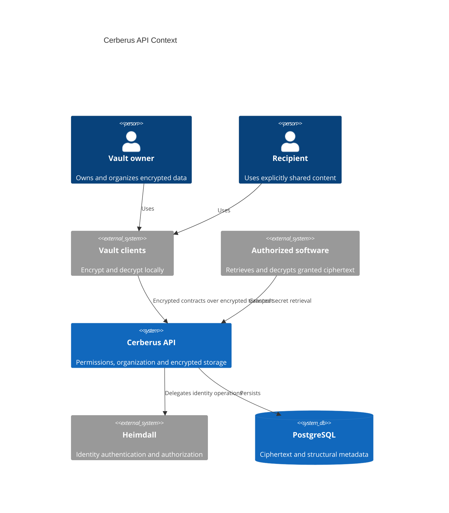
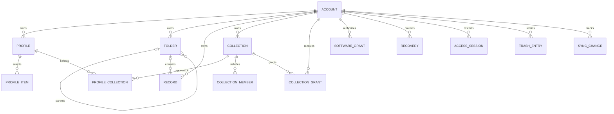
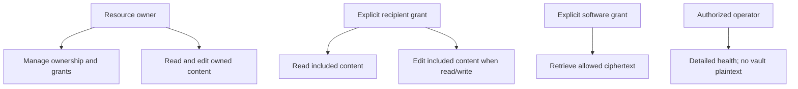

# Vision Document — Cerberus API

## 1. Introduction

### 1.1 Purpose

Define the first release of a personal and shared encrypted vault API, deriving from
[Project Overview](../initial/Project%20Overview.md) and
[Business Rules](../initial/Business%20Rules.md).

### 1.2 Scope

Deliver all approved API capabilities for the project owner as initial beta user. Clients,
their interfaces, and their cryptographic implementations are separate projects. Identity
belongs to Heimdall; vault storage, organization, resource permissions and contracts belong to
Cerberus. No additional external runtime application service is introduced.

### 1.3 Definitions and Acronyms

| Term | Definition |
| --- | --- |
| **Account** | Cerberus ownership boundary linked to one Heimdall identity. |
| **Profile** | Selectable account-internal vault view/access scope, distinct from identity details. |
| **Record** | Named encrypted collection of user-defined typed fields. |
| **Folder** | Nested account-owned container for records. |
| **Collection** | Owner-owned grouping shared only through explicit grants; associated with one or more profiles. |
| **Grant** | Read-only or read/write collection permission, or explicit read-only software permission. |
| **E2E** | End-to-end encryption: usable content keys and plaintext remain at authorized clients. |
| **Recovery credential** | One-time server-mediated recovery proof backed by client-encrypted key material. |
| **Lease** | Client-verifiable offline authorization with user-configured expiry or explicit renewal-disabled state. |
| **Tombstone** | Minimal terminal-deletion marker preventing stale updates from recreating erased identifiers. |
| **LGPD / GDPR** | Applicable privacy obligations requiring verified technical and operational controls. |

---

## 2. Problem Statement

Users need a consistent vault across devices and authorized software without giving its server
the means to decrypt sensitive content. They need selective profiles and controlled sharing
without exposing unrelated information. Deletion, recovery and disconnected operation must have
explicit behavior rather than promises the API cannot enforce on an offline client.

---

## 3. Product Position Statement

| Attribute | Description |
| --- | --- |
| **For** | The project owner initially, future vault owners and explicitly authorized recipients/software. |
| **Who** | Need flexible sensitive-data storage and controlled access across devices. |
| **The Cerberus API** | Is an end-to-end encrypted vault back end. |
| **That** | Combines custom records, profiles, nested folders, collections, recovery, synchronization and service-secret retrieval. |
| **Unlike** | Fragmented credentials and unscoped access to an entire vault. |
| **Our product** | Uses Heimdall identity and explicit vault scopes/grants with client-held decryption keys. |

Bitwarden and AWS Secrets Manager are inspiration, not an implicit parity checklist.

---

## 4. Stakeholders

| Stakeholder | Role | Concern |
| --- | --- | --- |
| Project owner | Product owner and beta user | All approved capabilities usable and verified. |
| Vault owner | Owns account data | Confidentiality, recovery and predictable deletion. |
| Collection recipient | Delegated consumer/editor | Limited and understandable sharing permissions. |
| Software maintainer | Integrates service-secret retrieval | Explicit ciphertext/key provisioning and revocation. |
| Client developer | Builds external apps | Stable encrypted contracts, synchronization and lease semantics. |
| API operator | Deploys and maintains API | Availability, secure operations and deletion-preserving restore. |
| Heimdall maintainer | Supplies identity integration | Scope-compatible adapters and constrained service privileges. |

---

## 5. High-Level Architecture

---

## 6. Core Features

| ID | Feature | Description |
| --- | --- | --- |
| F-01 | Identity and accounts | Deliver the identity and accounts operations specified by AC requirements. |
| F-02 | Vault profiles | Deliver the vault profiles operations specified by PR requirements. |
| F-03 | Records | Deliver the records operations specified by RC requirements. |
| F-04 | Folders | Deliver the folders operations specified by FD requirements. |
| F-05 | Collections | Deliver the collections operations specified by CL requirements. |
| F-06 | Collection sharing | Deliver the collection sharing operations specified by SH requirements. |
| F-07 | Vault protection and recovery | Deliver the vault protection and recovery operations specified by KY requirements. |
| F-08 | Software secret access | Deliver the software secret access operations specified by SW requirements. |
| F-09 | Offline policy and synchronization | Deliver the offline policy and synchronization operations specified by SY requirements. |
| F-10 | Trash and retention | Deliver the trash and retention operations specified by TR requirements. |
| F-11 | Privacy portability | Deliver the privacy portability operations specified by PV requirements. |
| F-12 | Operational health | Deliver the operational health operations specified by OP requirements. |

---

## 7. Domain Model Overview

The collection grant is the cross-account boundary. A recipient profile can select a shared
collection while direct folder/record ownership remains with its original account. Folder
membership and profile/collection membership are different relationships.

---

## 8. Roles Hierarchy

| Role | Relationship | Permissions |
| --- | --- | --- |
| **Owner** | Owns the target | Create, edit, delete, organize and delegate their own resources. |
| **Read-only recipient** | Has active collection grant | Read effective members only. |
| **Read/write recipient** | Has active collection grant | Read and edit existing effective members; no deletion, membership or sharing administration. |
| **Software client** | Has explicit software grant | Retrieve granted ciphertext and client-wrapped keys. |
| **Operator** | Operational privilege | Health, deployment and retention operations; never usable vault keys. |

These are resource relationships, not a replacement for Heimdall's identity roles.

---

## 9. Constraints

- Follow the approved [Technology Stack](Technology%20Stack%20Document.md).
- Build only this API; plaintext content validation and offline locking remain client obligations.
- Preserve E2E encryption through sharing, recovery and software access.
- Preserve one owner per entity; collection sharing never reveals private profiles.
- Default renewal to 24 hours, allowing any supported positive duration or no periodic renewal.
- Keep the 30-day trash/closure policies and immediate irreversible deletion options.
- No fixed budget or release date was supplied. No numerical performance/availability target is defined for beta.
- LGPD/GDPR controls and the crypto interoperability/security review must be completed before release.

---

## 10. Success Criteria

- Every core feature has traced requirements and verified main/alternative use-case flows.
- An owner can organize custom/template records across nested folders, profiles and collections.
- Recipients and software see only granted ciphertext; read-only grants cannot write.
- Recovery credentials are consumed/replaced atomically and can be refreshed.
- Synchronization handles conflicts, revocation and terminal deletion deterministically.
- Trash restoration and expiry honor the approved cascade/noncascade differences.
- The initial beta user can exercise all approved capabilities; test and operational release gates pass.
